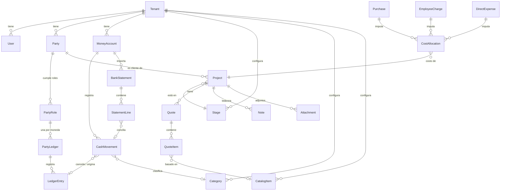

# Modelo de dominio

Modelo **conceptual** (no es el esquema de base de datos, que se define en cada
`plan.md`). Todas las entidades, salvo `Tenant`, pertenecen a una empresa.

## Diagrama de entidades

## Conceptos clave

### Tres "libros" separados

1. **Cuentas de dinero** (`MoneyAccount` + `CashMovement`): dónde está la plata.
   Cada cuenta tiene **una sola moneda**.
2. **Cuentas corrientes** (`PartyLedger` + `LedgerEntry`): quién nos debe y a quién
   le debemos. Hay una por **tercero, rol y moneda**, así el saldo de un socio que
   también es empleado no se mezcla.
3. **Costos de proyecto** (`CostAllocation`): qué parte de cada gasto corresponde a
   cada proyecto, para calcular su margen.

Cada operación del usuario impacta uno o más de estos libros de forma **atómica**.

### Efectos de cada operación

| Operación | Cuenta de dinero | Cuenta corriente | Costo de proyecto |
|-----------|------------------|------------------|-------------------|
| Aprobar presupuesto | — | Cliente: **+ total** (nos debe) | — |
| Ajuste de proyecto (adicional / bonificación) | — | Cliente: **±** | — |
| Cobro a cliente | **Entrada** | Cliente: **−** | — |
| Compra a proveedor | — | Proveedor: **−** (le debemos) | Opcional |
| Pago a proveedor | **Salida** | Proveedor: **+** | — |
| Compra de contado (atajo) | **Salida** | Proveedor: compra y pago (neto 0) | Opcional |
| Cargo a empleado (sueldo, jornal) | — | Empleado: **−** (le debemos) | Opcional |
| Pago a empleado (incluye adelantos) | **Salida** | Empleado: **+** | — |
| Pago directo a empleado (atajo) | **Salida** | Empleado: cargo y pago (neto 0) | Opcional |
| Aporte de socio | **Entrada** | Socio: **−** | — |
| Retiro de socio | **Salida** | Socio: **+** | — |
| Gasto directo (sin tercero) | **Salida** | — | Opcional |
| Ingreso directo (sin tercero) | **Entrada** | — | — |
| Transferencia entre cuentas | Salida origen + entrada destino | — | — |
| Saldo inicial de tercero (al migrar) | — | **±** según corresponda | — |
| Ajuste de arqueo | Entrada o salida por la diferencia | — | — |

Regla: **el costo se imputa en el hecho que lo genera** (compra, cargo o gasto
directo), nunca en el pago que lo cancela. Así no se cuenta dos veces.

### Multimoneda

- Monedas del MVP: **ARS y USD**. La empresa define una **moneda base** para
  reportes consolidados.
- Un presupuesto, y por lo tanto el proyecto, tiene una moneda.
- Un movimiento de caja siempre está en la moneda de su cuenta de dinero.
- Si un movimiento de caja cancela una cuenta corriente de **otra moneda**
  (ej. cobro en ARS de un proyecto en USD), se exige **tipo de cambio** y se guardan
  ambos importes. Ejemplo: se cobran ARS 1.200.000 con TC 1.200, la cuenta corriente
  en USD baja USD 1.000.
- Una transferencia entre cuentas de distinta moneda (compra/venta de dólares) exige
  tipo de cambio.
- No hay diferencias de cambio automáticas. Los reportes consolidados usan un tipo
  de cambio que el usuario ingresa al consultarlos.

### Inmutabilidad y anulación

- `CashMovement` y `LedgerEntry` no se editan ni se borran.
- **Anular** una operación marca todos sus registros como anulados (con motivo,
  usuario y fecha) y deja de computarlos en los saldos.
- Los datos descriptivos que no alteran importes (nota, descripción) se pueden editar
  y quedan en la auditoría.

### Configuración por empresa

| Elemento | Ejemplo carpintería de aluminio |
|----------|---------------------------------|
| Etapas | Presupuesto → Aprobado → En producción → Instalación → Finalizado · (Perdido) |
| Nombres | "Proyecto" → "Obra" (opcional) |
| Categorías de egreso | Perfiles de aluminio, Vidrios, Accesorios, Flete, Mano de obra, Alquiler, Servicios, Impuestos |
| Categorías de ingreso | Cobros de clientes (sistema), Otros ingresos |
| Catálogo | Ventana corrediza (m²), Puerta de abrir (u), Mampara de baño (u), Colocación (u) |
