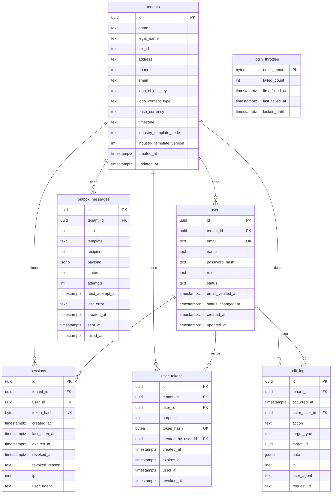

# Modelo de datos: Empresas, usuarios y roles

**Spec**: [`spec.md`](spec.md) · **Plan**: [`plan.md`](plan.md) · **ADR**: ADR-003, ADR-004, ADR-005, ADR-008
**Revisión 2026-09-27**: sesiones 24 h sin uso / 7 días (P-5); auditoría de reactivación (P-3) y
de reemisión de invitación por pedido de reset (DD-20). Sin cambios de columnas ni índices.
**Revisión 2026-09-29**: hallazgos H-2, H-4, H-5 y H-6 (plan §18): `ETag` del logo derivado de
`logo_object_key` (§2.1), zona horaria del registro (§2.1), semántica de `invitation_expires_at` y
conservación de la invitación abierta en la limpieza (§2.4, §3.4), auditoría de cambios de rol de
invitados (§2.6). Sin columnas, tablas ni índices nuevos; cambian la política `worker_cleanup` de
`user_tokens` y los privilegios por columna de `crm_worker` sobre esa tabla.
**Segunda revisión 2026-09-29**: hallazgo H-11 (plan §18): límites exactos del archivo del logo
(§2.1) y tratamiento de sus metadatos (§5). Sin cambios de esquema: el tamaño no se guarda en la
base.
**Tercera revisión 2026-09-30**: documentación alineada con lo implementado en la Fase 1 y con el
checklist de §6 (`sessions.tenant_id` y `user_tokens.tenant_id` tienen FK a `tenants(id)`, §2.3 y
§2.4); lock de `GRANT crm_tenant` en el aprovisionamiento (§3.3, DD-33); origen de las columnas
`ip` (DD-32); archivos de las queries de sistema (§3.4, plan §4.4). Sin cambios de esquema.
**Cuarta revisión 2026-10-01** (Accepted; revisión del PR fdelillo/crm#8, ADR-024): formato y
saneamiento de `outbox_messages.last_error`, efecto de los aplazamientos del `Dispatcher` sobre
`attempts` y `next_attempt_at`, y `created_at` fijado por `Enqueue` con el reloj inyectable (§2.5);
el worker escribe `next_attempt_at` como `crm_worker` para aplazar un mensaje, con el privilegio y
la política que ya tenía (§3.4). Sin cambios de esquema, privilegios ni políticas.
**Quinta revisión 2026-10-01** (*Accepted*; tercera revisión del PR fdelillo/crm#8): saneamiento
de `outbox_messages.last_error` según ADR-025 (§2.5); política de credenciales de `audit_log.data`
(DD-37, §2.6); `user_agent` normalizado en cada escritura (DD-38, §2.3 y §2.6). Sin cambios de
esquema: los `CHECK` de `user_agent` y `last_error` se mantienen.
**Sexta revisión 2026-10-02** (*Accepted*, aprobada por el usuario el 2026-10-02; séptima tanda
del plan, §18): `audit_log.data` también rechaza una credencial incrustada en un texto
(DD-37 (4)) y solo lleva valores que arma el servidor según el catálogo; el texto libre que
escribe un usuario no va en `data` (§2.6). Sin cambios de esquema.
**Séptima revisión 2026-10-05** (*Accepted*, aprobada por el usuario el 2026-10-05; novena tanda del plan, §18): las filas de `tenants` y `users` se bloquean con `FOR NO KEY UPDATE`, nunca con `FOR UPDATE`, porque toda FK hacia esas tablas se verifica con `FOR KEY SHARE` (DD-40; §2.1, §2.2 y checklist de §6). Sin cambios de esquema ni de privilegios.

DDL **conceptual**: define tablas, tipos, constraints, índices, políticas y privilegios. No es
una migración ejecutable: las migraciones goose las escribe quien implementa, respetando esto.
Convenciones:

- Esquema de negocio: `app`. Funciones de aprovisionamiento: `provisioning`. Tabla de versiones
  de goose: `public.goose_db_version` (sin privilegios para roles de runtime).
- Identificadores `uuid` (UUIDv7, `DEFAULT uuidv7()` de PostgreSQL 18), salvo `tenants.id`, que se
  genera en Go porque hace falta antes del `INSERT` para crear el rol (ADR-008).
- Fechas: `timestamptz`, siempre en UTC.
- Textos con largo máximo vía `CHECK (char_length(col) <= N)`: `text` + `CHECK` en vez de
  `varchar(N)` para poder cambiar el límite sin reescribir la tabla.
- Enumerados como `text` + `CHECK (col IN (...))`, no `CREATE TYPE ... AS ENUM`: agregar un valor
  es una migración trivial y sqlc lo mapea a `string`.
- Sin triggers: `updated_at` y demás columnas derivadas las escribe la query correspondiente.
- 🔒 = dato personal o sensible (ver §5).

---

## 1. Diagrama ER

`user_tokens.created_by_user_id` también referencia a `users` (el Administrador que invitó).
`login_throttles` no se relaciona con ninguna tabla a propósito: se indexa por HMAC del email
exista o no la cuenta (DD-7).

Toda tabla con `tenant_id` tiene **dos** clases de FK hacia la empresa: `tenant_id → tenants(id)`
(la empresa existe) y, cuando referencia otra tabla de empresa, una FK **compuesta** que incluye
`tenant_id` (la fila referida es de la misma empresa, INV-07). Las tablas de §2 listan ambas.

---

## 2. Tablas

### 2.1 `app.tenants` — Empresa (`Tenant`)

| Columna | Tipo | Null | Constraint / default | Notas |
|---|---|:---:|---|---|
| `id` | `uuid` | no | PK | UUIDv7 generado en Go |
| `name` | `text` | no | `char_length BETWEEN 1 AND 120` | Nombre de la empresa (registro) |
| `legal_name` | `text` | sí | `<= 200` | Razón social |
| `tax_id` | `text` | sí | `tax_id ~ '^[0-9]{11}$'` | CUIT sin guiones; el dígito verificador se valida en Go (DD-16). 🔒 si es persona humana |
| `address` | `text` | sí | `<= 300` | |
| `phone` | `text` | sí | `<= 50` | |
| `email` | `text` | sí | `<= 254` | Email de contacto de la empresa (para PDF), distinto del de los usuarios |
| `logo_object_key` | `text` | sí | `<= 300` | Clave en S3: `tenants/{tenant_id}/logo/{uuidv7}.{png\|jpg}`. El UUIDv7 del nombre es **el `ETag`** de `GET /tenant/logo` (DD-23): cambia en cada subida y nunca coincide entre empresas |
| `logo_content_type` | `text` | sí | `IN ('image/png','image/jpeg')` | |
| `base_currency` | `text` | no | `IN ('ARS','USD')` | ISO 4217; no editable en 001 (DD-15) |
| `timezone` | `text` | no | default `'America/Argentina/Buenos_Aires'`, `<= 64` | Nombre IANA; se valida en Go con `time.LoadLocation` (base IANA embebida con `time/tzdata`). En el registro, una zona desconocida se reemplaza por el default; en `PATCH /tenant`, se rechaza (DD-27) |
| `industry_template_code` | `text` | no | `<= 64` | Código del catálogo embebido; se valida en Go |
| `industry_template_version` | `integer` | no | `> 0` | Versión de la plantilla aplicada (002 puede evolucionar las plantillas) |
| `created_at` | `timestamptz` | no | default `now()` | |
| `updated_at` | `timestamptz` | no | default `now()` | |

Constraints de tabla:

- `tenants_logo_pair_chk`: `(logo_object_key IS NULL) = (logo_content_type IS NULL)`.

Índices: solo la PK. Toda lectura es por `id` (incluida la revalidación del logo, que solo lee
esta fila para comparar el `ETag` y no toca S3).

**Locks sobre la fila** (DD-40, INV-10): cada `INSERT` en una tabla con FK hacia `tenants` (`users`, `sessions`, `user_tokens`, `outbox_messages`, `audit_log` y las tablas de empresa de las specs siguientes) verifica la FK con `FOR KEY SHARE` sobre esta fila. Por eso la fila se bloquea solo con `FOR NO KEY UPDATE`: la query de INV-10 de la administración de usuarios y el `UPDATE` de datos o logo, que lo toma implícito porque no cambia `id`. Nunca con `FOR UPDATE`: cada inserción de la empresa esperaría, y los flujos que ya bloquearon a un usuario entrarían en deadlock con la administración de usuarios. `id` no se actualiza y ningún rol de runtime tiene `DELETE`, que también tomaría `FOR UPDATE`.

**Objeto referido por `logo_object_key` (DD-11, DD-31, H-11)**: PNG o JPEG de **hasta 2 097 152
bytes** (2 MiB, medidos sobre el archivo) y hasta 2000×2000 px. Lo valida `tenant.Service` antes
de subirlo a S3; la base no guarda el tamaño ni las dimensiones porque el objeto no cambia después
de subido (reemplazarlo crea otra clave). Los bytes se guardan **tal como llegaron** una vez
validados: el servidor no quita metadatos ni aplica la orientación EXIF (ver §5).

### 2.2 `app.users` — Usuario (`User`)

| Columna | Tipo | Null | Constraint / default | Notas |
|---|---|:---:|---|---|
| `id` | `uuid` | no | PK, default `uuidv7()` | |
| `tenant_id` | `uuid` | no | FK → `tenants(id)` | |
| `email` | `text` | no | `users_email_key UNIQUE`; `email = lower(btrim(email))`; `<= 254` | 🔒 Único **global** (DD-2) |
| `name` | `text` | sí | `<= 120` | 🔒 `NULL` mientras está `invited` |
| `password_hash` | `text` | sí | `<= 255` | 🔒 Secreto. PHC argon2id. `NULL` si nunca aceptó la invitación |
| `role` | `text` | no | `IN ('admin','operator')` | `authz.Role`. Editable en `invited` y `active`; no en `disabled` (DD-26) |
| `status` | `text` | no | `IN ('invited','active','disabled')` | |
| `email_verified_at` | `timestamptz` | sí | | `NULL` = sin verificar; no bloquea nada (P-2) |
| `status_changed_at` | `timestamptz` | no | default `now()` | |
| `created_at` | `timestamptz` | no | default `now()` | |
| `updated_at` | `timestamptz` | no | default `now()` | |

Constraints de tabla:

- `users_tenant_id_id_key UNIQUE (tenant_id, id)`: destino de las FK compuestas (INV-07).
- `users_active_complete_chk`: `status <> 'active' OR (name IS NOT NULL AND password_hash IS NOT NULL)`.
  Consecuencia para la reactivación (P-3): un usuario `disabled` sin contraseña **no puede** pasar
  a `active`; la base obliga a que vuelva a `invited`.

Índices:

| Índice | Columnas | Por qué |
|---|---|---|
| `users_email_key` | `(email)` único | Login y reset por email (fase `crm_auth`); garantiza DD-2 incluso bajo concurrencia; su violación en el registro produce `409 email_already_registered` |
| `users_tenant_id_id_key` | `(tenant_id, id)` único | FK compuestas; lecturas por id dentro de la empresa |
| `users_tenant_created_idx` | `(tenant_id, created_at)` | `GET /users` ordenado por alta |

La cuenta de Administradores activos (INV-10) recorre los usuarios de una empresa (pocas decenas)
con `users_tenant_created_idx`; no justifica un índice propio. Solo cuentan `status = 'active'` y
`role = 'admin'`: un invitado con rol `admin` no cuenta. Se cuenta después de tomar la fila de la
empresa con `FOR NO KEY UPDATE` (INV-10, DD-40): dos operaciones de administración de la misma
empresa nunca cuentan a la vez.

**Locks sobre la fila** (DD-40): `sessions.user_id`, `user_tokens.user_id`, `user_tokens.created_by_user_id` y `audit_log.actor_user_id` referencian esta tabla, y cada `INSERT` que las llena toma `FOR KEY SHARE` sobre la fila del usuario. Por eso las filas de `users` se bloquean solo con `FOR NO KEY UPDATE` (`LockManagedUser` en la administración de usuarios, `GetTokenFlowUser` en reset y verificación); los `UPDATE` de 001 (estado, rol, contraseña, verificación, nombre) lo toman implícito porque no cambian columnas con índice único. Nunca `FOR UPDATE`: el cierre de sesión (actualiza su sesión y después audita) entraría en deadlock con la desactivación y con la confirmación de reset. `id` y `email` no se actualizan (lo harían tomar `FOR UPDATE`) y ningún rol de runtime tiene `DELETE`. El login lee la fila sin lock (DD-41).

### 2.3 `app.sessions` — Sesión (`Session`)

| Columna | Tipo | Null | Constraint / default | Notas |
|---|---|:---:|---|---|
| `id` | `uuid` | no | PK, default `uuidv7()` | |
| `tenant_id` | `uuid` | no | FK → `tenants(id)` | |
| `user_id` | `uuid` | no | FK `(tenant_id, user_id)` → `users(tenant_id, id)` | |
| `token_hash` | `bytea` | no | `sessions_token_hash_key UNIQUE`; `octet_length = 32` | 🔒 SHA-256 del token de la cookie |
| `created_at` | `timestamptz` | no | default `now()` | |
| `last_seen_at` | `timestamptz` | no | default `now()` | Se actualiza como máximo cada 5 min (DD-10) |
| `expires_at` | `timestamptz` | no | `expires_at > created_at` | Vencimiento absoluto: `created_at + 7 días` (P-5) |
| `revoked_at` | `timestamptz` | sí | | |
| `revoked_reason` | `text` | sí | `IN ('logout','password_reset','user_disabled')`; `(revoked_at IS NULL) = (revoked_reason IS NULL)` | |
| `ip` | `inet` | sí | | 🔒 IP del cliente según `httpx.ClientIP` (DD-32): detrás de un proxy de confianza, la de `X-Forwarded-For`; nunca la del proxy |
| `user_agent` | `text` | sí | `<= 512` | 🔒 Valor de `httpx.NormalizeUserAgent` (DD-38, INV-33): UTF-8 válido, sin `NUL`, primeras 512 runas; vacío → `NULL`. Un User-Agent más largo nunca hace fallar la operación |

Una sesión es **válida** si `revoked_at IS NULL AND $now < expires_at AND $now < last_seen_at +
idle_timeout` y el usuario está `active`. `idle_timeout` es configuración (`SESSION_IDLE`,
default **24 h**); el absoluto (`SESSION_ABSOLUTE`, default **7 días**) se fija en `expires_at` al
crear la sesión. `$now` lo provee `clock.Clock` (DD-18).

No hace falta una columna ni un índice para la expiración por inactividad: se evalúa sobre la
fila ya encontrada por `token_hash`. Con vida máxima de 7 días, una sesión inactiva queda en la
tabla como mucho 7 días + 30 días de retención antes de la limpieza (el índice `sessions_expires_idx`
alcanza). Cambiar `SESSION_ABSOLUTE` solo afecta a sesiones nuevas; cambiar `SESSION_IDLE` afecta
a todas en el siguiente request.

Índices:

| Índice | Columnas | Por qué |
|---|---|---|
| `sessions_token_hash_key` | `(token_hash)` único | Resolución de sesión en **cada** request |
| `sessions_user_open_idx` | `(tenant_id, user_id) WHERE revoked_at IS NULL` | Revocar todas las sesiones de un usuario (desactivación, reset) |
| `sessions_expires_idx` | `(expires_at)` | Limpieza periódica |

### 2.4 `app.user_tokens` — Token de un solo uso (`UserToken`)

| Columna | Tipo | Null | Constraint / default | Notas |
|---|---|:---:|---|---|
| `id` | `uuid` | no | PK, default `uuidv7()` | |
| `tenant_id` | `uuid` | no | FK → `tenants(id)` | |
| `user_id` | `uuid` | no | FK `(tenant_id, user_id)` → `users(tenant_id, id)` | Destinatario |
| `purpose` | `text` | no | `IN ('email_verification','password_reset','invitation')` | |
| `token_hash` | `bytea` | no | `user_tokens_token_hash_key UNIQUE`; `octet_length = 32` | 🔒 SHA-256 |
| `created_by_user_id` | `uuid` | sí | FK `(tenant_id, created_by_user_id)` → `users(tenant_id, id)` | Administrador que invitó o reactivó; `NULL` si la reemisión la disparó un pedido de reset (DD-20) |
| `created_at` | `timestamptz` | no | default `now()` | |
| `expires_at` | `timestamptz` | no | `expires_at > created_at` | Verificación 48 h, reset 1 h, invitación 7 días |
| `used_at` | `timestamptz` | sí | | |
| `revoked_at` | `timestamptz` | sí | `NOT (used_at IS NOT NULL AND revoked_at IS NOT NULL)` | Reemplazado, desactivación, reset nuevo |

Un token es **válido** si `used_at IS NULL AND revoked_at IS NULL AND $now < expires_at`, su
`purpose` es el esperado y el usuario está en el estado esperado (`invited` para invitación,
`active` para reset). Consumirlo es un `UPDATE ... SET used_at = $now WHERE id = … AND used_at IS
NULL AND revoked_at IS NULL` que debe afectar **exactamente una fila**: dos aceptaciones
concurrentes del mismo token no pueden ganar ambas.

**`User.invitation_expires_at` de la API (DD-25, H-4)**: para un usuario `invited` es el
`expires_at` de su invitación **abierta** (`purpose = 'invitation' AND used_at IS NULL AND
revoked_at IS NULL`), **aunque ya haya vencido**. Siempre hay exactamente una: cada reinvitación
revoca la anterior antes de crear la nueva, y la limpieza periódica no borra la invitación abierta
(§3.4). Para `active` y `disabled` es `null`. La lectura usa `user_tokens_open_idx`.

Índices:

| Índice | Columnas | Por qué |
|---|---|---|
| `user_tokens_token_hash_key` | `(token_hash)` único | Búsqueda por token (fase `crm_auth`) |
| `user_tokens_open_idx` | `(tenant_id, user_id, purpose) WHERE used_at IS NULL AND revoked_at IS NULL` | Revocar tokens previos del mismo propósito; leer la invitación abierta de cada invitado en `GET /users` |
| `user_tokens_expires_idx` | `(expires_at)` | Limpieza |

### 2.5 `app.outbox_messages` — Mensaje saliente (`OutboxMessage`)

| Columna | Tipo | Null | Constraint / default | Notas |
|---|---|:---:|---|---|
| `id` | `uuid` | no | PK, default `uuidv7()` | |
| `tenant_id` | `uuid` | no | FK → `tenants(id)` | |
| `kind` | `text` | no | `IN ('email')` | |
| `template` | `text` | no | `IN ('email_verification','password_reset','invitation')` | Se amplía por migración. La reemisión por reset (DD-20) y la reactivación sin contraseña usan `invitation` |
| `recipient` | `text` | no | `<= 254` | 🔒 |
| `payload` | `jsonb` | sí | ver `outbox_scrub_chk` | 🔒 Parámetros de la plantilla, **incluido el token en claro** |
| `status` | `text` | no | `IN ('pending','sent','failed')`, default `'pending'` | |
| `attempts` | `integer` | no | default `0`, `>= 0` | No aumenta si el envío se interrumpe por el apagado del proceso ni cuando el `Dispatcher` aplaza el mensaje (plan §9.4, ADR-024 §6) |
| `next_attempt_at` | `timestamptz` | no | default `now()` | `Enqueue` lo fija con `clock.Now()` (DD-18). Lo mueven el reintento (rol de la empresa, con backoff) y el aplazamiento del `Dispatcher` (`crm_worker`, demora `clamp(edad, 10 s, 15 min)`; ADR-024 §6) |
| `last_error` | `text` | sí | `<= 1000` | Último fallo de entrega en el formato de ADR-024 §3: `<causa> <fase>[ <código SMTP>[ <código extendido>]]: <detalle>` (p. ej. `config connection 535 5.7.8: …`, `recipient rcpt_to 550 5.1.1: [redacted] …`). Saneado (ADR-024 §3 y ADR-025, *Accepted*): en la fase `data` no se guarda el texto del proveedor (detalle fijo `response text omitted`: el servidor ya recibió el enlace con el token); en todas las fases, todo campo con `@`, con `://` o con 20 o más caracteres seguidos de `[A-Za-z0-9+/=_-]` → `[redacted]` (**nunca** el destinatario ni el token); una sola línea, truncado a 1000 caracteres. El código extendido es el que informa el servidor o, si no lo informa, el del comienzo del texto (ADR-025 §3). Se escribe al reprogramar y al pasar a `failed`; `NULL` al pasar a `sent`; no cambia al aplazar ni al cancelar |
| `created_at` | `timestamptz` | no | default `now()` | `Enqueue` lo fija con `clock.Now()` (DD-18): es la base de la demora del aplazamiento (ADR-024 §6). La limpieza de terminales lo compara con `now()` de la base (§3.4) |
| `sent_at` | `timestamptz` | sí | | |
| `failed_at` | `timestamptz` | sí | | |

Constraints de tabla:

- `outbox_scrub_chk`: `(status = 'pending') = (payload IS NOT NULL)`. La base **obliga** a borrar
  el payload al pasar a un estado terminal (INV-09): el token en claro vive solo mientras el
  mensaje está pendiente.
- `outbox_terminal_chk`: `(status = 'sent') = (sent_at IS NOT NULL)` y `(status = 'failed') =
  (failed_at IS NOT NULL)`.

Índices:

| Índice | Columnas | Por qué |
|---|---|---|
| `outbox_pending_idx` | `(next_attempt_at) WHERE status = 'pending'` | Consulta del worker cada 2 s; parcial para que no crezca con los enviados |
| `outbox_created_idx` | `(created_at)` | Limpieza de terminales viejos |

### 2.6 `app.audit_log` — Auditoría (`AuditLog`)

| Columna | Tipo | Null | Constraint / default | Notas |
|---|---|:---:|---|---|
| `id` | `uuid` | no | PK, default `uuidv7()` | |
| `tenant_id` | `uuid` | no | FK → `tenants(id)` | |
| `occurred_at` | `timestamptz` | no | default `now()` | |
| `actor_user_id` | `uuid` | sí | FK `(tenant_id, actor_user_id)` → `users(tenant_id, id)` | `NULL` = anónimo o sistema |
| `action` | `text` | no | `action ~ '^[a-z_]+\.[a-z_]+$'` | Ver catálogo abajo |
| `target_type` | `text` | sí | `<= 40` | `user`, `tenant`, `session` |
| `target_id` | `uuid` | sí | | Sin FK (polimórfico) |
| `data` | `jsonb` | no | default `'{}'` | Detalles **sin** credenciales (INV-32): `audit.Recorder` rechaza con `ErrSecretInData` las claves y los valores de la política de DD-37 (contraseñas, tokens, cabeceras `Authorization`/`Cookie`/`Set-Cookie`, claves de API, sesión, CSRF, firmas; valores `Bearer …`/`Basic …`/`Digest …`, JWT o con el formato de `securetoken`; y, desde la séptima tanda del plan (*Accepted*, aprobada por el usuario el 2026-10-02), una de esas claves seguida de `=` o `:` o una secuencia de 43 caracteres base64url **dentro** de un texto, p. ej. un enlace con `#token=…`) y con `ErrUnsupportedData` los tipos que no puede recorrer. Las claves del catálogo de abajo no chocan con la política (lo verifica T-B209). Lleva **exactamente** las claves de su acción en el catálogo (lo verifica el test de cada operación; ver "Qué va en `data`") |
| `ip` | `inet` | sí | | 🔒 IP del cliente según `httpx.ClientIP` (DD-32) |
| `user_agent` | `text` | sí | `<= 512` | 🔒 Valor de `httpx.NormalizeUserAgent`, aplicado por `audit.Recorder.Record` (DD-38, INV-33) |
| `request_id` | `text` | sí | `<= 64` | Correlación con logs |

Append-only por privilegios: el rol de empresa tiene solo `SELECT, INSERT` (INV-15). Los usuarios
nunca se borran, así que la FK del actor no bloquea nada.

Índice: `audit_log_tenant_time_idx (tenant_id, occurred_at DESC)` para la futura consulta por
empresa.

Catálogo de acciones de 001. ✱ = obligatoria por FR-008 (inicios de sesión, invitaciones, cambios
de rol); ✚ = obligatoria por decisión del usuario (P-3: la reactivación se audita).

| `action` | Actor | Target | `data` |
|---|---|---|---|
| `tenant.registered` | admin nuevo | tenant | `{industry_template_code}` |
| `tenant.updated` | admin | tenant | `{fields: [nombres de campos cambiados]}` |
| `tenant.logo_updated` / `tenant.logo_removed` | admin | tenant | `{content_type}` |
| `auth.login_succeeded` ✱ | usuario | session | `{}` |
| `auth.login_failed` | `NULL` | user | `{reason: "bad_password" \| "not_active"}` |
| `auth.login_locked` | `NULL` | user | `{}` |
| `auth.login_rejected_disabled` | `NULL` | user | `{}` |
| `auth.logout` | usuario | session | `{}` |
| `auth.password_reset_requested` | `NULL` | user | `{}` (solo usuarios `active`) |
| `auth.password_reset_completed` | usuario | user | `{sessions_revoked}` |
| `auth.email_verified` | usuario | user | `{}` |
| `user.invited` ✱ | admin | user | `{role}` |
| `user.invitation_reissued` ✱ | admin, o `NULL` si lo disparó un pedido de reset (DD-20) | user | `{role, trigger: "admin" \| "password_reset_request" \| "reactivation"}`; `role` es el rol **después** de la reinvitación |
| `user.invitation_accepted` ✱ | usuario | user | `{}` |
| `user.role_changed` ✱ | admin | user | `{from, to, status}`; se registra para usuarios `invited` y `active`, tanto por `PUT /users/{id}/role` como por una reinvitación con otro rol (DD-26). Asignar el mismo rol no audita |
| `user.deactivated` | admin | user | `{sessions_revoked}` |
| `user.reactivated` ✚ | admin | user | `{to_status: "active" \| "invited"}` |

Una reinvitación con cambio de rol deja **dos** filas en la misma transacción:
`user.invitation_reissued {role: <nuevo>, trigger: "admin"}` y `user.role_changed {from, to,
status: "invited"}`.

El registro con email existente (`409 email_already_registered`) **no** se audita: no hay empresa
a la cual asociarlo sin revelar cuál es. Queda en logs como `security_event=signup_email_exists`
(DD-19).

**Qué va en `data`** (séptima tanda del plan, 2026-10-02, *Accepted*, aprobada por el usuario;
DD-37 (5)): solo valores que arma el servidor según el catálogo de arriba (enumerados, nombres de
campos, contadores, ids). Nunca un enlace, una cabecera, un mensaje de error ni el texto libre que
escribe un usuario. Si una spec futura necesita conservar un texto del usuario (p. ej. el motivo de
una anulación, principio IV), ese texto vive en la tabla de dominio de la operación y la fila de
auditoría lo referencia con `target_type`/`target_id`; si aun así quiere ponerlo en `data`, lo
decide su plan sabiendo que DD-37 (4) puede rechazarlo (p. ej. un motivo que contenga `pin: …`). El
test de cada operación auditada verifica que `data` tenga exactamente las claves de su acción
(T-B303 en la Fase 3; los de las Fases 4 a 7 para el resto del catálogo).

### 2.7 `app.login_throttles` — Contador de intentos (sin empresa)

| Columna | Tipo | Null | Constraint / default | Notas |
|---|---|:---:|---|---|
| `email_hmac` | `bytea` | no | PK; `octet_length = 32` | HMAC-SHA256(`AUTH_HMAC_KEY`, email normalizado) |
| `failed_count` | `integer` | no | `>= 0` | Fallos seguidos |
| `first_failed_at` | `timestamptz` | no | | |
| `last_failed_at` | `timestamptz` | no | | |
| `locked_until` | `timestamptz` | sí | | Bloqueo vigente si `> $now` |

Sin `tenant_id` a propósito (Constitution Check, principio III). Se mantiene tras P-4 (DD-19): el
login sigue sin revelar si un email existe. Si se rota `AUTH_HMAC_KEY`, los contadores vigentes se
pierden (efecto: se levantan los bloqueos en curso); aceptable.

---

## 3. Seguridad a nivel de base

### 3.1 Roles del clúster (bootstrap, fuera de goose)

Los roles son **globales al clúster**, no a la base, y crearlos exige `CREATEROLE`; por eso no van
en las migraciones (que corren como `crm_owner`) sino en `db/bootstrap/` (ADR-004), que ejecuta
una vez por clúster un DBA o, en tests, el harness.

| Rol | Atributos | Membresías (PostgreSQL ≥ 16: opciones por *grant*) |
|---|---|---|
| `crm_owner` | `LOGIN NOSUPERUSER NOCREATEROLE NOBYPASSRLS` | Miembro de `crm_provisioner` con `SET TRUE, INHERIT FALSE` (para crear la función de aprovisionamiento). Dueño de la base `crm` |
| `crm_app` | `LOGIN NOSUPERUSER NOCREATEROLE NOBYPASSRLS`; `statement_timeout = 5s`, `idle_in_transaction_session_timeout = 30s` | Miembro de `crm_auth`, `crm_worker`, `crm_signup` con `SET TRUE, INHERIT FALSE`. Recibe cada `crm_t_*` con `SET TRUE, INHERIT FALSE` (lo hace la función) |
| `crm_tenant` | `NOLOGIN` | — |
| `crm_auth`, `crm_worker`, `crm_signup` | `NOLOGIN NOBYPASSRLS` | — |
| `crm_provisioner` | `NOLOGIN CREATEROLE NOBYPASSRLS` | Tiene `crm_tenant` con `ADMIN TRUE, INHERIT FALSE, SET FALSE` |
| `crm_t_<hex>` (uno por empresa) | `NOLOGIN NOSUPERUSER NOCREATEDB NOCREATEROLE NOREPLICATION NOBYPASSRLS` | Miembro de `crm_tenant` con `INHERIT TRUE, SET FALSE`. Lo crea la función (§3.3) |

Base: `REVOKE ALL ON DATABASE crm FROM PUBLIC` (quita `CONNECT` y `TEMPORARY`);
`GRANT CONNECT ON DATABASE crm TO crm_app`. `pg_hba.conf`: solo `crm_app`, `crm_owner` y el DBA.

`INHERIT FALSE` en las membresías de `crm_app` es lo que lo deja **sin privilegios propios**
(INV-02): puede *convertirse* en otro rol con `SET ROLE`, pero no *hereda* lo que ese rol puede.

### 3.2 Función de mapeo rol → empresa

`app.current_tenant_id() RETURNS uuid` — `LANGUAGE sql STABLE PARALLEL SAFE`, `SECURITY INVOKER`.

- Si `current_user` cumple `^crm_t_[0-9a-f]{32}$`, devuelve esos 32 hex convertidos a `uuid`.
- En cualquier otro caso devuelve `NULL` (y `tenant_id = NULL` nunca es verdadero: sin filas).
- `EXECUTE` para `PUBLIC`: la función no revela nada y la evalúan las políticas de cualquier rol.
- En las políticas se escribe envuelta en un subselect, `(SELECT app.current_tenant_id())`, para
  que PostgreSQL la evalúe una vez por sentencia (*initplan*) y no por fila.

Por qué parsear el nombre y no una tabla de mapeo: sin *lookup* por fila ni tabla extra que
proteger; el nombre del rol es determinístico a partir del `id` de la empresa. Es además el
**único punto** que cambia si se reemplaza la estrategia de aislamiento (ADR-005, alternativa B).

### 3.3 Función de aprovisionamiento

`provisioning.provision_tenant_role(p_tenant_id uuid) RETURNS text` (devuelve el nombre del rol).

- `SECURITY DEFINER`, dueña `crm_provisioner`, `SET search_path = pg_catalog, pg_temp`.
- `REVOKE EXECUTE ... FROM PUBLIC`; `GRANT EXECUTE ... TO crm_signup`.
- Comportamiento: deriva `crm_t_` + hex del UUID (sin guiones, minúsculas); si el rol no existe lo
  crea con los atributos de §3.1; asegura la membresía en `crm_tenant` (`INHERIT TRUE, SET FALSE`)
  y concede el rol a `crm_app` (`INHERIT FALSE, SET TRUE`). Idempotente: llamarla dos veces deja
  el mismo estado. Arma las sentencias con `format('%I', ...)`.
- Corre dentro de la transacción del registro: si el registro hace `ROLLBACK`, el rol no queda
  creado (`CREATE ROLE` es transaccional en PostgreSQL).
- **Lock (DD-33, nota 2026-09-30 en ADR-005)**: desde PostgreSQL 16, el
  `GRANT crm_tenant TO crm_t_<hex>` toma un lock sobre `crm_tenant` que dura **hasta el fin de la
  transacción que llamó a la función**. Dos registros concurrentes se serializan: el segundo espera
  a que el primero haga `COMMIT` o `ROLLBACK`. Por eso la transacción de registro fija
  `lock_timeout = '2s'` y no hace E/S de red después de llamar a la función (R-a y R-b de DD-33), y
  la reprovisión usa una transacción por empresa (R-d). El `GRANT` del rol nuevo a `crm_app` toma
  lock sobre el rol nuevo, que nadie más usa: no compite.
- La usan también `crm tenants reprovision-roles` (ops) y los tests. La llamada vive en
  `internal/tenant/store/provisioning.sql` (plan §4.4).

### 3.4 Privilegios y políticas por tabla

Privilegios por defecto (migración 00001): `ALTER DEFAULT PRIVILEGES FOR ROLE crm_owner IN SCHEMA
app GRANT SELECT, INSERT ON TABLES TO crm_tenant` y `ALTER DEFAULT PRIVILEGES FOR ROLE crm_owner
REVOKE EXECUTE ON FUNCTIONS FROM PUBLIC`. Toda tabla nueva de cualquier spec nace con `SELECT,
INSERT` para las empresas; `UPDATE` y `DELETE` se conceden **explícitamente** en la migración que
crea la tabla, así una tabla inmutable (movimientos de caja, 006) no los recibe por accidente.

Todas las tablas: `ENABLE ROW LEVEL SECURITY` + `FORCE ROW LEVEL SECURITY`.

Política estándar `tenant_isolation` (`FOR ALL TO PUBLIC`):
`USING (tenant_id = (SELECT app.current_tenant_id()))`
`WITH CHECK (tenant_id = (SELECT app.current_tenant_id()))`.
En `tenants`, la misma con `id` en lugar de `tenant_id`.

| Tabla | `crm_tenant` (vía `crm_t_*`) | `crm_auth` | `crm_worker` | Políticas adicionales |
|---|---|---|---|---|
| `tenants` | `SELECT, INSERT, UPDATE` | — | `SELECT (id)` | `worker_read FOR SELECT TO crm_worker USING (true)` |
| `users` | `SELECT, INSERT, UPDATE` | `SELECT (id, tenant_id, email)` | — | `auth_lookup FOR SELECT TO crm_auth USING (true)` |
| `sessions` | `SELECT, INSERT, UPDATE` | `SELECT (id, tenant_id, token_hash)` | `SELECT (id, expires_at, revoked_at)`, `DELETE` | `auth_lookup FOR SELECT TO crm_auth USING (true)`; `worker_read FOR SELECT TO crm_worker USING (true)`; `worker_cleanup FOR DELETE TO crm_worker USING (expires_at < now() - interval '30 days' OR revoked_at < now() - interval '30 days')` |
| `user_tokens` | `SELECT, INSERT, UPDATE` | `SELECT (id, tenant_id, token_hash, purpose)` | `SELECT (id, purpose, expires_at, used_at, revoked_at)`, `DELETE` | `auth_lookup` y `worker_read` como arriba; `worker_cleanup FOR DELETE TO crm_worker USING (expires_at < now() - interval '30 days' AND (purpose <> 'invitation' OR used_at IS NOT NULL OR revoked_at IS NOT NULL))` — **la invitación abierta de un invitado no se borra** (DD-25) |
| `outbox_messages` | `SELECT, INSERT, UPDATE` | — | `SELECT (id, tenant_id, status, next_attempt_at, created_at)`, `UPDATE (next_attempt_at)`, `DELETE` | `worker_read FOR SELECT TO crm_worker USING (true)`; `worker_lock FOR UPDATE TO crm_worker USING (status = 'pending') WITH CHECK (status = 'pending')`; `worker_cleanup FOR DELETE TO crm_worker USING (status <> 'pending' AND created_at < now() - interval '30 days')` |
| `audit_log` | `SELECT, INSERT` | — | — | — |
| `login_throttles` | — | `SELECT, INSERT, UPDATE, DELETE` | `SELECT (email_hmac, last_failed_at, locked_until)`, `DELETE` | Sin `tenant_isolation` (no hay `tenant_id`). `auth_all FOR ALL TO crm_auth USING (true) WITH CHECK (true)`; `worker_read FOR SELECT TO crm_worker USING (true)`; `worker_cleanup FOR DELETE TO crm_worker USING (last_failed_at < now() - interval '1 day' AND (locked_until IS NULL OR locked_until < now()))` |

Notas sobre estas decisiones:

- **Por qué `crm_worker` necesita `UPDATE (next_attempt_at)`**: `SELECT ... FOR UPDATE SKIP LOCKED`
  exige privilegio `UPDATE` sobre al menos una columna y aplica también las políticas de
  `UPDATE`. El worker marca el mensaje (enviado, reintento, fallido) con el rol de la empresa. La
  **única** escritura como `crm_worker` es el **aplazamiento** (`DeferMessage`, ADR-024 §6, desde la
  revisión del 2026-10-01): cuando la fase con el rol de la empresa falla para un mensaje, mueve
  solo su `next_attempt_at` (si sigue `pending` y con el mismo `next_attempt_at` leído). Usa este
  mismo privilegio y la política `worker_lock`; no hace falta ningún privilegio nuevo.
- **Por qué `worker_read USING (true)`**: una sentencia `DELETE` con `WHERE` aplica también las
  políticas de `SELECT`; si la de lectura filtrara por `pending`, la limpieza no vería las filas
  terminales. La lectura amplia es segura porque el privilegio es **por columna** (solo ruteo y
  estado; nunca el hash del token ni el usuario).
- **Por qué la invitación abierta no se limpia**: el `DELETE` de un token vencido de un invitado
  dejaría `invitation_expires_at` en `null` y la UI no podría mostrar "Invitación vencida" (DD-25).
  La política lo impide aunque el código de limpieza se equivoque; queda como mucho una fila por
  invitado. Cuando se reinvita (la anterior pasa a revocada), se acepta (usada) o se desactiva al
  usuario (revocada), la fila vuelve a ser limpiable.
- Las políticas de limpieza usan `now()` de la base a propósito: la limpieza no necesita tiempo
  controlado por tests (se prueba con filas antiguas) y así la política protege aunque el código
  pase un valor equivocado.
- Columnas de ruteo por rol de sistema = el conjunto que fija el test T-B109 (INV-05).
- Ningún rol de runtime tiene `DELETE` sobre `users`, `tenants` ni `audit_log`.
- **Dónde viven las queries de los roles de sistema**: en cuatro archivos con ruta exacta, uno por
  módulo dueño de las tablas (plan §4.4): `identity/store/auth_lookup.sql` (`crm_auth`),
  `identity/store/cleanup.sql` (`crm_worker`: `sessions`, `user_tokens`, `login_throttles`),
  `platform/outbox/store/worker.sql` (`crm_worker`: `outbox_messages`) y
  `tenant/store/provisioning.sql` (`crm_worker` sobre `tenants(id)` y la llamada a la función de
  §3.3). Son las únicas excepciones al filtro por `tenant_id` que admite T-B112.

### 3.5 Esquemas y funciones

| Objeto | Dueño | Privilegios |
|---|---|---|
| Esquema `app` | `crm_owner` | `USAGE` para `crm_tenant`, `crm_auth`, `crm_worker` |
| Esquema `provisioning` | `crm_provisioner` | `USAGE` para `crm_signup` |
| Esquema `public` | dueño de la base (`crm_owner`) | `REVOKE ALL ... FROM PUBLIC`; solo contiene la tabla de versiones de goose |
| `app.current_tenant_id()` | `crm_owner` | `EXECUTE` para `PUBLIC` |
| `provisioning.provision_tenant_role(uuid)` | `crm_provisioner` | `EXECUTE` solo para `crm_signup` |
| Vistas (ninguna en 001) | `crm_owner` | Siempre `WITH (security_invoker = true)` (INV-08) |

---

## 4. Mapeo a Go

| Tabla | Tipo de dominio | Paquete | Notas de sqlc |
|---|---|---|---|
| `tenants` | `tenant.Tenant` | `internal/tenant` | `uuid` → `github.com/google/uuid.UUID` (override); `timestamptz` → `time.Time` |
| `users` | `identity.User` | `internal/identity` | `role` → `authz.Role` con override de columna |
| `sessions` | `identity.Session` | `internal/identity` | `token_hash` → `[]byte`; `inet` → `netip.Addr` |
| `user_tokens` | `identity.userToken` (no exportado) | `internal/identity` | |
| `outbox_messages` | `outbox.Message` | `internal/platform/outbox` | `payload` → `[]byte` (JSON) |
| `audit_log` | `audit.Entry` | `internal/platform/audit` | `data` → `[]byte` (JSON) |
| `login_throttles` | `identity.throttle` (no exportado) | `internal/identity` | |

Los structs que genera sqlc son del paquete `store` y **no salen del módulo**: el servicio los
convierte a tipos de dominio, y el handler a DTOs del contrato. Así un cambio de columna no se
filtra hasta el JSON.

---

## 5. Datos personales y sensibles

| Dato | Dónde | Clasificación | Tratamiento |
|---|---|---|---|
| Email de usuario | `users.email`, `outbox_messages.recipient` | Personal | Nunca en logs (se loguea `user_id` o `email_hmac`). El registro confirma su existencia (DD-19) pero nunca lo asocia a una empresa |
| Nombre de usuario | `users.name` | Personal | — |
| Hash de contraseña | `users.password_hash` | Secreto | Nunca sale del módulo `identity`; nunca en respuestas ni logs |
| Hash de tokens | `sessions.token_hash`, `user_tokens.token_hash` | Secreto derivado | Solo comparación |
| Token en claro | `outbox_messages.payload` (solo `pending`) | Secreto | Borrado obligatorio al terminar (`outbox_scrub_chk`) |
| IP y user agent | `sessions`, `audit_log` | Personal | La IP es la del cliente según DD-32 (no la del proxy). Retención: sesiones hasta la limpieza; auditoría indefinida (S-5) |
| CUIT, dirección, teléfono, email de la empresa | `tenants` | Comercial; personal si es persona humana | Solo visible dentro de la empresa; las respuestas de la API llevan `Cache-Control: no-store` (DD-28) |
| Logo de la empresa | S3 (clave en `tenants.logo_object_key`) | Comercial; **personal si un JPEG conserva metadatos EXIF** (ubicación GPS, datos del dispositivo) | `private, no-cache` + `ETag` por objeto: nunca se reutiliza sin revalidar con la sesión actual (DD-23). El servidor guarda los bytes sin modificar: la SPA vuelve a codificar todo JPEG y así quita el EXIF (DD-F21 de `ui.md`), pero un cliente que no sea la SPA podría subir un JPEG con EXIF. Riesgo aceptado (R-13 del plan): solo lo sube un Administrador de la empresa y solo lo ve esa empresa |
| HMAC de email | `login_throttles.email_hmac` | Seudónimo | Borrado a las 24 h sin fallos |

---

## 6. Migraciones de 001 (orden)

| # | Archivo goose | Contenido | Tarea |
|---|---|---|---|
| 1 | `00001_schemas.sql` | Esquemas `app` y `provisioning` (este con `AUTHORIZATION crm_provisioner`), `REVOKE ALL ON SCHEMA public FROM PUBLIC`, privilegios por defecto (§3.4), `USAGE` de esquemas (§3.5) | T-B007 |
| 2 | `00002_tenant_functions.sql` | `app.current_tenant_id()` y `provisioning.provision_tenant_role(uuid)` (esta creada con `SET LOCAL ROLE crm_provisioner`) | T-B102 |
| 3 | `00003_tenants.sql` | `tenants` + RLS + políticas + grants | T-B111 |
| 4 | `00004_users.sql` | `users` + RLS + políticas + grants | T-B111 |
| 5 | `00005_sessions_user_tokens.sql` | `sessions`, `user_tokens` (con la política `worker_cleanup` de §3.4, que conserva la invitación abierta) | T-B111 |
| 6 | `00006_outbox_messages.sql` | `outbox_messages` | T-B111 |
| 7 | `00007_audit_log.sql` | `audit_log` | T-B111 |
| 8 | `00008_login_throttles.sql` | `login_throttles` | T-B111 |

Como todavía no hay código, los cambios del 2026-09-29 se aplican directamente en estas
migraciones (no hace falta una migración correctiva). Si alguna ya se hubiera aplicado en un
entorno compartido, el cambio de política y privilegios de `user_tokens` iría en una migración
nueva.

Cada migración tiene su `-- +goose Down`. Un *backfill* que necesite leer datos de varias empresas
(no hay en 001) desactiva `FORCE ROW LEVEL SECURITY` en esa tabla **dentro de la misma migración**
y lo reactiva antes de terminar (ADR-004): queda explícito y versionado.

### Checklist para una tabla de empresa nueva (cualquier spec)

1. `tenant_id uuid NOT NULL` con FK a `tenants(id)`. Cada `INSERT` verifica esa FK con `FOR KEY SHARE` sobre la fila de la empresa: ninguna query de la spec bloquea `tenants` con `FOR UPDATE` (DD-40 de 001).
2. `UNIQUE (tenant_id, id)` si otras tablas la van a referenciar; FKs **compuestas** hacia otras
   tablas de empresa (INV-07). Si la tabla es destino de FK, sus filas se bloquean con `FOR NO KEY UPDATE`, nunca con `FOR UPDATE` (cada `INSERT` que la referencia toma `FOR KEY SHARE`; DD-40 de 001), y no se actualizan sus columnas con índice único.
3. `ENABLE` + `FORCE ROW LEVEL SECURITY` y política `tenant_isolation`.
4. `UPDATE`/`DELETE` para `crm_tenant` solo si la tabla es mutable (los movimientos de caja y de
   cuenta corriente **no** reciben `DELETE`, y su `UPDATE` se limita por columna a los campos de
   anulación).
5. Agregar la tabla a la lista esperada del test de catálogo (T-B107).
6. Si la tabla referencia un archivo que se sirve por el backend (adjuntos de 004, PDF de 005), la
   respuesta que lo sirve sigue la política de caché del logo (DD-23, nota en ADR-011), y la
   subida define su límite de archivo y de cuerpo como el logo (DD-31).
7. Si un rol de sistema necesita leerla o limpiarla sin empresa conocida, la query va en el archivo
   de sistema **del módulo dueño de la tabla** y ese archivo se agrega a la tabla de plan §4.4 y a
   la lista de excepciones de T-B112 (es una decisión de diseño, no un detalle de implementación).
