# Plan técnico (backend): Empresas, usuarios y roles

**Spec**: [`spec.md`](spec.md) · **Rama**: `001-empresas-usuarios` · **Fecha**: 2026-09-27
**Autor**: `backend-architect` · **Estado**: Aprobado (2026-09-29)
**Revisión 2026-09-27**: incorporadas las respuestas del usuario a P-2, P-3, P-4 y P-5 (§14.2).
**Revisión 2026-09-29 (posterior a la aprobación)**: incorporados los hallazgos H-1 a H-9 del
`frontend-architect` (`ui.md` §27), aprobados por el usuario, y las rutas de la SPA confirmadas.
Detalle en §18.
**Segunda revisión 2026-09-29**: hallazgos H-10 (HTTPS local con mkcert en desarrollo y E2E) y
H-11 (límite exacto del logo), resueltos por el usuario; re-codificación de todo JPEG en el
navegador confirmada. Cambian DD-11 y DD-24; se agregan DD-31, INV-23 e INV-24. Detalle en §18.
**Tercera revisión 2026-09-30**: cuatro decisiones previas a la Fase 2, aprobadas por el usuario:
código `method_not_allowed` (contrato v0.4.0), IP del cliente detrás de proxies (DD-32),
cancelaciones del cliente (`db.ErrCanceled`) y serialización de registros por el lock de
`GRANT crm_tenant` (DD-33); además, rutas exactas de las queries de sistema (§4.4). Se agregan
INV-25 e INV-26. Estado de la implementación y detalle en §18.
**Cuarta revisión 2026-09-30**: hallazgo de implementación en PostgreSQL 18.6 (primer
`SET ROLE` a una empresa recién aprovisionada desde otra conexión falla con `42501`) y decisión
del usuario sobre cómo defenderse: DD-34, INV-27, S-16, R-17, runbook §12.3, nota (b) en ADR-005
y research R-28. Detalle en §18.

Artefactos de esta spec:

| Archivo | Contenido |
|---|---|
| `plan.md` (este) | Contexto técnico, Constitution Check, arquitectura, invariantes, errores, seguridad, paquetes, `DD-n` |
| [`research.md`](research.md) | Alternativas evaluadas por decisión |
| [`data-model.md`](data-model.md) | Tablas, DDL conceptual, RLS, roles, ER, datos sensibles |
| [`contracts/openapi.yaml`](contracts/openapi.yaml) | Contrato HTTP **canónico** (OpenAPI 3.1) |
| [`tasks.md`](tasks.md) | Plan TDD (sección Backend) |
| [`ui.md`](ui.md) | Diseño del frontend (`frontend-architect`) |
| [`docs/adr/`](../../docs/adr/README.md) | ADR-001 a ADR-014: decisiones base del proyecto; ADR-019: SPA embebida |

---

## 1. Contexto técnico

Proyecto que empezó **greenfield**: la Fase 0 del backend ya está mergeada y la Fase 1
implementada en su rama (§18). Esta es la primera spec, así que además de diseñar la
funcionalidad fija las decisiones base del proyecto (ADR-001 a ADR-014).

| Aspecto | Decisión | Fuente |
|---|---|---|
| Lenguaje | Go **1.27** (estable actual; 1.27.1 del 2026-09-01) | Constitución + verificación |
| Base de datos | PostgreSQL **18**, último *minor* (debe incluir el arreglo de CVE-2026-14666; el comportamiento de DD-34 se observó en 18.6) | ADR-005 |
| Router HTTP | `github.com/go-chi/chi/v5` (v5.3.2) para la API (`/api/`); mux raíz de la librería estándar que reparte entre API, ops y SPA | ADR-002 (decisión del usuario), DD-22 |
| Acceso a datos | `sqlc` (generador) + `github.com/jackc/pgx/v5` (`pgxpool`) | ADR-003 (decisión del usuario) |
| Migraciones | `github.com/pressly/goose/v3`, SQL versionado embebido con `embed.FS` | ADR-004 (decisión del usuario) |
| Aislamiento | **Un rol de PostgreSQL por empresa** + RLS forzada + filtro explícito | ADR-005 (decisión del usuario) |
| Sesiones | Tabla `sessions` + token opaco en cookie `__Host-crm_session`, siempre `Secure`; 24 h de inactividad / 7 días máximo | ADR-006 (decisión del usuario), DD-24 |
| CSRF | `net/http.CrossOriginProtection` (Go ≥1.25) con *deny handler* problem+json + `SameSite=Lax` + JSON obligatorio | ADR-006, DD-30 |
| IP del cliente | `X-Forwarded-For` solo desde proxies de `TRUSTED_PROXIES` (vacía por defecto), en un único middleware | DD-32 |
| Contraseñas | argon2id (`golang.org/x/crypto/argon2`), formato PHC | ADR-007 |
| Identificadores | UUIDv7 (`uuidv7()` de PG 18 y `github.com/google/uuid` en Go) | ADR-008 |
| Errores HTTP | RFC 9457 `application/problem+json` con `code` estable | ADR-009 |
| Email | Outbox transaccional + worker en el mismo binario; puerto `Mailer`, adaptador SMTP con `github.com/wneessen/go-mail` | ADR-010 |
| Archivos | S3 compatible (MinIO en desarrollo) con `github.com/minio/minio-go/v7` | ADR-011 |
| Tests | `testing` nativo, table-driven; integración con PostgreSQL real vía `testcontainers-go`; contrato con `libopenapi-validator`; HTTP con `httptest.NewTLSServer` cuando hay cookie | ADR-012 |
| Autorización | Matriz estática rol → permisos (FR-007) en `internal/authz` | ADR-013 |
| Contrato | OpenAPI 3.1 canónico; handlers y DTOs escritos a mano; validación en tests | ADR-014 |
| Frontend servido | SPA embebida en el binario (paquete `web`, `go:embed`), mismo origen | ADR-019 (decisión del usuario) |
| Compresión | gzip solo para la SPA con `github.com/klauspost/compress/gzhttp` (dependencia aprobada por el usuario) | DD-29, ADR-019 |
| Zonas horarias | Base IANA embebida con `time/tzdata` (librería estándar) | DD-27 |
| Logs | `log/slog` (JSON) de la librería estándar | DD-12 |
| Rate limit | `golang.org/x/time/rate`, en memoria; clave por IP (IPv6 por /64) | DD-9, DD-32 |
| Desarrollo local | PostgreSQL 18 + Mailpit + MinIO (`compose.yaml`); **HTTPS local** con un certificado de `mkcert` (herramienta de desarrollo, no dependencia del binario); Vite con *proxy* de `/api` | ADR-010, ADR-011, ADR-019, DD-24 |

**Validación del stack**: detecté un repo sin código, con la constitución fijando Go +
PostgreSQL + OpenAPI + monolito modular y las librerías que eligió el usuario. Diseño sobre eso.

**Escala supuesta** (S-3): hasta ~1.000 empresas, ~5 usuarios por empresa, tráfico pico
< 20 req/s, **una sola instancia** del binario. Todo lo que sigue está dimensionado para eso.

**Arquetipo**: API / servicio de recursos, con dos componentes secundarios: un **worker
asíncrono** (outbox de emails: idempotencia, reintentos, estados terminales) y una
**integración** con SMTP y S3 (timeouts y mapeo de errores). Además el binario sirve la SPA
como archivos estáticos embebidos (ADR-019).

---

## 2. Constitution Check

| Principio | Estado | Cómo se cumple / justificación |
|---|:---:|---|
| **I. Simplicidad primero** | ✅ | Se construye solo lo que pide la spec. Registro y aceptación de invitación son una sola pantalla y un solo request. Un único binario (API + worker + SPA). Sin colas externas, sin caché, sin microservicios. Las únicas adiciones fuera del texto literal de la spec son consecuencias necesarias, marcadas y **confirmadas por el usuario**: reemisión de invitación (DD-5), reactivación de usuarios (P-3), los ajustes H-1 a H-11, las cuatro decisiones de la tercera revisión y la defensa de DD-34 (§18). El TLS local es una herramienta de desarrollo (mkcert), no una dependencia del binario. |
| **II. Genérico por configuración** | ✅ | Las plantillas de rubro son **datos** embebidos (catálogo), no código por rubro. 001 define el catálogo mínimo (código y nombre) y el puerto `industrytemplate.Seeder`; el contenido lo define 002 (DD-3), con la restricción heredada R-c de DD-33. |
| **III. Aislamiento entre empresas** | ✅ / ⚠️ | Toda tabla de negocio tiene `tenant_id NOT NULL`, RLS habilitada y **forzada**, política por rol de empresa y filtro explícito en cada query (INV-01 a INV-07). Tests de aislamiento en BD y HTTP (Fases 1 y 8). Ninguna respuesta con datos de una empresa se reutiliza desde la caché del navegador sin revalidar (INV-21, H-2, H-7). El reintento de DD-34 no debilita el aislamiento: solo repite un cambio de rol que falló antes de ejecutar nada, y un `42501` en cualquier otro punto sigue siendo un bug (INV-19, INV-27). ⚠️ **Excepciones justificadas**: (a) `tenants` no tiene `tenant_id` porque *es* la empresa: su política usa `id`; (b) `login_throttles` no tiene `tenant_id` porque se indexa por email **exista o no la cuenta** (anti-enumeración, DD-7): no es dato de negocio ni pertenece a una empresa; solo lo ve el rol `crm_auth`; (c) las queries de roles de sistema viven en cuatro archivos con ruta exacta (§4.4) y se eximen del filtro por empresa una por una, por nombre. |
| **IV. Integridad del dinero** | ✅ (N/A) | 001 no maneja importes. `tenants.base_currency` es ISO 4217 restringido a `ARS`/`USD`. Quedan listas la auditoría append-only (`audit_log`) y la atomicidad por operación (`TxRunner`) que usarán las specs financieras; el checklist de tablas nuevas (`data-model.md` §6) ya prevé tablas inmutables sin `DELETE`. |
| **V. Spec Driven Development** | ✅ / ⚠️ | Plan derivado de `spec.md` y sus Clarificaciones; criterios Dado/Cuando/Entonces trazados a tareas `[T]` (`tasks.md`, tabla de trazabilidad). P-2 a P-5 están **resueltas** por el usuario (§14.2). ⚠️ Queda abierta P-1 (hosting): no bloquea el desarrollo, sí la elección del proveedor de producción. |
| **VI. Tests primero** | ✅ | Todas las fases son TDD. El contrato OpenAPI se valida con tests de contrato sobre cada respuesta de los tests HTTP (ADR-014). El comportamiento de PostgreSQL del que depende DD-34 lo vigila un test de reproducción que corre en `make check`. |
| **VII. Mobile-first** | ✅ | Sesiones con expiración por inactividad, payloads chicos, logo acotado en tamaño (el navegador achica las fotos grandes antes de subir), SPA comprimida con gzip y assets con caché inmutable. PWA servida desde el mismo origen que la API (S-2, ADR-019). |
| **Stack** | ✅ | Go, PostgreSQL, OpenAPI, monolito modular, S3 compatible, React servido por el mismo binario. Librerías registradas como ADR, como pide la constitución (`gzhttp` en ADR-019, aprobada en DD-29). |
| **Convenciones** | ✅ | Documentación en español; tablas, columnas, endpoints, rutas de la SPA e identificadores en inglés con nombres del glosario (`Tenant`, `User`, `Role`, `IndustryTemplate`, `AuditLog`). Fechas `timestamptz` en UTC; `tenants.timezone` para mostrar. Términos nuevos incorporados al glosario (§17). |

Ninguna excepción queda sin justificar: el plan no está bloqueado por la constitución.

---

## 3. Resumen ejecutivo

Un monolito modular en Go con dos módulos de dominio (`tenant` e `identity`) más un paquete
transversal de autorización (`authz`) y una capa de plataforma (`platform/*`). El binario sirve
también la SPA embebida: un mux raíz reparte `/api/` al router chi, `/healthz` y `/readyz` a ops
y todo lo demás al paquete `web`. La autenticación usa sesiones del lado servidor en PostgreSQL
con token opaco en cookie `HttpOnly`, lo que permite que desactivar un usuario corte su acceso en
el siguiente request. El aislamiento se apoya en tres capas: filtro explícito por `tenant_id`,
**RLS forzada con un rol de PostgreSQL por empresa** (cada transacción hace `SET LOCAL ROLE` al
rol de su empresa, y el rol de login no tiene ningún privilegio propio: si alguien se olvida de
cambiar de rol, la query falla en vez de filtrar datos), y tests automáticos que recorren todas
las tablas y todos los endpoints. Los flujos anteriores a conocer la empresa (registro, login,
reset, invitación, worker) usan **roles de sistema** que solo ven columnas de ruteo (`id`,
`tenant_id`, hashes) y luego pasan al rol de la empresa para todo lo demás. Los emails salen por
un outbox transaccional, así que nunca se manda un email de una operación que se deshizo.

---

## 4. Arquitectura

### 4.1 Componentes

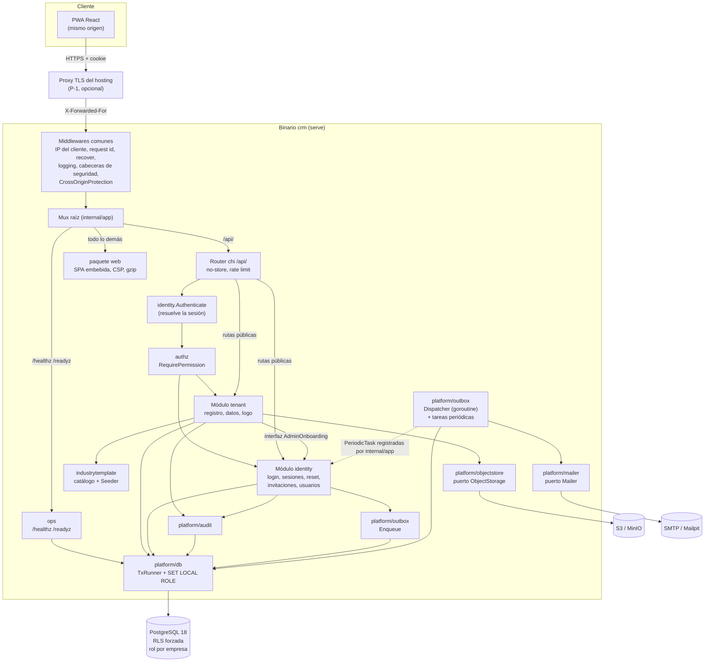

**Montaje (DD-22, H-1)**: la SPA **no** se registra en el router chi. `internal/app` arma un
`http.ServeMux` raíz con tres destinos: `/api/` → router chi (con su propio `NotFound` y
`MethodNotAllowed` en problem+json), `GET /healthz` y `GET /readyz` → ops, y `/` (todo lo demás)
→ `web.NewHandler`. Los middlewares comunes (IP del cliente, request id, recover, logging,
cabeceras de seguridad y `CrossOriginProtection`) envuelven al mux raíz, así que aplican a los tres
destinos; los middlewares propios de la API (`Cache-Control: no-store`, rate limit,
autenticación, autorización) viven dentro del router chi. Consecuencias: `chi.Walk` sobre el
router de la API ve **solo** rutas de la API (T-B801 y el test de rutas contra el contrato no
cambian), y un `/api/…` inexistente sigue siendo `404 problem+json`, nunca `index.html`.

Reglas de dependencia entre paquetes (se verifican con `depguard`, ver ADR-001):

- `platform/*` no importa ningún módulo de dominio ni `authz`.
- `authz` e `industrytemplate` solo importan `platform/*`.
- `identity` importa `platform/*` y `authz`. **Nunca importa `tenant`.**
- `tenant` importa `platform/*`, `authz`, `industrytemplate` e `identity` (solo tipos y errores).
  Usa `identity` a través de una interfaz chica que **declara él mismo** (`AdminOnboarding`,
  §11.1); el cableado con `*identity.Service` lo hace `internal/app` (composition root).
- `web` (en la raíz del repo, fuera de `internal/`, porque `go:embed` necesita que `dist` esté bajo
  el paquete) solo importa la librería estándar y `gzhttp`; ningún paquete salvo `internal/app` y
  `cmd/crm` importa `web`.
- Ningún paquete importa el `store` (código sqlc) de otro módulo: un módulo no lee tablas de otro.
  Esto vale también para las queries de sistema (§4.4): la limpieza de tablas de `identity` vive en
  `identity`, y el `Dispatcher` de `platform/outbox` la ejecuta como una `PeriodicTask` que le
  registra `internal/app` (así `platform` no importa dominio).

### 4.2 Roles de PostgreSQL (resumen; detalle en `data-model.md` §3 y ADR-005)

| Rol | LOGIN | Para qué | Privilegios |
|---|:---:|---|---|
| `crm_owner` | sí | Dueño del esquema; lo usa **solo** `crm migrate` | Dueño de tablas y funciones de `app`. Sin `BYPASSRLS` (la RLS forzada también lo alcanza) |
| `crm_app` | sí | Rol de login del pool en runtime | **Ninguno** sobre tablas. Miembro `SET TRUE, INHERIT FALSE` de los roles de sistema y de cada rol de empresa |
| `crm_tenant` | no | Rol grupo con los privilegios DML sobre tablas de empresa | `SELECT, INSERT` por defecto (`ALTER DEFAULT PRIVILEGES`); `UPDATE`/`DELETE` explícitos por tabla |
| `crm_t_<uuid hex>` | no | Un rol por empresa | Miembro `INHERIT TRUE, SET FALSE` de `crm_tenant`. Sin `BYPASSRLS`, no es dueño de nada |
| `crm_auth` | no | Flujos previos a conocer la empresa (login, sesión, tokens) | Solo columnas de ruteo (ver §4.4) + `login_throttles` |
| `crm_worker` | no | Worker de outbox, limpieza y listado de empresas para reaprovisionar | Solo columnas de cola de `outbox_messages`; `DELETE` de filas vencidas; `SELECT (id)` de `tenants` |
| `crm_signup` | no | Registro de empresa | Solo `EXECUTE` de `provisioning.provision_tenant_role(uuid)` |
| `crm_provisioner` | no | Dueño de la función `SECURITY DEFINER` que crea roles | `CREATEROLE`; `ADMIN` sobre `crm_tenant` |

### 4.3 Cómo corre una transacción de empresa

Toda operación de negocio corre dentro de `TxRunner.InTenantTx(ctx, tenantID, fn)`, que:

1. Toma una conexión del pool (conectada como `crm_app`) y abre `BEGIN`.
2. Cambia de rol: en **un solo viaje de red** manda la lectura de catálogo de DD-34
   (`SELECT 1 FROM pg_catalog.pg_auth_members LIMIT 0`) y `SET LOCAL ROLE crm_t_<hex>`
   (identificador derivado solo del UUID y saneado con `pgx.Identifier`). `SET LOCAL` se revierte
   solo al `COMMIT`/`ROLLBACK`, así que la conexión vuelve al pool como `crm_app` sin privilegios.
   Si **este** cambio inicial falla con `42501`, hace `ROLLBACK` y repite la transacción completa
   **una sola vez** (DD-34, INV-27); si vuelve a fallar, devuelve `db.ErrPrivilege`.
3. Ejecuta `fn`; todas las queries sqlc reciben además `tenant_id` como parámetro explícito.
4. `COMMIT` si `fn` devuelve `nil`; `ROLLBACK` en cualquier otro caso (incluido *panic*).

La misma función privada de cambio de rol (con la lectura de catálogo) la usan `InSystemTx`,
`Tx.AsTenant` y `Tx.AsSystem`, pero **sin** reintento.

Las políticas RLS no nombran roles: comparan `tenant_id` con `app.current_tenant_id()`, una
función que devuelve el UUID codificado en `current_user` si sigue el patrón `crm_t_<32 hex>`, o
`NULL` en cualquier otro caso (roles de sistema, `crm_owner`). Consecuencia deliberada: **cambiar
la estrategia de aislamiento (p. ej. a la alternativa con variable de sesión) solo cambia esa
función y `InTenantTx`**; las políticas y las queries quedan igual (ADR-005, reversibilidad).

### 4.4 Flujos previos a conocer la empresa (y por qué no son un bypass)

Patrón único: **fase 1** con un rol de sistema que solo resuelve *a qué empresa* pertenece algo,
viendo únicamente columnas de ruteo; **fase 2** con el rol de esa empresa para leer o escribir
cualquier dato de negocio, bajo RLS. Ambas fases pueden ir en la misma transacción: el `Tx`
permite `AsSystem` → `AsTenant`, pero **nunca dos empresas distintas en una transacción**
(INV-03).

| Flujo | Rol de fase 1 | Qué ve en fase 1 | Qué pasa en fase 2 (rol de empresa) | Por qué no es bypass |
|---|---|---|---|---|
| Registro | `crm_signup` | Nada (solo puede ejecutar la función de aprovisionamiento) | Crea el rol, `SET LOCAL ROLE` al rol nuevo e inserta empresa, admin, token, outbox, sesión y auditoría | Todas las escrituras pasan por la RLS de la empresa nueva |
| Resolución de sesión (cada request) | `crm_auth` | `sessions(id, tenant_id, token_hash)` | Valida revocación, vencimiento y estado del usuario; carga rol | La validación y los datos del usuario se leen bajo RLS |
| Login | `crm_auth` | `users(id, tenant_id, email)`, `login_throttles` | Lee hash, estado y rol; crea sesión; audita | `crm_auth` no puede leer `password_hash`, `name`, `role` ni `status` (privilegios por columna) |
| Pedir reset | `crm_auth` | `users(id, tenant_id, email)` | Según el estado: token de reset, reemisión de invitación (DD-20) o nada | Idem |
| Confirmar reset, verificar email, ver/aceptar invitación | `crm_auth` | `user_tokens(id, tenant_id, token_hash, purpose)` | Valida vencimiento/uso, escribe | Vencimiento, uso y usuario se validan bajo RLS |
| Worker de outbox | `crm_worker` | `outbox_messages(id, tenant_id, status, next_attempt_at)` pendientes | Lee destinatario y payload, envía, marca | Destinatario y contenido solo bajo RLS |
| Limpieza periódica | `crm_worker` | Filas **vencidas** de `sessions`, `user_tokens` (salvo la invitación abierta de un invitado, DD-25), `outbox_messages` terminales, `login_throttles` | — | La política de `DELETE` solo alcanza filas vencidas |
| Reaprovisionar roles (ops) | `crm_worker` + `crm_signup` | `tenants(id)` | — | No toca datos de negocio |

**Rutas exactas de las queries de sistema** (las únicas que pueden omitir el filtro por
`tenant_id`; T-B112 exime **por ruta exacta y por nombre de query**: dentro de estos archivos solo se
saltean las queries sqlc listadas por nombre en `queryrules.DefaultExceptions`, cada una con su motivo;
cualquier otra query del archivo se revisa como las demás, y un nombre listado que no existe es
violación. Un archivo con el mismo nombre en otro lugar también es violación. Corrección de la revisión
del PR fdelillo/crm#7, 2026-09-30):

| Archivo | Rol | Qué contiene | Tareas |
|---|---|---|---|
| `internal/identity/store/auth_lookup.sql` | `crm_auth` | Fase 1 de login, pedido de reset, resolución de sesión y tokens (por igualdad exacta sobre una columna única); lecturas y escrituras de `login_throttles` | T-B308, T-B403, T-B503, T-B505, T-B605 |
| `internal/identity/store/cleanup.sql` | `crm_worker` | `DELETE` de filas vencidas de `sessions`, `user_tokens` y `login_throttles` (las políticas de `data-model.md` §3.4 acotan qué filas) | T-B902 |
| `internal/platform/outbox/store/worker.sql` | `crm_worker` | Tomar mensajes pendientes (`FOR UPDATE SKIP LOCKED`) y limpiar mensajes terminales de `outbox_messages` | T-B212, T-B902 |
| `internal/tenant/store/provisioning.sql` | `crm_worker` y `crm_signup` | `SELECT id FROM app.tenants` (reaprovisionamiento y métrica `tenant_roles_total`) y la llamada a `provisioning.provision_tenant_role` (registro y reaprovisionamiento) | T-B304, T-B904, T-B907 |

Regla: cada módulo guarda las queries de sistema **sobre sus propias tablas** (ADR-001). Agregar
un archivo a esta tabla (p. ej. en una spec futura) es una decisión de diseño que actualiza esta
sección, `data-model.md` §3.4 y la lista de excepciones de T-B112 en el mismo cambio. Agregar una
query a uno de estos archivos exige agregar su nombre y su motivo a la excepción en el mismo cambio:
así la exención se revisa junto con la query (p. ej. un `SELECT id, email FROM app.users` sin filtro
en `auth_lookup.sql` no queda eximido por estar en ese archivo).

**Riesgo residual declarado**: un bug en una de las queries de fase 1 de `crm_auth` podría
listar `(id, tenant_id, email)` de usuarios de todas las empresas. Se acota con: queries de
fase 1 en un archivo propio (`identity/store/auth_lookup.sql`), todas por igualdad exacta sobre
una columna única, y un test que fija el conjunto de privilegios por columna de cada rol de
sistema (T-B109). La alternativa más fuerte (funciones `SECURITY DEFINER` por lookup) se evaluó
y se descartó por complejidad (research R-04b).

### 4.5 Flujos principales

#### Registro de empresa (Historia 1, FR-001, FR-002)

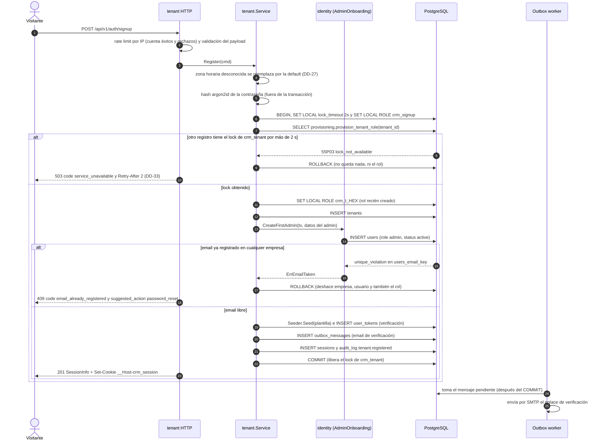

El `409` dice explícitamente que ya existe un usuario con ese email y ofrece recuperar la
contraseña (P-4, DD-19, DD-21). No incluye empresa, nombre ni estado de la cuenta, y es el mismo
cualquiera sea el estado del usuario existente (`invited`, `active`, `disabled`). Desde la llamada
a `provision_tenant_role` hasta el `COMMIT` no hay ninguna E/S de red (INV-26, DD-33). El
`SET LOCAL ROLE` al rol recién creado corre en la **misma** conexión que lo creó, así que no le
afecta el problema de DD-34; el siguiente request (`GET /me`, en otra conexión) sí.

#### Primer uso de una empresa recién aprovisionada desde otra conexión (DD-34)

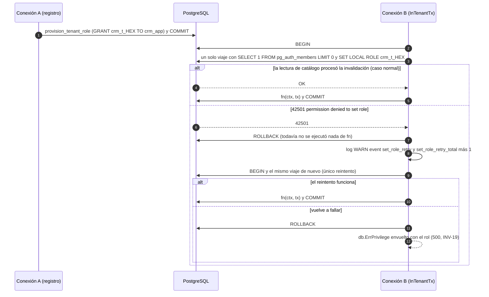

#### Inicio de sesión con bloqueo (Historia 2, escenarios 1 y 2; FR-003, FR-008)

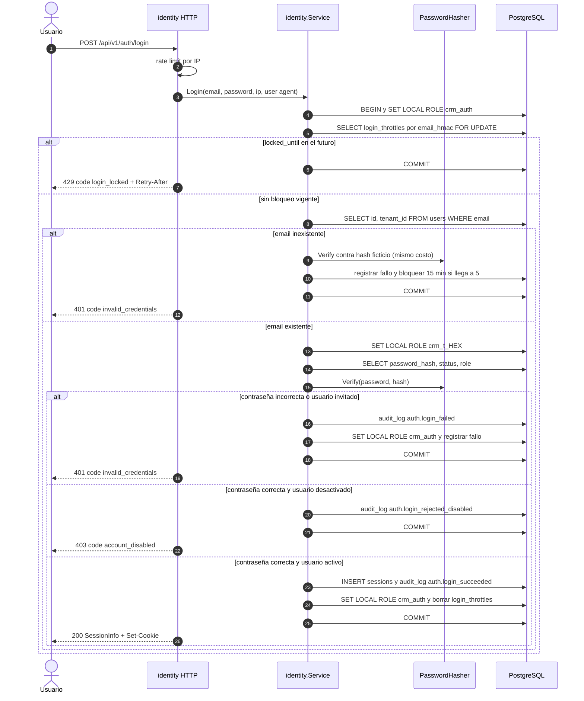

El quinto fallo seguido responde `401` y deja `locked_until = now + 15 min`; el sexto intento
(con cualquier contraseña) recibe `429`. El comportamiento es **idéntico** exista o no el email
(DD-7). Aunque el registro ahora confirma la existencia de un email, el login **se mantiene no
enumerable** por defensa en profundidad (DD-19). La fila de `login_throttles` se toma con
`FOR UPDATE`: intentos concurrentes contra el mismo email se serializan y el límite de 5 es exacto.

#### Recuperación de contraseña (Historia 2, escenario 3; FR-004)

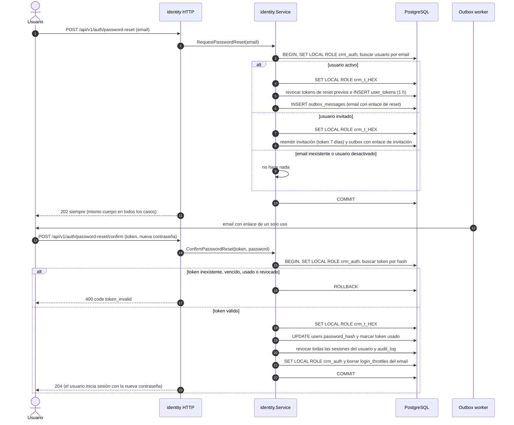

El caso "usuario invitado" existe porque el `409` del registro ahora sugiere "recuperar la
contraseña" a cualquiera cuyo email ya exista, incluido quien todavía no aceptó su invitación
(DD-20).

#### Invitación y aceptación (Historia 3, escenarios 1 y 2; FR-005, FR-008)

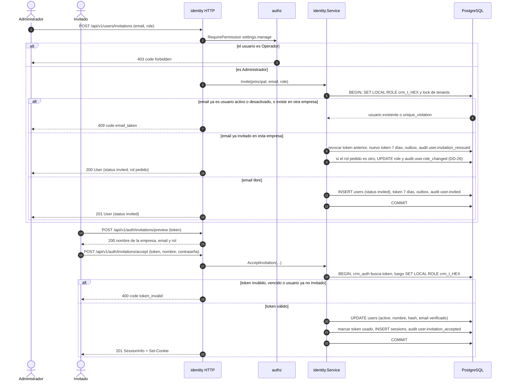

#### Desactivación con cierre de sesiones (Historia 3, escenarios 3 y 4)

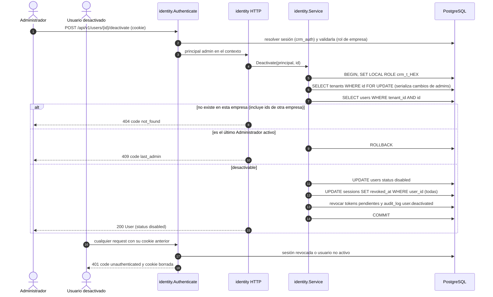

La **reactivación** (P-3, confirmada) sigue el mismo patrón: `RequirePermission(settings.manage)`,
lock de `tenants`, búsqueda del usuario (`404` si no es de la empresa), transición según la tabla
de §4.6 (`409 invalid_state` si no está `disabled`), y auditoría `user.reactivated` en la misma
transacción. Las sesiones revocadas al desactivar **no** se reabren.

#### Subida del logo (Historia 4; DD-11, DD-31)

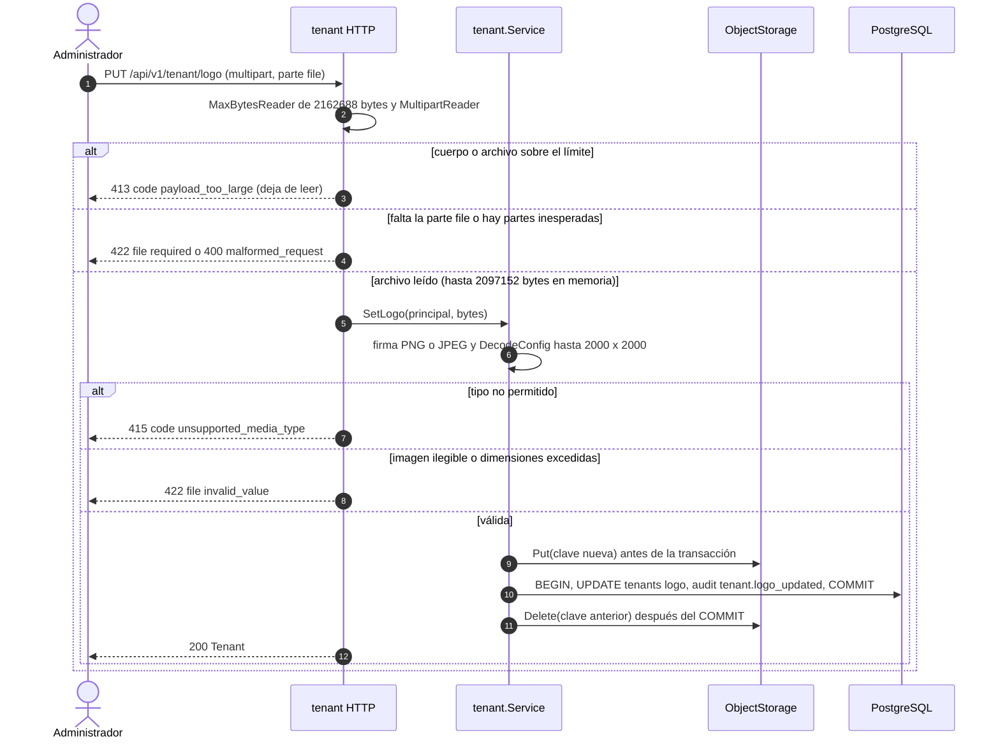

#### Cliente que corta la conexión a mitad de un request (§9.2, R-27)

```mermaid
sequenceDiagram
    autonumber
    actor C as Cliente
    participant H as handler
    participant S as servicio
    participant DB as PostgreSQL

    C->>H: request
    H->>S: operación con r.Context()
    S->>DB: query
    C-->>H: cierra la conexión (el contexto se cancela)
    DB-->>S: context.Canceled
    S-->>H: db.ErrCanceled (la transacción hizo ROLLBACK)
    alt r.Context().Err() distinto de nil
        H->>H: no escribe respuesta; log INFO event client_canceled status 499
    else la cancelación vino de otro lado (apagado del proceso)
        H-->>C: 503 code service_unavailable
    end
```

### 4.6 Máquinas de estado

#### Estado del usuario (`users.status`)

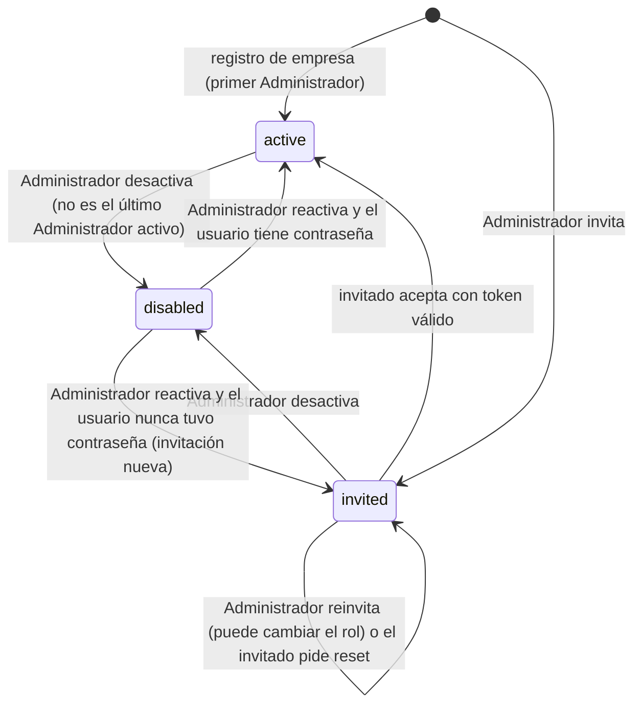

- El **rol** (`admin`/`operator`) es ortogonal al estado. Se puede cambiar en usuarios `invited` y
  `active` (con `PUT /users/{id}/role` o, para `invited`, reinvitando con otro rol); en `disabled`
  responde `409 invalid_state` (DD-26). Bajar a Operador al último Administrador **activo** se
  rechaza con `409 last_admin` (INV-10); los invitados no cuentan como Administradores activos.
- Entrar a `disabled` revoca en la misma transacción todas las sesiones y los tokens pendientes
  (INV-11). Salir de `disabled` (reactivar) no reabre sesiones: el usuario vuelve a iniciar
  sesión.
- Toda transición la ejecuta un Administrador y queda auditada (`user.invited`,
  `user.invitation_reissued`, `user.invitation_accepted`, `user.deactivated`,
  `user.reactivated`, `user.role_changed`); la reemisión disparada por un pedido de reset se audita
  con actor `NULL`.
- No hay estado terminal ni borrado: los usuarios no se eliminan (la auditoría los referencia).
- La tabla de transiciones (`estado × acción → estado | error`) vive en `identity/user.go` y es
  la única fuente de verdad en el código (T-B605).

#### Estado de una invitación (derivado de `users.status` + `user_tokens`)

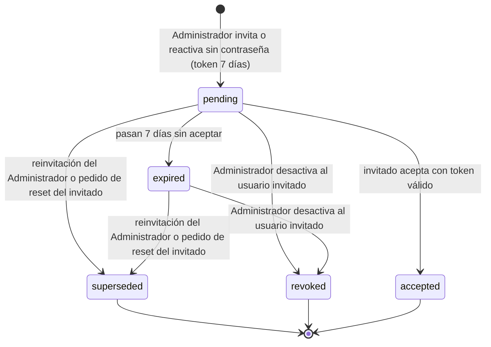

No hay tabla `invitations`: la spec modela "invitado" como estado del `User`, y la invitación es
el token de propósito `invitation` (DD-1). Una invitación vencida no cambia de fila: su estado se
deriva de `expires_at`, y se conserva mientras el usuario siga invitado para que la API pueda
informar cuándo venció (`User.invitation_expires_at`, DD-25). Reinvitar crea una invitación nueva
(DD-5, DD-20).

#### Estado de un mensaje del outbox

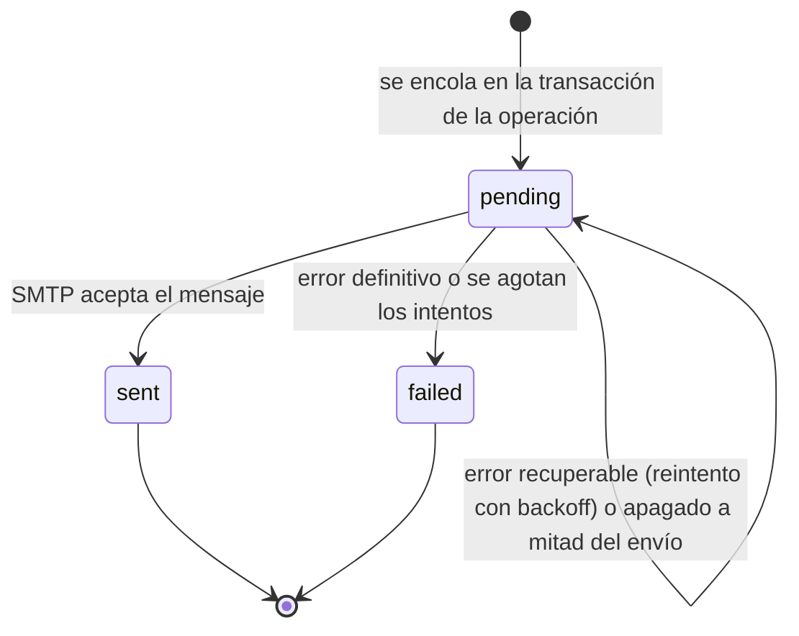

Un apagado a mitad del envío (`context.Canceled`) deja el mensaje exactamente como estaba:
`pending`, sin sumar `attempts` ni mover `next_attempt_at` (§9.4).

---

## 5. Invariantes del diseño

Propiedades que se rompen **sin que falle la compilación**. Cada una tiene al menos un test que
la vigila.

| ID | Invariante | Dónde vive | Test |
|---|---|---|---|
| INV-01 | Toda tabla del esquema `app` tiene RLS **habilitada y forzada**. Toda tabla con columna `tenant_id` la tiene `NOT NULL` y tiene la política `tenant_isolation` (`tenant_id = app.current_tenant_id()`, `USING` y `WITH CHECK`). | Migraciones | T-B107, T-B110 |
| INV-02 | `crm_app` no tiene ningún privilegio sobre tablas: toda query fuera de `InTenantTx`/`InSystemTx` falla con `permission denied` (falla cerrada). | Bootstrap + migraciones | T-B103, T-B107 |
| INV-03 | Una transacción se asocia como máximo a **una** empresa: `Tx.AsTenant` con otra empresa devuelve `ErrTenantAlreadyBound`. `SET ROLE` solo existe como `SET LOCAL` dentro de `platform/db`. | `platform/db` | T-B103, T-B011 |
| INV-04 | Toda query sqlc sobre una tabla de empresa filtra por `tenant_id` con parámetro explícito, además de la RLS. Las únicas excepciones son las queries listadas por nombre de los cuatro archivos de §4.4 (ruta exacta). | `*/store/*.sql` | T-B112, T-B804 |
| INV-05 | Los roles de sistema solo tienen privilegios sobre las columnas de ruteo declaradas en `data-model.md` §3.4; nunca sobre columnas de negocio. | Migraciones | T-B109 |
| INV-06 | Ningún rol de runtime tiene `BYPASSRLS`, `SUPERUSER` ni es dueño de tablas. Solo `crm_owner` es dueño, y no se usa en runtime. | Bootstrap + función de aprovisionamiento | T-B101, T-B107 |
| INV-07 | Toda FK entre tablas de empresa es **compuesta** con `tenant_id` (`(tenant_id, user_id) → users(tenant_id, id)`): la base impide referencias entre empresas. | Migraciones | T-B108 |
| INV-08 | Las vistas se crean con `security_invoker = true`. Las únicas funciones `SECURITY DEFINER` viven en el esquema `provisioning`, con `search_path` fijo y `EXECUTE` revocado a `PUBLIC`. | Migraciones | T-B107 |
| INV-09 | Tokens de sesión y de un solo uso se guardan solo como SHA-256; el valor en claro existe únicamente en la cookie o en el email. El payload del outbox se borra al pasar a `sent` o `failed` (lo obliga un `CHECK`). | `identity`, `outbox` | T-B205, T-B211, T-B307 |
| INV-10 | Cada empresa tiene siempre al menos un Administrador **activo**. Todo cambio de rol o estado de un usuario (incluida la reactivación y la reinvitación con otro rol) toma primero `SELECT … FROM tenants … FOR UPDATE`. | `identity.Service` | T-B601, T-B603, T-B604 (con concurrencia) |
| INV-11 | Pasar un usuario a `disabled` revoca en la **misma transacción** todas sus sesiones y tokens pendientes; la resolución de sesión verifica en cada request que el usuario siga `active`. | `identity` | T-B307, T-B604 |
| INV-12 | La autorización por permiso se decide **antes** de buscar el recurso y no depende de su existencia. Un recurso de otra empresa responde `404`, nunca `403`. | `authz`, handlers | T-B207, T-B801, T-B802 |
| INV-13 | Login y pedido de reset responden igual (status, cuerpo, bloqueo y costo de hash) exista o no el email, y cualquiera sea su estado. Se mantiene aunque el registro confirme la existencia de un email (DD-19). | `identity.Service` | T-B402, T-B404, T-B501, T-B506 |
| INV-14 | El registro es atómico: rol de PostgreSQL, empresa, admin, configuración de plantilla, token, outbox, sesión y auditoría se crean todos o ninguno. | `tenant.Service` | T-B303 |
| INV-15 | `audit_log` es append-only: el rol de empresa solo tiene `SELECT, INSERT`. | Migraciones | T-B107, T-B209 |
| INV-16 | Ningún email se envía dentro del request: toda notificación se encola en el outbox dentro de la transacción de la operación. | `identity`, `outbox` | T-B211, T-B303, T-B601 |
| INV-17 | La base nunca referencia un objeto de logo inexistente: se sube a S3 **antes** del `COMMIT` y el objeto anterior se borra **después**. | `tenant.Service` | T-B703 |
| INV-18 | Los tests de integración se conectan como `crm_app`, nunca como superusuario (un superusuario ignora la RLS y haría pasar los tests de aislamiento en falso). | `internal/testsupport/pgtest` | T-B009 |
| INV-19 | Una violación de RLS o de privilegio (`SQLSTATE 42501`) es un bug: se responde `500`, se loguea con `level=ERROR` y `security_event=rls_violation`, nunca se traduce a `403`/`404`. La única excepción acotada es el reintento de INV-27. | `platform/db`, `platform/httpx` | T-B105 |
| INV-20 | El `409 email_already_registered` del registro nunca incluye datos de la cuenta existente (empresa, nombre, estado, fechas) y es idéntico byte a byte (salvo `instance`) cualquiera sea el estado del usuario existente. | `tenant` HTTP | T-B305 |
| INV-21 | Ninguna respuesta con datos de una empresa se reutiliza desde la caché del navegador sin preguntarle al servidor: todo `/api/v1` lleva `Cache-Control: no-store`, salvo `GET /tenant/logo`, que lleva `private, no-cache` con un `ETag` distinto por objeto (y por lo tanto por empresa). | Router chi, `tenant` HTTP | T-B203, T-B705, T-B801 |
| INV-22 | Una ruta bajo `/api/` nunca llega al handler de la SPA (un `/api/…` inexistente es `404 problem+json`), y la SPA nunca queda registrada en el router chi. | `internal/app` (mux raíz) | T-B004, T-F007 |
| INV-23 | La cookie de sesión se emite **siempre** como `__Host-crm_session` con `Secure`, `HttpOnly`, `SameSite=Lax`, `Path=/` y sin `Domain`, en todos los entornos: no existe configuración que la emita de otra forma, y `APP_BASE_URL` siempre es `https://` (DD-24). | `platform/config`, `identity` HTTP | T-B002, T-B305, T-B404 |
| INV-24 | Ningún logo guardado supera 2 097 152 bytes ni 2000×2000 px, ni es de otro tipo que PNG o JPEG, lo haya subido la SPA u otro cliente: el servidor valida por sí mismo y no depende de que el navegador haya achicado o vuelto a codificar la imagen (DD-11, DD-31). | `tenant` (HTTP y servicio) | T-B703, T-B705 |
| INV-25 | La IP del cliente sale **solo** de `httpx.ClientIP` (DD-32): ningún otro código lee `X-Forwarded-For`, `Forwarded` ni `X-Real-IP`, y `X-Forwarded-For` se ignora por completo si la conexión no viene de un proxy de `TRUSTED_PROXIES`. Logs, rate limit, `sessions.ip` y `audit_log.ip` usan ese valor. | `platform/httpx` | T-B011, T-B219 |
| INV-26 | La transacción de registro corre con `lock_timeout = 2s` y no hace E/S de red entre `provision_tenant_role` y el `COMMIT` (DD-33): la espera por el lock de `crm_tenant` termina en un `503` reintentable, nunca en un `500` ni en un `statement_timeout`. | `tenant.Service` | T-B303, T-B905 |
| INV-27 | Todo cambio de rol en `platform/db` manda, en el mismo viaje de red, la lectura de catálogo de DD-34 antes del `SET LOCAL ROLE`. Un `42501` en el cambio de rol se reintenta **solo** si es el `SET LOCAL ROLE` inicial de `InTenantTx`, **una** vez y **antes** de ejecutar `fn` (que por lo tanto corre como mucho una vez). En cualquier otro punto (`InSystemTx`, `AsTenant`, `AsSystem`, dentro de `fn`) se propaga como `db.ErrPrivilege` (INV-19). | `platform/db` | T-B103 |

---

## 6. Decisiones locales de esta feature (`DD-n`)

Las decisiones estructurales están en `docs/adr/` (ADR-001 a ADR-014; la SPA en ADR-019). Estas
son locales a 001.

| ID | Decisión | Por qué | Trade-off |
|---|---|---|---|
| **DD-1** | El "usuario invitado" es una fila de `users` con `status = invited`, sin nombre ni contraseña; la invitación es un `user_tokens` de propósito `invitation`. No hay tabla `invitations`. | La spec define `invitado` como estado del `User`; una sola lista de usuarios; menos conceptos. | Un email invitado queda reservado globalmente hasta que se acepte o se desactive. |
| **DD-2** | Email **único global** (`users_email_key`) y normalizado (trim + minúsculas). | Un usuario pertenece a una sola empresa (Clarificaciones); el login es por email sin elegir empresa. | Cuando se permitan varias empresas por usuario habrá que separar identidad y membresía (fuera del MVP). |
| **DD-3** | Plantillas de rubro: catálogo embebido en el binario (código, nombre, versión) + puerto `industrytemplate.Seeder` invocado **dentro** de la transacción de registro. En 001 el seeder no precarga nada: se registra el código y la versión en `tenants`; 002 implementa la precarga, **con la restricción R-c de DD-33**. | Principio II (datos, no código por rubro); atomicidad; 001 no invade 002. | Hasta 002, "se precarga la configuración" (Historia 1.1) se cumple solo en el registro del código de plantilla. |
| **DD-4** | Registro y aceptación de invitación inician sesión en el mismo response (`201` + cookie). La verificación de email **no bloquea nada** (P-2, resuelta): `/me` expone `email_verified` y la UI muestra un aviso hasta verificar. | SC-001 (panel en < 3 min); una pantalla. | Una cuenta puede operar con email no verificado. |
| **DD-5** | Invitar un email que ya está `invited` **en la misma empresa** reemite la invitación (revoca el token anterior, crea uno nuevo de 7 días) y responde `200`. Si el rol pedido es distinto, además lo cambia (DD-26). | Sin esto, una invitación vencida deja el email reservado sin salida. No agrega endpoint. | Reinvitar y "reenviar" son la misma acción. |
| **DD-6** | Contraseñas: mínimo 10 caracteres, máximo 128, sin reglas de composición; se rechazan si son iguales al email. | Las guías actuales desaconsejan reglas de composición; 128 acota el costo del hash. | Algunas guías recientes piden mínimos mayores para contraseñas de un solo factor (verificar la revisión vigente de NIST SP 800-63B); se prioriza la carga desde el celular. |
| **DD-7** | Bloqueo: contador por **HMAC-SHA256(email normalizado)** en `login_throttles`, exista o no la cuenta. 5 fallos seguidos → `locked_until = now + 15 min`; los intentos durante el bloqueo no lo extienden ni verifican contraseña; al vencer se reinicia el contador; un login exitoso o un reset de contraseña lo borra. | Bloqueo indistinguible para emails inexistentes; HMAC evita guardar en claro emails que no son usuarios. Se mantiene tras P-4 (DD-19). | Cualquiera puede bloquear 15 min una cuenta ajena (aceptado por la spec); se acota con rate limit por IP (DD-9). |
| **DD-8** | Login de usuario `disabled` con contraseña **correcta** → `403 account_disabled`; con contraseña incorrecta → `401` genérico. Usuario `invited` → siempre `401` genérico. | Quien conoce la contraseña merece saber por qué no entra; no filtra nada a quien no la conoce. | — |
| **DD-9** | Rate limit en memoria por IP (token bucket, `golang.org/x/time/rate`): **signup 5/h por IP, contando éxitos y rechazos** (es la mitigación principal de la enumeración aceptada en DD-19), login 20/min, password-reset 5/h (y 3/h por email), invitations/preview y accept 20/h, email-verification 20/h. Excedido → `429 rate_limited` + `Retry-After`. La IP es la de `httpx.ClientIP` y, en IPv6, la clave es el prefijo /64 (DD-32). | Una sola instancia (S-1); cero infraestructura extra. | Con varias instancias el límite es por instancia; un atacante con muchas IPs enumera más rápido (se detecta con la métrica de DD-19). Valores ajustables por configuración. |
| **DD-10** | Sesión: expira a las **24 h sin uso** o a los **7 días** desde el login, lo que ocurra primero (P-5, elección del usuario). `last_seen_at` se actualiza como máximo cada 5 minutos. Cookie con `Max-Age = 604800`. | Ventana de exposición corta ante un dispositivo perdido o compartido en obra/taller. | Quien no usa la app un día vuelve a iniciar sesión; la expiración por inactividad tiene una tolerancia de hasta 5 min. |
| **DD-11** | Logo: solo PNG y JPEG (detección por *magic bytes*, no por extensión ni `Content-Type`), archivo de **hasta 2 097 152 bytes (2 MiB)** y 2000×2000 px, subido como `multipart/form-data` (límites exactos y del cuerpo en DD-31, H-11). Se sirve por el backend (`GET /tenant/logo`) con `Content-Type` fijo y `nosniff`, sin URLs prefirmadas, con la política de caché de DD-23. Clave: `tenants/{tenant_id}/logo/{uuidv7}.{png\|jpg}`. El navegador achica las fotos grandes y **vuelve a codificar todo JPEG** antes de subirlo (decisiones del usuario sobre el frontend, DD-F11 y DD-F21 de `ui.md`); **los límites del backend no cambian** y el servidor valida por sí mismo sin depender de eso (INV-24). Los bytes validados se guardan **sin modificar**: el servidor no quita metadatos EXIF ni aplica la orientación (R-13). | SVG permite scripts; las librerías de PDF (005) soportan PNG/JPEG; servir por backend mantiene el bucket privado y sin CORS. No decodificar la imagen completa en el servidor evita superficie de DoS. | El backend transfiere los bytes del logo (volumen despreciable); un cliente que no sea la SPA puede subir un JPEG con EXIF. |
| **DD-12** | Logs estructurados con `log/slog` en JSON; cada request lleva `request_id`, `tenant_id`, `user_id`, `route`, `status`, `duration_ms` e `ip` (la de `httpx.ClientIP`, DD-32). `route` es el patrón chi en la API, `ops` en health checks y `spa` en el resto (nunca la URL cruda). Nunca se loguean contraseñas, tokens, cookies ni payloads del outbox. | Librería estándar; operable. | Sin trazas distribuidas (un solo proceso). |
| **DD-13** | Verificación de email: token de 48 h; reenviable con `POST /auth/email-verification/resend` (autenticado). Aceptar una invitación marca el email como verificado (el token llegó a ese email). | Cierra Historia 1.3 sin bloquear el uso. | 48 h es un supuesto. |
| **DD-14** | Los enlaces de los emails llevan el token en el **fragmento** (`{APP_BASE_URL}{APP_LINK_*}#token=…`), y la SPA lo envía en el body de un `POST`. Rutas confirmadas por el usuario (en inglés): `APP_LINK_RESET=/reset-password`, `APP_LINK_VERIFY=/verify-email`, `APP_LINK_INVITATION=/accept-invitation`; son los defaults de la configuración. | El fragmento no viaja al servidor ni en `Referer`: el token no queda en logs de acceso ni de proxies. | Si `ui.md` cambia una ruta, cambia el default y T-B002/T-B213. |
| **DD-15** | `tenants.base_currency` se fija al registrarse y **no se edita** en 001; `timezone` sí (default `America/Argentina/Buenos_Aires`, o la que envíe el navegador al registrarse; ver DD-27). | La Historia 4 no incluye moneda base; cambiarla tiene efectos en reportes (009). | Si se quiere editar, se agrega en 009 con su análisis. |
| **DD-16** | CUIT opcional; si se informa, 11 dígitos con dígito verificador válido (módulo 11); se guarda sin guiones. | Evita errores de tipeo en los PDF (005). | Validación específica de Argentina: es del país, no del rubro (no afecta el principio II). |
| **DD-17** | El contrato de 001 es la fuente canónica de los componentes compartidos (`Problem`, `ValidationProblem`, `ErrorCode`, `Role`, `Permission`); las specs siguientes los referencian con `$ref` a este archivo. | Un solo lugar para el modelo de errores y los permisos. | Hace falta un paso de *bundle* para que el frontend genere tipos de todas las specs juntas (lo resuelve `ui.md` §11.4). |
| **DD-18** | Toda comparación de vencimientos en queries recibe `now` como parámetro desde `clock.Clock` (no usa `now()` de SQL). Excepción: las políticas de limpieza de `crm_worker`, que usan `now()` a propósito. | Tests deterministas de vencimientos (15 min, 1 h, 24 h, 48 h, 7 días) sin dormir ni manipular el reloj del sistema. | Un parámetro más en esas queries. |
| **DD-19** | **Enumeración aceptada solo en el registro** (P-4). El `409` de `POST /auth/signup` confirma que existe un usuario con ese email (sin ningún otro dato). **Login y pedido de reset se mantienen no enumerables** (INV-13, DD-7): mismas respuestas, hash ficticio, bloqueo por HMAC y `202` constante. Se registra `security_event=signup_email_exists` y la métrica `signup_email_exists_total` para detectar enumeración masiva. | Defensa en profundidad: el registro es el oráculo más lento (5/h por IP, formulario completo, argon2id por intento); simplificar login (20/min) o reset daría oráculos 240 veces más rápidos. Mantener la uniformidad no cuesta nada: ya está diseñada y probada. | Quien quiera saber si un email tiene cuenta puede averiguarlo por el registro, de a pocos por IP. Aceptado por el usuario. |
| **DD-20** | Un pedido de reset para un usuario **`invited`** reemite su invitación (revoca el token anterior, token nuevo de 7 días, email de invitación) en lugar de enviar un enlace de reset; para un usuario **`disabled`** o un email inexistente no se envía nada. La respuesta es siempre `202`. Auditoría `user.invitation_reissued` con actor `NULL` y `data.trigger = "password_reset_request"`. | Coherencia con DD-19: el registro sugiere "recuperar la contraseña" también a quien todavía no aceptó su invitación; sin esto, ese usuario no recibiría nada. Reusa la plantilla y la lógica de reinvitación (DD-5). | Un invitado puede renovar su invitación por su cuenta (solo le llega a su propio email; rate limit 3/h por email). El usuario `disabled` no recibe explicación: debe hablar con su Administrador. |
| **DD-21** | Mismo error de dominio (`identity.ErrEmailTaken`), **distinto `code` HTTP por endpoint**: registro → `409 email_already_registered` con `suggested_action: "password_reset"`; invitación → `409 email_taken` sin acción sugerida. | Semánticas distintas para la UI: el visitante probablemente ya tiene cuenta y puede recuperarla; el Administrador no puede recuperar la cuenta de otra persona. | Dos códigos para la misma condición de base; el mapeo vive en el `http.go` de cada módulo. |
| **DD-22** | **Mux raíz** (H-1): `internal/app` arma un `http.ServeMux` con `/api/` → router chi, `GET /healthz` y `GET /readyz` → ops, `/` → `web.NewHandler(dist)`. Los middlewares comunes (IP del cliente, request id, recover, logging, cabeceras de seguridad, `CrossOriginProtection`) envuelven al mux raíz; `no-store`, rate limit, autenticación y autorización quedan dentro de chi. `/api` sin barra final lo redirige el propio `ServeMux` a `/api/`. El `MethodNotAllowed` de chi responde `405 method_not_allowed` con `Allow` (§9.2). | Registrar la SPA como `/*` en chi rompería T-B004, T-B801 y el test de rutas contra el contrato, y convertiría un `/api/…` inexistente en `index.html`. | Un nivel más de ruteo; dos formas de declarar rutas (stdlib para 3 destinos fijos, chi para la API). |
| **DD-23** | **Caché del logo** (H-2): `GET /tenant/logo` responde `Cache-Control: private, no-cache` y `ETag: "<uuid del objeto>"` (el UUIDv7 de `logo_object_key`, distinto por subida y por empresa). Con `If-None-Match` igual responde `304` sin leer S3. Acepta un parámetro de query opcional `v` que el servidor **ignora** (lo usa la UI para cambiar la URL cuando cambia el logo: `?v={id}-{updated_at}`). | La URL es la misma para todas las empresas: con `max-age` un celular compartido mostraba el logo de la empresa anterior o el viejo tras reemplazarlo. `no-cache` obliga a revalidar siempre; el `ETag` hace que revalidar cueste un `304` sin bytes. | Un request de revalidación por carga del logo (liviano: solo lee la fila de la empresa). |
| **DD-24** | **HTTPS en todos los entornos; TLS propio solo en modo local** (H-3, **revisada por H-10**; decisión del usuario). `APP_BASE_URL` debe ser `https://` (cualquier `http://` es error de configuración) y la cookie es siempre `__Host-crm_session` con `Secure` (INV-23): se **eliminan** la excepción `http://localhost` y la variable `COOKIE_SECURE`. **Modo local** = el host de `APP_BASE_URL` es `localhost` o `127.0.0.1`. Solo en modo local se aceptan `TLS_CERT_FILE` y `TLS_KEY_FILE` (las dos o ninguna): con ellas `crm serve` escucha **HTTPS** en `HTTP_ADDR` con ese certificado (de `mkcert`, §10.5.1); sin ellas escucha HTTP plano (producción detrás del proxy TLS del hosting; `curl` y tests en desarrollo). En modo local **no** se envía `Strict-Transport-Security`. *Versión anterior (reemplazada)*: aceptaba `http://localhost`/`127.0.0.1` con `COOKIE_SECURE=true` y afirmaba que se podía desarrollar con Chrome o Firefox. | Chrome/Chromium rechaza una cookie `__Host-` servida por `http://localhost` y Safari rechaza `Secure` allí (H-10, R-23): la regla anterior no daba sesión en esos navegadores ni en los E2E de Chromium. Con HTTPS local la cookie es la misma que en producción en todos los navegadores, y sin excepciones no hay combinación de variables que emita la cookie sin `Secure`. El TLS de producción es del hosting (P-1): aceptar un certificado solo en modo local evita desplegar uno de desarrollo por error. HSTS en `localhost` podría forzar HTTPS en otros proyectos del desarrollador (S-13). | Instalar mkcert y generar el certificado una vez por equipo (`make dev-certs`), y la CA también en el job de E2E. Sin `TLS_*`, el navegador no tiene sesión en desarrollo (a propósito). |
| **DD-25** | **`User.invitation_expires_at`** (H-4): para un usuario `invited` es el vencimiento de su **última** invitación, **aunque ya haya pasado**; para los demás estados, `null`. La limpieza periódica no borra la invitación abierta de un usuario invitado (solo invitaciones usadas o revocadas, `data-model.md` §3.4). | La UI muestra "Invitación vencida" y ofrece reenviar; sin la fecha no puede distinguir vencida de vigente. | Una fila de `user_tokens` por invitado que nunca aceptó queda sin limpiar mientras siga invitado (volumen despreciable). |
| **DD-26** | **Rol de un invitado** (H-5): reinvitar con otro rol **cambia el rol** (auditoría `user.invitation_reissued` con `data.role` y, además, `user.role_changed {from, to}`); `PUT /users/{id}/role` vale para usuarios `invited` y `active`; para `disabled` responde `409 invalid_state` (se reactiva primero). Todas estas operaciones toman el lock de `tenants`; los invitados no cuentan como Administradores activos, así que cambiar el rol de un invitado nunca dispara `last_admin`. | El Administrador corrige el rol de una invitación sin desactivar y volver a invitar; FR-008 exige auditar todo cambio de rol. | Dos filas de auditoría para una reinvitación con cambio de rol. |
| **DD-27** | **Zona horaria en el registro** (H-6): si `timezone` falta o no es una zona IANA conocida, el registro usa `America/Argentina/Buenos_Aires` en lugar de responder `422`, y lo loguea (`level=INFO`, `event=signup_timezone_defaulted`, sin datos personales). `PATCH /tenant` sigue respondiendo `422 invalid_timezone` (ahí el campo es visible). El binario importa `time/tzdata` (en `cmd/crm`) para conocer todas las zonas aunque el contenedor no tenga `/usr/share/zoneinfo`. | El usuario no puede corregir un campo que no ve; sin `tzdata` embebido, `time.LoadLocation` fallaría para todas las zonas en imágenes mínimas. | Una empresa de otra zona que llega con un navegador mal configurado arranca en la zona por defecto (la corrige en Datos de la empresa); el binario crece unos cientos de KB. |
| **DD-28** | **`Cache-Control: no-store` en toda la API** (H-7): un middleware del router chi lo pone en **todas** las respuestas de `/api/v1` (JSON, problem+json y `204`); la única excepción es `GET /tenant/logo` (`200` y `304`), que usa DD-23. | `/users` y `/tenant` tienen datos personales; en un dispositivo compartido nada de la API debe quedar en la caché del navegador. | Ninguno práctico: la SPA ya cachea en memoria con TanStack Query. |
| **DD-29** | **Cabeceras y compresión de la SPA** (H-8): se adoptan las reglas de ADR-019 / `ui.md` §21.2 (tabla en §10.7). Se **aprueba** `github.com/klauspost/compress/gzhttp` para comprimir con gzip **solo** el handler de la SPA (HTML, JS, CSS, manifest), con el umbral por defecto (1 KB). La API **no** se comprime. Si el hosting pone un proxy que comprime, se quita. | La librería estándar no trae compresión HTTP; `gzhttp` es mantenida, maneja `ETag` y tipos ya comprimidos. Comprimir solo estáticos públicos evita tener que analizar ataques tipo BREACH sobre respuestas con datos personales, y las respuestas JSON de 001 son chicas. | Una dependencia más (aprobada por el usuario) y CPU por request de la SPA (bajo: pocos usuarios, archivos chicos). |
| **DD-30** | **Rechazo de CSRF en problem+json** (H-9): `CrossOriginProtection.SetDenyHandler` responde `403 problem+json` con `code: forbidden` y loguea `security_event=csrf_rejected` (con `ip` y `route`, sin cuerpo). | El frontend trata cualquier `403` con el mismo mapa de errores; el texto plano por defecto caía como "respuesta inesperada". | La UI no distingue un rechazo de CSRF de un permiso faltante (no debería ocurrir con la SPA en el mismo origen). |
| **DD-31** | **Límites exactos de la subida del logo** (H-11, decisión del usuario). Archivo ≤ `LogoMaxBytes` = **2 097 152 bytes** (2 MiB), medido sobre el contenido de la parte `file`. Cuerpo `multipart/form-data` completo ≤ `LogoMaxBodyBytes` = **2 162 688 bytes** (archivo + 64 KiB para *boundary*, encabezados de la parte y nombre de archivo), aplicado con `http.MaxBytesReader` antes de leer. El handler lee con `r.MultipartReader()` **exactamente una** parte `file`: otra parte o una segunda `file` → `400 malformed_request`; sin `file` o vacía → `422` (`file`, `required`). La parte se lee con un tope de `LogoMaxBytes + 1` bytes en memoria: si se llega al byte extra → `413 payload_too_large` sin leer el resto. `tenant.Service.SetLogo` recibe los bytes, vuelve a verificar el tamaño (defensa en profundidad), valida el tipo por firma (`415`) y las dimensiones con `image.DecodeConfig` (`422`, `file`, `invalid_value`). Las constantes viven en `internal/tenant` y **no son configurables**: son parte del contrato. | El cliente necesita un número exacto al que apuntar; medir el archivo y no el cuerpo hace que el límite no dependa del nombre de archivo ni del *boundary* que elige el navegador; `MultipartReader` evita archivos temporales en disco y partes inesperadas (R-24). | Hasta ~2 MiB en memoria por subida concurrente (irrelevante a la escala S-3); tres lugares que mantener alineados: constantes, contrato y la constante del cliente en `ui.md` (matriz §16). |
| **DD-32** | **IP del cliente detrás de proxies** (decisión del usuario, 2026-09-30). Variable `TRUSTED_PROXIES`: lista de CIDR separada por comas, **vacía por defecto** (no se confía en ningún proxy). `0.0.0.0/0`, `::/0` y un CIDR inválido son error de arranque. Un único middleware, `httpx.ClientIP`, **primero** de la cadena común, calcula la IP y la deja en el contexto como `netip.Addr`; la usan el log (`ip`), el rate limit (DD-9), `sessions.ip` y `audit_log.ip` (INV-25). Algoritmo: (1) si `RemoteAddr` no está en `TRUSTED_PROXIES`, la IP es `RemoteAddr` y `X-Forwarded-For` se ignora; (2) si está, se recorre `X-Forwarded-For` de **derecha a izquierda** (varias cabeceras se concatenan en orden) salteando las IPs de confianza: la primera que no es de confianza es la del cliente; (3) si todas son de confianza o no hay cabecera, se usa la de más a la izquierda que sea válida o, si no hay, `RemoteAddr`; (4) si aparece una entrada mal formada antes de encontrar la del cliente, se usa `RemoteAddr` y se loguea `WARN` (`event=bad_forwarded_for`). Se normaliza con `netip.Addr.Unmap()` y sin puerto. Solo se lee `X-Forwarded-For` (no `Forwarded` ni `X-Real-IP`). Clave del rate limit: la IPv4 completa; en IPv6, el prefijo **/64**. | Detrás del proxy del hosting, `RemoteAddr` es el proxy: el rate limit por IP sería global (un atacante agota el cupo de todos) y logs y auditoría quedarían con una IP inútil. Tomar la IP de la izquierda deja que el cliente la invente. Configurable sin conocer todavía el hosting (P-1). Un cliente IPv6 controla al menos un /64 y podría rotar direcciones para esquivar el límite. | Una variable más que configurar al desplegar; si se olvida detrás de un proxy, el rate limit por IP vuelve a ser global (runbook §12.3). Clientes detrás del mismo NAT (p. ej. celulares de una operadora) comparten cupo, igual que antes. |
| **DD-33** | **Serialización de registros por el lock de `GRANT crm_tenant`** (decisión del usuario, 2026-09-30; nota en ADR-005). Desde PostgreSQL 16, el `GRANT crm_tenant TO crm_t_<hex>` de `provision_tenant_role` toma un lock sobre `crm_tenant` hasta el fin de la transacción: los registros concurrentes esperan uno detrás de otro. Se acepta con cuatro restricciones: **R-a** la transacción de registro hace `SET LOCAL lock_timeout = '2s'` antes de aprovisionar; `55P03 lock_not_available` → `db.ErrUnavailable` → `503 service_unavailable` con `Retry-After: 2`, sin crear nada (ni el rol); métrica `signup_lock_timeout_total`. **R-b** desde `provision_tenant_role` hasta el `COMMIT` no hay E/S de red (argon2 antes, email por outbox, nada de S3) y el objetivo es **p95 < 250 ms** (§13, medido en T-B905 con registros concurrentes). **R-c** (restricción heredada para el plan de 002): el `Seeder` corre dentro de esa transacción (INV-14) solo con SQL por conjuntos y dentro del presupuesto de R-b; si el sembrado de 002 no entra, el plan de 002 lo rediseña (p. ej. estado "configuración pendiente" y siembra idempotente después del `COMMIT`). **R-d** `crm tenants reprovision-roles` usa **una transacción por empresa** y no corre en paralelo consigo mismo (advisory lock de sesión; la segunda ejecución termina con un mensaje claro). | No se puede evitar sin romper INV-14 (el rol necesita la membresía antes de insertar sus filas). A la escala del MVP los registros son raros y la transacción dura milisegundos; lo que hay que evitar es que una espera termine en `500` o que una transacción larga (reprovisión en bloque, sembrado pesado) frene todos los registros. | Un pico de registros simultáneos puede dar algunos `503` reintentables; hay que vigilar la duración de la transacción de registro. Si T-B905 no cumple: *pool* de roles pre-creados o alternativa B de ADR-005 (research R-04c). |
| **DD-34** | **Primer `SET ROLE` a una empresa recién aprovisionada desde otra conexión** (hallazgo de implementación y decisión del usuario, 2026-09-30; nota (b) en ADR-005; research R-28). **Evidencia**: en PostgreSQL 18.6, después del `COMMIT` que crea `crm_t_<hex>` y lo concede a `crm_app` con `SET TRUE`, el primer `SET LOCAL ROLE crm_t_<hex>` desde **otra** conexión del pool a veces falla con `42501 permission denied to set role`. Hipótesis del desarrollador (no verificada en el código de PostgreSQL, S-16): la lista de roles "SET-ables" que cada backend guarda en caché (`roles_is_member_of`, `acl.c`) todavía no procesó la invalidación de la membresía nueva. El test `TestTxRunner_NewCompanyIsUsableOnAnyConnectionRightAfterProvisioning` (registros concurrentes) daba **64 a 105 fallas en 600** primeros usos. En producción: "me registro, el siguiente request cae en otra conexión y recibo un `500`". **Dos defensas**: **(1) lectura previa de catálogo** (commit e3d990b): la función privada de `platform/db` que cambia de rol manda en **un solo viaje de red** `SELECT 1 FROM pg_catalog.pg_auth_members LIMIT 0; SET LOCAL ROLE …`. Leer el catálogo hace que el backend procese las invalidaciones pendientes antes del chequeo. Vale para todo cambio de rol (`InTenantTx`, `InSystemTx`, `AsTenant`, `AsSystem`) y para los fixtures de test. Medido: **0 fallas en 1800** en la reproducción y 0 en 8 corridas de la suite de integración. **(2) Un único reintento en `InTenantTx`**: si el `SET LOCAL ROLE` inicial a un rol de empresa falla con `42501` **antes** de ejecutar `fn`, hace `ROLLBACK` y repite la transacción completa (nuevo `BEGIN`, el mismo viaje de (1)) **una** vez. Registra log `WARN` `event=set_role_retry` con `tenant_id` y `outcome` (`recovered` o `failed`, sin datos personales) y suma a la métrica `set_role_retry_total`. **Nunca** reintenta: después de que `fn` empezó, en `InSystemTx`, en `tx.AsTenant`/`tx.AsSystem` a mitad de transacción, ni ante otro SQLSTATE (p. ej. `22023`, rol inexistente en PostgreSQL 18, que es el caso de §12.4). Si el reintento también falla, devuelve `db.ErrPrivilege` envuelto con el nombre del rol y el paso (`set role crm_t_…`), así el `ERROR` de INV-19 distingue un cambio de rol denegado de una violación de RLS dentro de una query (INV-27). | **(1) sola** depende de un comportamiento interno no documentado de PostgreSQL (R-17). **(2) sola** cubre solo `InTenantTx` y paga un viaje fallido en cada primer uso. Juntas, (1) resuelve el caso en todos los caminos y (2) es la red si (1) deja de alcanzar en otra versión. **El reintento es seguro solo en ese punto**: la transacción todavía no ejecutó nada (solo `BEGIN` y el cambio de rol que falló), así que el `ROLLBACK` no deshace trabajo, `fn` corre como mucho una vez y ningún efecto externo quedó hecho. Después de `fn`, un `42501` puede ser una violación real de RLS (INV-19) y reintentar repetiría efectos. En `InSystemTx` las membresías son fijas desde el bootstrap, así que un `42501` es un bug. En `AsTenant` la transacción ya ejecutó la fase 1 y reintentar exigiría repetir `fn`. | Una sentencia más por cambio de rol, en el mismo viaje de red (costo a confirmar en T-B905). Dependencia de un detalle interno de PostgreSQL, vigilada por el test de reproducción (corre en `make check`) y por la métrica. **Cobertura parcial del reintento**: el camino `InSystemTx(crm_auth) → AsTenant` (resolución de sesión, login, tokens) queda cubierto **solo** por (1), y es justamente el del `GET /me` que sigue al registro. Si (1) fallara ahí, el usuario vería un `500` hasta el siguiente request. Salida estructural si R-17 se materializa: *pool* de roles pre-creados (la membresía se concede mucho antes del primer uso) o alternativa B de ADR-005. |

---

## 7. Modelo de datos (resumen)

Detalle completo en [`data-model.md`](data-model.md).

| Tabla | Qué guarda | `tenant_id` | Borrado |
|---|---|:---:|---|
| `tenants` | La empresa: nombre, datos fiscales y de contacto, logo, moneda base, zona horaria, plantilla | (es `id`) | Nunca |
| `users` | Usuarios: email, nombre, hash, rol, estado | ✔ | Nunca |
| `sessions` | Sesiones: hash del token, vencimientos (24 h sin uso / 7 días), revocación | ✔ | Limpieza 30 días después de vencer |
| `user_tokens` | Tokens de un solo uso: verificación, reset, invitación | ✔ | Limpieza 30 días después de vencer, salvo la invitación abierta de un invitado (DD-25) |
| `outbox_messages` | Emails pendientes/enviados | ✔ | Limpieza 30 días después de `sent`/`failed` |
| `audit_log` | Auditoría append-only | ✔ | Nunca |
| `login_throttles` | Contador de intentos por HMAC de email | ✘ (ver Constitution Check) | Limpieza 24 h sin fallos |

---

## 8. Contrato de API

**Canónico**: [`contracts/openapi.yaml`](contracts/openapi.yaml) (OpenAPI 3.1, versión 0.4.0). Los
tipos del cliente se derivan de él; los handlers Go se escriben a mano y los tests validan cada
request y response contra el contrato (ADR-014). Si este plan y el YAML se contradicen, **manda
el YAML** y este plan está desactualizado. DD-34 no cambia el contrato: si el reintento no alcanza,
la respuesta sigue siendo el `500 internal` que ya describe.

Base: `/api/v1`. Cookie de sesión: `__Host-crm_session`, siempre `Secure`. Todas las respuestas de
la API llevan `Cache-Control: no-store`, salvo el logo (DD-28, DD-23).

| Método | Ruta | Propósito | Auth | Permiso | Éxito | Errores |
|---|---|---|---|---|---|---|
| GET | `/industry-templates` | Plantillas para el formulario de registro | — | — | 200 | 429 |
| POST | `/auth/signup` | Registrar empresa + admin (inicia sesión) | — | — | 201 | 409 `email_already_registered`, 415, 422, 429, 503 (con `Retry-After`, DD-33) |
| POST | `/auth/login` | Iniciar sesión | — | — | 200 | 401 `invalid_credentials`, 403 `account_disabled`, 422, 429 `login_locked`/`rate_limited` |
| POST | `/auth/logout` | Cerrar la sesión actual | opcional | — | 204 | — |
| POST | `/auth/password-reset` | Pedir enlace de reset (o reemisión de invitación, DD-20) | — | — | 202 | 422, 429 |
| POST | `/auth/password-reset/confirm` | Definir nueva contraseña | — | — | 204 | 400 `token_invalid`, 422, 429 |
| POST | `/auth/email-verification/confirm` | Verificar email | — | — | 204 | 400 `token_invalid`, 429 |
| POST | `/auth/email-verification/resend` | Reenviar verificación | sí | — | 202 | 401, 429 |
| POST | `/auth/invitations/preview` | Ver datos de una invitación | — | — | 200 | 400 `token_invalid`, 429 |
| POST | `/auth/invitations/accept` | Aceptar invitación (inicia sesión) | — | — | 201 | 400 `token_invalid`, 422, 429 |
| GET | `/me` | Usuario (incluido `email_verified`), empresa y permisos de la sesión | sí | — | 200 | 401 |
| GET | `/tenant` | Datos de la empresa | sí | — | 200 | 401 |
| PATCH | `/tenant` | Editar datos de la empresa | sí | `settings.manage` | 200 | 401, 403, 422 |
| GET | `/tenant/logo` | Imagen del logo (`?v=` opcional e ignorado; `If-None-Match`) | sí | — | 200 / 304 | 401, 404 |
| PUT | `/tenant/logo` | Subir/reemplazar logo (archivo ≤ 2 097 152 bytes, cuerpo ≤ 2 162 688, DD-31) | sí | `settings.manage` | 200 | 400, 401, 403, 413, 415, 422 |
| DELETE | `/tenant/logo` | Quitar logo | sí | `settings.manage` | 204 | 401, 403 |
| GET | `/users` | Listar usuarios de la empresa | sí | `settings.manage` | 200 | 401, 403 |
| POST | `/users/invitations` | Invitar (o reinvitar, con cambio de rol si corresponde) | sí | `settings.manage` | 201 / 200 | 401, 403, 409 `email_taken`, 422 |
| PUT | `/users/{userId}/role` | Cambiar rol (usuarios `invited` o `active`) | sí | `settings.manage` | 200 | 401, 403, 404, 409 `last_admin`/`invalid_state`, 422 |
| POST | `/users/{userId}/deactivate` | Desactivar | sí | `settings.manage` | 200 | 401, 403, 404, 409 `last_admin`/`invalid_state` |
| POST | `/users/{userId}/reactivate` | Reactivar (P-3, confirmado) | sí | `settings.manage` | 200 | 401, 403, 404, 409 `invalid_state` |
| GET | `/healthz` | Liveness (fuera de `/api/v1`, en el mux raíz) | — | — | 200 | — |
| GET | `/readyz` | Readiness: BD alcanzable y migraciones al día (mux raíz) | — | — | 200 | 503 |

Todas las rutas pueden responder `5XX` (`500 internal`, `503 service_unavailable`); las que
reciben JSON, además `400 malformed_request` y `415`; los métodos no seguros, `403 forbidden` si
`CrossOriginProtection` los rechaza (DD-30); cualquier ruta existente con un método que no admite,
`405 method_not_allowed` con la cabecera `Allow` (regla global del contrato).

Las rutas de la SPA (`/`, `/login`, `/reset-password`, `/settings/users`, …) no son parte del
contrato: las sirve el paquete `web` fuera de `/api/` (DD-22, ADR-019).

---

## 9. Modelo de errores

Formato: RFC 9457 `application/problem+json` (ADR-009). Campos: `type` (URI relativa
`/problems/{code}`), `title` (en español, genérico), `status`, `detail` (opcional, en español,
sin datos internos), `instance` (request id), **`code`** (estable, en inglés: es lo que usa el
frontend), en validaciones `errors[]` con `{field, code}` y, cuando la UI puede ofrecer una
salida, **`suggested_action`** (enum estable; en 001 solo `password_reset`).

### 9.1 Taxonomía

| `code` | HTTP | Tipo | Cuándo | ¿Reintentar? |
|---|---|---|---|---|
| `malformed_request` | 400 | Rechazo definitivo | JSON inválido, campos desconocidos; multipart mal formado o con partes distintas de una sola `file` (DD-31) | No, corregir |
| `validation_failed` | 422 | Rechazo definitivo | Payload bien formado pero inválido (email, contraseña corta, CUIT, zona horaria en `PATCH /tenant`; logo sin archivo, ilegible o de más de 2000×2000 px con `field = file`) | No, corregir |
| `unsupported_media_type` | 415 | Rechazo definitivo | Falta `Content-Type: application/json`, o logo no PNG/JPEG | No |
| `payload_too_large` | 413 | Rechazo definitivo | Body > límite: logo con archivo > 2 097 152 bytes o cuerpo multipart > 2 162 688 bytes (DD-31); JSON > 64 KB | No |
| `unauthenticated` | 401 | Rechazo definitivo | Sin sesión, sesión inválida, vencida o revocada | Iniciar sesión |
| `invalid_credentials` | 401 | Rechazo definitivo | Email o contraseña incorrectos (mensaje único) | Sí, con otros datos |
| `account_disabled` | 403 | Rechazo definitivo | Usuario desactivado con contraseña correcta | No |
| `forbidden` | 403 | Rechazo definitivo | Operador en recurso de Administrador, o request de origen cruzado rechazado por `CrossOriginProtection` (DD-30) | No |
| `not_found` | 404 | Rechazo definitivo | No existe **o es de otra empresa**; ruta inexistente bajo `/api/` | No |
| `method_not_allowed` | 405 | Rechazo definitivo (error de programación del cliente) | La ruta existe bajo `/api/` pero no con ese método; lleva la cabecera `Allow` con los métodos que sí admite | No, corregir el cliente |
| `email_already_registered` | 409 | Rechazo definitivo | **Registro** con un email que ya tiene usuario. `title`: "Ya existe un usuario con ese email"; `detail`: "Ya existe un usuario con ese email. ¿Querés recuperar la contraseña?"; `suggested_action: "password_reset"` (DD-19, DD-21, INV-20) | No; ofrecer recuperar la contraseña |
| `email_taken` | 409 | Rechazo definitivo | **Invitación** con un email que ya tiene usuario (en esta u otra empresa) | No, otro email |
| `last_admin` | 409 | Rechazo definitivo | Desactivar o bajar al último Administrador activo | No |
| `invalid_state` | 409 | Rechazo definitivo | Transición no válida (p. ej. reactivar un activo, cambiar el rol de un desactivado) | No |
| `token_invalid` | 400 | Rechazo definitivo | Token inexistente, vencido, usado o revocado (un solo código para no filtrar cuál) | No, pedir otro |
| `login_locked` | 429 | **Recuperable** | Bloqueo de 15 min vigente | Sí, después de `Retry-After` |
| `rate_limited` | 429 | **Recuperable** | Límite por IP/email | Sí, después de `Retry-After` |
| `service_unavailable` | 503 | **Recuperable** | BD no disponible, timeout de BD, S3 caído al subir logo, espera por el lock del registro vencida (`55P03`, con `Retry-After`, DD-33), cancelación interna (apagado del proceso) | Sí, con backoff |
| `internal` | 500 | Bug | Error no previsto, incluida violación de RLS (INV-19) y un cambio de rol denegado que el reintento de DD-34 no resolvió (o que no se reintenta, INV-27) | No automático |

**Cliente que se fue** (el contexto del request está cancelado): no hay `code` ni respuesta; el
servidor no escribe nada y lo registra como `status=499` solo en el log (§9.2, R-27).

### 9.2 Propagación

```
store (sqlc/pgx) ──► platform/db.MapError ──► errores de dominio ──► handler ──► httpx.WriteProblem
   pgx.ErrNoRows        db.ErrNotFound          identity.ErrUserNotFound       404 not_found
   23505 + constraint   db.ErrUniqueViolation   identity.ErrEmailTaken         409 email_already_registered (signup)
                                                                               409 email_taken (invitación)
   42501 (RLS/priv)     db.ErrPrivilege         (no se traduce)                500 internal + alerta
   conexión / timeout   db.ErrUnavailable       (no se traduce)                503 service_unavailable
   55P03 (lock_timeout) db.ErrUnavailable       (no se traduce)                503 service_unavailable + Retry-After (registro)
   context.Canceled     db.ErrCanceled          (no se traduce)                cliente se fue: sin respuesta, log INFO 499
                                                                               cancelación interna: 503 service_unavailable
```

- Orden de clasificación en `MapError`: primero `errors.Is(err, context.Canceled)` →
  `ErrCanceled` (aunque el error también traiga `57014`); después `context.DeadlineExceeded`,
  errores de conexión y `57014` (`statement_timeout`) → `ErrUnavailable`; `55P03` →
  `ErrUnavailable`; `42501` → `ErrPrivilege`; `23505` → `ErrUniqueViolation`. La firma no cambia
  (`MapError(err error) error`): la decisión "¿el cliente se fue?" la toma la capa HTTP mirando
  `r.Context().Err()`, no `platform/db`.
- **`42501` en el cambio de rol** (DD-34, INV-27): el reintento vive **dentro** de
  `InTenantTx`, antes de que el error llegue a `MapError`; lo que sale de ahí (si el reintento
  también falló, o si el `42501` vino de `InSystemTx`/`AsTenant`/`AsSystem`) es un
  `db.ErrPrivilege` envuelto con el paso y el nombre del rol, y sigue el camino normal de INV-19.
- `httpx` escribe el problem+json y tiene el mapeo por defecto de los errores de `platform/db`,
  el `404`/`405` del router chi y el rechazo de CSRF (DD-30). Ante `db.ErrCanceled`:
  si `r.Context().Err() != nil` no escribe cuerpo, marca `status=499` para el log de request
  (`level=INFO`, `event=client_canceled`, métrica `http_client_canceled_total`) y **nunca** loguea
  `ERROR`; si no, responde `503 service_unavailable`.
- **`405` y la cabecera `Allow`** (verificado en el código de chi v5.3.2, `mux.go`: el manejador
  de `405` por defecto de chi agrega `Allow`, pero un manejador propio registrado con
  `MethodNotAllowed` se invoca **sin** la lista de métodos, porque `Context.methodsAllowed` no es
  exportado). El manejador propio del router de la API arma `Allow` preguntándole al router, para
  cada método de una lista fija (`GET`, `HEAD`, `POST`, `PUT`, `PATCH`, `DELETE`, `OPTIONS`),
  `router.Match(chi.NewRouteContext(), método, r.URL.Path)`, y responde `405` problem+json con
  `code: method_not_allowed`. Es lo que ya hace `internal/app/root.go`; solo cambia el `code`
  (antes `malformed_request`). Un método que chi no conoce (p. ej. `FOO`) llega al mismo manejador
  y recibe la misma respuesta. Fuera de `/api/`, el `405` lo dan el `ServeMux` (ops) y el handler
  de la SPA, en texto plano.
- El único lugar que conoce códigos HTTP es la capa HTTP de cada módulo (`http.go`), a través de
  una tabla de mapeo **por endpoint** cuando el mismo error de dominio tiene distinto significado
  para la UI (DD-21).
- En la subida del logo, el `*http.MaxBytesError` del cuerpo y el tope de lectura de la parte se
  mapean a `413` en `tenant/http.go`; `ErrLogoTooLarge` del servicio también (DD-31).
- Los errores se envuelven con `fmt.Errorf("...: %w", err)` para conservar la causa en los logs;
  la respuesta HTTP nunca incluye el mensaje envuelto.
- Fuera de `/api/`, el handler de la SPA responde texto plano (`404` de un archivo inexistente,
  `405`, `503` sin `index.html`): no son respuestas de la API y no usan problem+json (ADR-019).

### 9.3 Errores centinela (firmas)

```go
// internal/platform/db
var (
    ErrNotFound           = errors.New("db: not found")
    ErrUniqueViolation    = errors.New("db: unique violation")   // envuelto en *ConstraintError
    ErrPrivilege          = errors.New("db: insufficient privilege or RLS violation") // incluye SET ROLE denegado (DD-34)
    ErrUnavailable        = errors.New("db: unavailable")        // conexión, timeouts, 57014, 55P03
    ErrCanceled           = errors.New("db: canceled")           // context.Canceled (el cliente se fue o apagado)
    ErrTenantAlreadyBound = errors.New("db: transaction already bound to another tenant")
)
type ConstraintError struct {
    Constraint string
    Err        error // ErrUniqueViolation u otro
}

// internal/identity
var (
    ErrInvalidCredentials = errors.New("identity: invalid credentials")
    ErrAccountDisabled    = errors.New("identity: account disabled")
    ErrEmailTaken         = errors.New("identity: email taken") // signup → email_already_registered; invitación → email_taken
    ErrTokenInvalid       = errors.New("identity: token invalid")
    ErrLastAdmin          = errors.New("identity: last active admin")
    ErrInvalidTransition  = errors.New("identity: invalid status transition") // incluye cambiar el rol de un disabled
    ErrUserNotFound       = errors.New("identity: user not found")
    ErrUnauthenticated    = errors.New("identity: unauthenticated")
)
type LockedError struct{ RetryAfter time.Duration }

// internal/tenant
var (
    ErrUnknownTemplate     = errors.New("tenant: unknown industry template")
    ErrLogoTooLarge        = errors.New("tenant: logo too large")                                   // 413
    ErrLogoUnsupportedType = errors.New("tenant: logo type not allowed")                             // 415
    ErrLogoInvalidImage    = errors.New("tenant: logo is not a valid image or exceeds dimensions")  // 422 file invalid_value
    ErrLogoNotFound        = errors.New("tenant: no logo")
)

// internal/authz
var ErrForbidden = errors.New("authz: forbidden")

// internal/platform/outbox
type PermanentError struct{ Err error } // el Mailer lo devuelve para fallos definitivos

// internal/platform/httpx
type SuggestedAction string
const SuggestedPasswordReset SuggestedAction = "password_reset"
// WriteProblem acepta opciones; una de ellas agrega suggested_action al problem+json.
func CSRFDenyHandler(log *slog.Logger) http.Handler // 403 problem+json code forbidden (DD-30)
func MethodNotAllowed(w http.ResponseWriter, r *http.Request) // 405 code method_not_allowed; Allow lo fija el llamador
```

### 9.4 Errores del worker (recuperable vs definitivo)

| Situación | Clasificación | Efecto |
|---|---|---|
| Timeout o conexión SMTP rechazada, respuesta `4xx` | Recuperable | `attempts+1`, `next_attempt_at` con backoff (1, 5, 15, 60 min, 6 h); `status` sigue `pending` |
| Respuesta SMTP `5xx` (destinatario inválido, rechazo permanente) | Definitivo | `status = failed`, payload borrado, log `WARN` |
| 8 intentos recuperables fallidos | Definitivo | `status = failed`, payload borrado, log `ERROR` |
| Plantilla inexistente o payload inválido | Definitivo (bug) | `status = failed`, log `ERROR` |
| Apagado del proceso a mitad del envío (`context.Canceled`, `db.ErrCanceled`) | **Ninguno de los dos** | El mensaje queda exactamente como estaba: `pending`, sin sumar `attempts`, sin mover `next_attempt_at`, sin `last_error`; log `INFO` (`outcome=canceled`). Se reintenta en el próximo arranque |
| SMTP aceptó pero el `COMMIT` falló | — | Reenvío en el próximo ciclo: **entrega al menos una vez** (aceptado; los enlaces son de un solo uso) |

El worker lee y marca cada mensaje con `InSystemTx(crm_worker)` → `AsTenant`: un `42501` al
cambiar al rol de una empresa recién creada **no** se reintenta dentro de la transacción
(INV-27); el mensaje queda `pending` y el ciclo siguiente lo vuelve a tomar.

---

## 10. Seguridad

### 10.1 Autenticación y sesión

- Contraseñas: argon2id en formato PHC con parámetros mínimos de OWASP (m = 19 MiB, t = 2,
  p = 1), sal aleatoria de 16 bytes; *rehash* al iniciar sesión si los parámetros guardados son
  más débiles que los vigentes (ADR-007). La verificación corre bajo un **semáforo** de
  concurrencia (default 4) para que una ráfaga de logins no agote la memoria (19 MiB por hash).
- Token de sesión: 32 bytes de `crypto/rand`, base64url en la cookie; en la base, SHA-256.
- Cookie: `__Host-crm_session`; `HttpOnly; Secure; SameSite=Lax; Path=/`, sin `Domain`,
  `Max-Age=604800` (7 días, el vencimiento absoluto). `Secure` **siempre**, en todos los entornos:
  no hay variable que lo quite (INV-23, DD-24).
- Vencimiento: **24 h sin uso** o **7 días** desde el login, lo primero que ocurra (DD-10, P-5).
- Sin fijación de sesión: el token siempre lo genera el servidor al autenticar; una cookie
  entrante nunca se reutiliza como sesión nueva.
- Revocación: logout (esa sesión), reset de contraseña (todas las del usuario), desactivación
  (todas). Cambio de rol: no revoca, porque el rol se lee de la base en cada request. Reactivar no
  reabre sesiones revocadas.

### 10.2 CSRF

1. `http.CrossOriginProtection` (Go ≥ 1.25) envuelve el mux raíz: rechaza métodos no seguros de
   origen cruzado usando `Sec-Fetch-Site` y, si falta, comparando `Origin` con `Host`. Su *deny
   handler* responde `403 problem+json` con `code: forbidden` (DD-30).
2. `SameSite=Lax`: el navegador no manda la cookie en `POST` de otro sitio.
3. Los endpoints JSON exigen `Content-Type: application/json` (`415` si no): un formulario HTML
   de otro sitio no puede mandarlo sin *preflight* CORS, y la API no habilita CORS.

La capa 1 deja pasar requests sin `Sec-Fetch-Site` ni `Origin` (navegadores muy viejos, clientes
no navegador); las capas 2 y 3 cubren ese hueco. `PUT /tenant/logo` es `multipart` (enviable
desde un formulario), así que depende de las capas 1 y 2.

En desarrollo con el *proxy* de Vite, el navegador ve un solo origen (`https://localhost:5173`,
§10.5.1) y envía `Sec-Fetch-Site: same-origin`, que la capa 1 acepta sin configurar orígenes de
confianza.

### 10.3 Amenazas y mitigaciones

| Amenaza (OWASP 2021) | Vector concreto en 001 | Mitigación |
|---|---|---|
| A01 Broken Access Control | Leer o modificar usuarios/empresa de otra empresa por id (IDOR) | Filtro explícito + RLS con rol por empresa + FKs compuestas + `404` (INV-01..07, INV-12); tests de aislamiento en BD y HTTP (T-B110, T-B801..T-B804) |
| A01 | Operador invita, cambia roles, reactiva o edita la empresa | `RequirePermission(settings.manage)` por grupo de rutas; test de matriz (T-B207) y por endpoint (T-B802) |
| A01 | Dejar la empresa sin administrador por concurrencia | Lock de la fila `tenants` (INV-10) + tests concurrentes (T-B603, T-B604) |
| A01 | Datos de otra empresa desde la caché del navegador en un celular compartido (logo con URL fija, JSON cacheado) | `no-store` en toda la API (DD-28); logo con `private, no-cache` + `ETag` por objeto (DD-23); INV-21; tests T-B203, T-B705, T-B801 |
| A01 | Un reintento que tape una violación real de RLS | El reintento de DD-34 solo aplica al `SET LOCAL ROLE` inicial de `InTenantTx`, antes de ejecutar nada; un `42501` dentro de `fn` o en cualquier otro cambio de rol sigue siendo `500` + `rls_violation` (INV-19, INV-27, T-B103) |
| A02 Cryptographic Failures | Clave de la CA local de `mkcert` de un desarrollador (permite interceptar HTTPS de ese equipo) | La CA es por equipo, queda en el directorio de mkcert y nunca se versiona ni comparte; `.certs/` (certificado y clave del servidor de desarrollo) está en `.gitignore`; en CI la CA se crea en el runner y muere con él (R-14) |
| A07 Identification & Auth Failures | Fuerza bruta / *credential stuffing* | Bloqueo 5/15 min por email + rate limit por IP + argon2id |
| A07 | Evasión del rate limit por IP: el cliente escribe `X-Forwarded-For`, rota direcciones IPv6, o todo el tráfico llega con la IP del proxy (límite global) | IP solo desde `httpx.ClientIP`, XFF de derecha a izquierda y solo desde `TRUSTED_PROXIES` (vacía por defecto; `0.0.0.0/0` y `::/0` rechazados); clave /64 en IPv6 (DD-32, INV-25, T-B219) |
| A07 | Enumeración de cuentas | **Aceptada solo en el registro** (P-4, DD-19): `409 email_already_registered` confirma la existencia, sin otros datos (INV-20). Mitigación: rate limit de signup 5/h por IP contando rechazos (DD-9), costo de argon2id por intento, métrica y evento `signup_email_exists` para detectar barridos. Login y reset **siguen no enumerables** (INV-13): mensajes idénticos, hash ficticio, bloqueo también para emails inexistentes, `202` constante |
| A07 | Robo de sesión | `HttpOnly`, `Secure` siempre, `__Host-`, revocación inmediata, 24 h de inactividad / 7 días de vida |
| A07 | Token de reset/invitación filtrado | Un solo uso, vencimiento corto, hash en base, fragmento en el enlace (DD-14), borrado del payload del outbox (INV-09) |
| A03 Injection | SQL | Solo queries parametrizadas de sqlc; el único identificador dinámico (nombre de rol) se deriva de un UUID y se sanea con `pgx.Identifier`; la función de aprovisionamiento recibe `uuid` tipado y usa `format('%I')` |
| A03 | XSS en la SPA | CSP con `script-src 'self'` sin inline en todo documento HTML (§10.7, ADR-019); la cookie de sesión es `HttpOnly` |
| A03 | Inyección de cabeceras de email | Emails validados con `net/mail.ParseAddress` y sin `\r`/`\n`; el nombre del invitado no va en cabeceras |
| A04 Insecure Design | CSRF | §10.2 |
| A05 Security Misconfiguration | Errores con detalles internos | problem+json sin stack ni SQL; headers `X-Content-Type-Options: nosniff`, `Referrer-Policy: no-referrer` en **todas** las respuestas (API, ops y SPA) y `Strict-Transport-Security` en todas salvo en modo local (DD-24); `Cache-Control: no-store` en toda la API (DD-28) |
| A05 | Cookie sin `Secure` o `http://` en producción | Imposible por construcción: `APP_BASE_URL` solo acepta `https://` y no existe variable que quite `Secure` (DD-24, INV-23, T-B002) |
| A05 | Certificado de desarrollo desplegado en producción | `TLS_CERT_FILE`/`TLS_KEY_FILE` solo se aceptan en modo local; con un `APP_BASE_URL` real, el binario no arranca (DD-24, T-B002) |
| A05 | `TRUSTED_PROXIES` sin configurar detrás del proxy del hosting | Default seguro (no se confía en nadie); el síntoma (todas las IPs iguales, `429` masivos) está en el runbook §12.3; paso obligatorio del despliegue en P-1 |
| A05 | Privilegios excesivos en BD | `crm_app` sin privilegios; roles por columna; `CREATEROLE` aislado en una función `SECURITY DEFINER` (§10.4). La lectura de catálogo de DD-34 no requiere privilegios nuevos: `pg_catalog.pg_auth_members` es legible por `PUBLIC` por defecto |
| A05 | SPA desactualizada o HTML cacheado como JS | `index.html` con `no-cache`; archivos inexistentes con extensión → `404` (nunca `index.html`); assets con hash `immutable` (§10.7) |
| A08 Software & Data Integrity | Subida de archivo malicioso (SVG con script, bomba de descompresión, cuerpo gigante) | Solo PNG/JPEG por *magic bytes*; archivo ≤ 2 097 152 bytes y cuerpo ≤ 2 162 688 bytes con lectura acotada (DD-31); `image.DecodeConfig` ≤ 2000×2000 sin decodificar la imagen; se sirve con tipo fijo y `nosniff` (INV-24) |
| A09 Logging Failures | Falta de trazas de seguridad | `audit_log` (FR-008) + logs con `security_event` (login fallido, bloqueo, violación RLS, email existente en registro, CSRF rechazado) y la IP real del cliente (DD-32) |
| A09 | `ERROR` falsos que tapan bugs reales (clientes que cortan la conexión; `SET ROLE` denegados por la caché de PostgreSQL) | `db.ErrCanceled` → log `INFO` `client_canceled`, nunca `ERROR` (§9.2); el `42501` del cambio de rol se envuelve con el paso y el rol, y el reintento exitoso es `WARN` `set_role_retry`, no `ERROR` (DD-34) |
| A09 | Secretos en logs | Redacción de `password`, `token`, `Cookie`, `Set-Cookie`, payload del outbox |
| DoS de aplicación | Ráfaga de hashes, bodies grandes | Semáforo de argon2id, `http.MaxBytesReader` (JSON 64 KB, logo DD-31), timeouts de servidor (`ReadHeaderTimeout` 5 s, `ReadTimeout` 15 s, `WriteTimeout` 30 s), `statement_timeout` 5 s en `crm_app` |
| DoS de aplicación | Ráfaga de registros simultáneos que esperan el lock de `crm_tenant` y retienen conexiones del pool | `lock_timeout` 2 s + `503` con `Retry-After` (DD-33, INV-26), rate limit de signup (DD-9), transacción de registro corta (R-b) |

### 10.4 El riesgo de `CREATEROLE` y cómo se acota

- `CREATEROLE` lo tiene solo `crm_provisioner` (`NOLOGIN`). `crm_app` **no** es miembro de
  `crm_provisioner`: solo puede, vía `crm_signup`, ejecutar
  `provisioning.provision_tenant_role(p_tenant_id uuid)`.
- La función es `SECURITY DEFINER`, dueña `crm_provisioner`, con
  `SET search_path = pg_catalog, pg_temp`. Recibe un `uuid` (no texto libre), deriva el nombre
  `crm_t_<hex>`, crea el rol `NOLOGIN NOSUPERUSER NOCREATEDB NOCREATEROLE NOREPLICATION
  NOBYPASSRLS` si no existe, lo hace miembro de `crm_tenant` y concede su membresía a `crm_app`
  con `INHERIT FALSE, SET TRUE`. Es idempotente.
- Desde PostgreSQL 16 un rol con `CREATEROLE` solo administra roles sobre los que tiene
  `ADMIN OPTION` y no puede otorgar atributos que no tiene (p. ej. `BYPASSRLS`), así que ni
  siquiera la función podría crear un rol con bypass.
- `pg_hba.conf` acepta conexiones solo de `crm_app` y `crm_owner` (y el DBA), así que un rol
  creado indebidamente no puede usarse para conectarse.
- **Lo que no protege**: una inyección SQL con ejecución arbitraria bajo `crm_app` podría hacer
  `SET ROLE` a cualquier rol de empresa. Es el mismo límite que tiene la alternativa con variable
  de sesión; la defensa contra eso es no tener SQL dinámico (sqlc, T-B011).
- **Costos operativos**: el `GRANT crm_tenant` de la función serializa los registros concurrentes
  hasta el fin de cada transacción de registro (DD-33); y la membresía nueva que concede a
  `crm_app` no siempre la ve enseguida otra conexión del pool (DD-34).

### 10.5 Secretos y configuración

Variables de entorno (nunca en el repo, nunca en logs): `DATABASE_URL` (`crm_app`),
`DATABASE_MIGRATION_URL` (`crm_owner`, solo para `crm migrate`), `AUTH_HMAC_KEY` (≥ 32 bytes,
para `login_throttles`), `SMTP_HOST/PORT/USERNAME/PASSWORD/FROM`, `S3_ENDPOINT/BUCKET/ACCESS_KEY/
SECRET_KEY/USE_SSL`, `APP_BASE_URL` (obligatoria, `https://`), `APP_LINK_RESET` (default
`/reset-password`), `APP_LINK_VERIFY` (default `/verify-email`), `APP_LINK_INVITATION` (default
`/accept-invitation`), `SESSION_IDLE` (default `24h`), `SESSION_ABSOLUTE` (default `168h`),
`HTTP_ADDR` (default `:8080`), `METRICS_ADDR` (default `127.0.0.1:9090`), `TRUSTED_PROXIES`
(lista de CIDR separada por comas; default vacía, DD-32), y **solo en modo local**
`TLS_CERT_FILE` / `TLS_KEY_FILE` (rutas a archivos PEM). **`COOKIE_SECURE` no existe** (DD-24):
la cookie es siempre `Secure`.

Reglas de validación (DD-24). **Modo local** = el host de `APP_BASE_URL` es `localhost` o
`127.0.0.1` (cualquier puerto):

| `APP_BASE_URL` | Sin `TLS_*` | Con `TLS_CERT_FILE` y `TLS_KEY_FILE` |
|---|---|---|
| `https://<dominio real>` | válido (producción: el TLS lo termina el hosting; `crm serve` escucha HTTP plano en `HTTP_ADDR`) | **error**: TLS propio solo en modo local |
| `https://localhost[:puerto]` o `https://127.0.0.1[:puerto]` | válido (HTTP plano: tests y `curl`; un navegador no tendrá sesión) | válido: `crm serve` escucha **HTTPS** en `HTTP_ADDR` (desarrollo y E2E con navegador) |
| cualquier `http://` | error | error |

Además: solo una de las dos `TLS_*` → error que nombra la que falta; `APP_BASE_URL` sin esquema o
con otro esquema → error. Que los archivos existan y formen un par válido lo verifica `crm serve`
**al arrancar, antes de escuchar** (error que nombra la variable, nunca el contenido). En modo
local no se envía `Strict-Transport-Security` (DD-24).

Reglas de `TRUSTED_PROXIES` (DD-32):

| Valor | Resultado |
|---|---|
| Vacía o ausente | válido: no se confía en ningún proxy (`X-Forwarded-For` se ignora siempre) |
| `10.0.0.0/8,2001:db8::/32` (CIDR IPv4 e IPv6, con espacios opcionales alrededor de las comas) | válido |
| Una IP sin prefijo (`10.1.2.3`) | válido, equivale a `/32` (o `/128` en IPv6) |
| `0.0.0.0/0` o `::/0` (solos o dentro de la lista) | **error**: confiar en cualquiera hace falsificable la IP |
| Un CIDR inválido | error que nombra la variable y la posición del valor inválido |

#### 10.5.1 Desarrollo local y E2E con HTTPS (H-10)

**Una vez por equipo**: instalar `mkcert` (en Linux, también `certutil`: paquete `libnss3-tools`
o equivalente), correr `mkcert -install` (crea una CA local y la agrega a los almacenes de
confianza del sistema y de los navegadores) y `make dev-certs`, que genera
`.certs/localhost.pem` y `.certs/localhost-key.pem` para `localhost` y `127.0.0.1`. `.certs/`
está en `.gitignore`. La clave de la CA (`rootCA-key.pem`, en `mkcert -CAROOT`) **no se comparte
ni se copia al repo**: con ella se puede interceptar HTTPS de ese equipo (R-14).

| Modo | `crm serve` | El navegador abre | `APP_BASE_URL` |
|---|---|---|---|
| Binario completo (y E2E) | `HTTP_ADDR=:8443`, `TLS_CERT_FILE=.certs/localhost.pem`, `TLS_KEY_FILE=.certs/localhost-key.pem` | `https://localhost:8443` | `https://localhost:8443` |
| Vite + API | Igual que arriba | `https://localhost:5173` (Vite con `server.https` y el mismo certificado; *proxy* de `/api` a `https://localhost:8443` **sin** `changeOrigin`) | `https://localhost:5173` (los enlaces de email abren Vite) |
| Solo backend (`curl`, sin navegador) | Sin `TLS_*` (HTTP plano en `:8080`) | — | `https://localhost:8080` (los enlaces de email no se abren) |

En desarrollo `TRUSTED_PROXIES` queda vacía: el *proxy* de Vite corre en la misma máquina y la IP
que se registra es la de loopback, que es la correcta para ese entorno.

Node no usa el almacén del sistema: para que el *proxy* de Vite (y cualquier script de Node que
llame al backend) confíe en el certificado, `NODE_EXTRA_CA_CERTS="$(mkcert -CAROOT)/rootCA.pem"`
(documentado por mkcert). La configuración de Vite y Playwright la define `ui.md` §21.3.

**En CI**:

- `make check` (backend) **no** necesita certificados: los tests HTTP que encadenan requests con
  la cookie usan `httptest.NewTLSServer`, cuyo cliente (`srv.Client()`) ya confía en el
  certificado de prueba (nota en ADR-012).
- **Job de E2E**: instalar `mkcert` (versión fijada, checksum verificado) y `certutil`;
  `mkcert -install`; `make dev-certs`; levantar `crm serve` como en el modo "Binario completo";
  `NODE_EXTRA_CA_CERTS` para el proceso de Playwright si lo necesita. La CA se crea en el runner y
  muere con él. Que Chromium y WebKit de Playwright confíen en esa CA es el supuesto S-12;
  respaldo: `ignoreHTTPSErrors`, solo si el service worker registra igual (T-F703).

### 10.6 Datos personales

Marcados en `data-model.md` §5: `users.email`, `users.name`, `sessions.ip`, `sessions.user_agent`,
`audit_log.ip`, `audit_log.user_agent`, `outbox_messages.recipient`/`payload`, datos de contacto de
`tenants` (el CUIT de un monotributista identifica a una persona) y, si conserva metadatos EXIF, el
logo (R-13). Secretos derivados: `users.password_hash`, `*.token_hash`. Las IP guardadas son las
del cliente según DD-32, nunca las del proxy.

### 10.7 Cabeceras y caché por tipo de respuesta (DD-22, DD-23, DD-28, DD-29; ADR-019)

| Respuesta | `Cache-Control` | Otras cabeceras | Compresión |
|---|---|---|---|
| Toda respuesta (API, ops, SPA) | — | `X-Request-Id`, `X-Content-Type-Options: nosniff`, `Referrer-Policy: no-referrer`, `Strict-Transport-Security` (**salvo en modo local**, DD-24) | — |
| `/api/v1/*` (JSON, problem+json, `202`, `204`) | `no-store` | — | No |
| `405` de `/api/v1/*` | `no-store` | `Allow` con los métodos que admite la ruta | No |
| `503` del registro por lock (DD-33) | `no-store` | `Retry-After: 2` | No |
| `GET /api/v1/tenant/logo` (`200`, `304`) | `private, no-cache` | `ETag`, `Content-Type` fijo (`image/png` o `image/jpeg`) | No (imagen ya comprimida) |
| `/healthz`, `/readyz` | `no-store` | — | No |
| `index.html` y el *fallback* de rutas de la SPA | `no-cache` | `Content-Security-Policy` (abajo) | gzip |
| `/assets/*` (nombre con hash) | `public, max-age=31536000, immutable` | — | gzip (JS, CSS) |
| `/sw.js`, `/manifest.webmanifest`, `/offline.html` | `no-cache` | tipos `text/javascript`, `application/manifest+json`, `text/html` + CSP | gzip |
| `/icons/*`, `/favicon.*` | `public, max-age=86400` | — | No |
| Archivo con extensión inexistente (fuera de `/api/`) | `no-store` | `text/plain`, `404` (nunca `index.html`) | — |

CSP de los documentos HTML (ADR-019):

```text
default-src 'self'; script-src 'self'; style-src 'self' 'unsafe-inline'; img-src 'self' blob: data:;
font-src 'self'; connect-src 'self'; manifest-src 'self'; worker-src 'self'; object-src 'none';
base-uri 'none'; form-action 'self'; frame-ancestors 'none'
```

Las reglas del handler de la SPA (métodos, *fallback*, `503` sin `index.html`) son las de
`ui.md` §21.1; las prueba T-F007 (código Go, lo implementa `backend-developer`).

---

## 11. Estructura de paquetes

```
crm/
├── cmd/crm/                    # main: subcomandos `serve`, `migrate`, `tenants reprovision-roles`; importa time/tzdata
├── internal/
│   ├── app/                    # composition root: dependencias, mux raíz (API, ops, SPA), servidor HTTP o HTTPS local, arranca el worker y registra sus tareas periódicas
│   ├── platform/               # técnico, sin dominio
│   │   ├── config/             # env → struct tipado; valida al arrancar (DD-24, DD-32)
│   │   ├── db/                 # pgxpool, TxRunner/Tx, cambio de rol (con la lectura de catálogo y el reintento de DD-34), MapError, interfaz DBTX de sqlc
│   │   ├── httpx/              # problem+json, DecodeJSON, ClientIP, middlewares genéricos, security headers, CSRF deny, 405
│   │   ├── clock/              # Clock inyectable (tests de vencimientos, DD-18)
│   │   ├── ids/                # UUIDv7
│   │   ├── securetoken/        # generación de tokens aleatorios y su hash SHA-256
│   │   ├── password/           # Hasher argon2id (PHC) con semáforo
│   │   ├── ratelimit/          # token bucket por clave, en memoria; clave de IP (/64 en IPv6)
│   │   ├── audit/              # Recorder → audit_log
│   │   ├── outbox/             # Enqueue + Dispatcher (worker y tareas periódicas) + store/worker.sql
│   │   ├── mailer/             # puerto Mailer + adaptador SMTP (go-mail) + render de plantillas
│   │   └── objectstore/        # puerto ObjectStorage + adaptador S3 (minio-go)
│   ├── authz/                  # Role, Permission, matriz FR-007, Principal, RequirePermission
│   ├── industrytemplate/       # catálogo embebido de plantillas + puerto Seeder (002 lo completa)
│   ├── identity/               # módulo: usuarios, credenciales, sesiones, tokens, invitaciones
│   │   ├── user.go             # tipos User, Status, tabla de transiciones
│   │   ├── session.go          # tipos Session, políticas de vencimiento
│   │   ├── throttle.go         # política de bloqueo (función pura)
│   │   ├── service.go          # casos de uso
│   │   ├── cleanup.go          # tarea periódica de limpieza de sus tablas (PeriodicTask)
│   │   ├── middleware.go       # Authenticate: resuelve la sesión y deja el Principal en el ctx
│   │   ├── http.go             # handlers, DTOs, mapeo de errores a problem+json
│   │   ├── emails/             # plantillas es-AR embebidas (verificación, reset, invitación)
│   │   └── store/              # *.sql (incluidos auth_lookup.sql y cleanup.sql) + código generado por sqlc
│   ├── tenant/                 # módulo: empresa (registro, datos, logo)
│   │   ├── tenant.go           # tipo Tenant, validaciones (CUIT, zona horaria)
│   │   ├── logo.go             # límites del logo (DD-31), firma y dimensiones
│   │   ├── service.go          # Register, Update, SetLogo, RemoveLogo, GetLogo
│   │   ├── reprovision.go      # reaprovisionamiento de roles, una transacción por empresa (DD-33 R-d)
│   │   ├── http.go             # incluye la lectura acotada del multipart (DD-31)
│   │   └── store/              # *.sql (incluido provisioning.sql) + código generado por sqlc
│   └── testsupport/            # solo tests: pgtest, apitest (httptest.NewTLSServer + cookiejar), fixture, isolation, queryrules, reporules, contrato
├── web/                        # frontend (ADR-015, ADR-019); en Go, solo el paquete `web`:
│   ├── embed.go                #   //go:embed all:dist + NewHandler (T-F007/T-F008)
│   └── dist/                   #   build de Vite (ignorado por git salvo .gitkeep)
├── db/
│   ├── bootstrap/              # SQL de roles de clúster (lo corre el DBA una vez por clúster)
│   └── migrations/             # goose, SQL versionado; paquete Go con //go:embed
├── .certs/                     # solo desarrollo: certificado de mkcert (`make dev-certs`); ignorado por git
├── sqlc.yaml
├── Makefile                    # generate, lint, test, test-int, check, db-reset, dev-certs (+ web-build, build, check-all: T-F009)
├── compose.yaml                # dev: postgres:18, mailpit, minio
└── .github/workflows/ci.yml    # make check con Docker disponible (+ job de frontend y E2E: T-F009, T-F701)
```

Por qué así en Go (resumen de ADR-001):

- **Paquetes por dominio, no por capa técnica** (`identity/` en vez de `handlers/`, `services/`,
  `repositories/`): en Go un paquete es la unidad de encapsulamiento; agrupar por dominio deja
  lo interno sin exportar y evita paquetes "utils" que todos importan.
- **`internal/`**: el compilador impide que código fuera del módulo importe esos paquetes. La
  única excepción es `web`: `go:embed` solo embebe archivos que están en el directorio del
  paquete o debajo, y el build de Vite vive en `web/dist` (ADR-019, nota en ADR-001).
- **Interfaces del lado del consumidor**: `tenant` declara `AdminOnboarding` con solo los tres
  métodos que necesita de `identity`; `identity` no sabe que existe (en Go una interfaz se
  satisface sin declararlo). Así la dependencia va en un solo sentido y los tests de `tenant`
  pueden sustituirla si hiciera falta. Lo mismo con `outbox.PeriodicTask`: `platform/outbox` la
  declara, `identity` la satisface sin importarlo y `internal/app` las conecta.
- **`store/` por módulo**: sqlc genera un paquete por conjunto de queries; que cada módulo tenga
  el suyo hace visible (y verificable) qué tablas toca cada uno.
- **`db.Tx` explícito** en los métodos que participan de una transacción ajena: la firma dice
  que la operación es parte de algo atómico más grande (INV-14).
- **Mux raíz de la librería estándar + chi para la API**: el `ServeMux` alcanza para tres destinos
  fijos; chi sigue siendo el router de la API por los grupos con permisos y `chi.Walk` (ADR-002).
- **Límites del contrato como constantes, no como configuración** (`tenant.LogoMaxBytes`): una
  constante de Go no se puede cambiar en runtime, así que el límite es el mismo que publica el
  contrato en todos los entornos.
- **`netip.Addr` para la IP del cliente** (librería estándar): es un valor comparable, sin
  asignaciones, con `Unmap()` y prefijos (`netip.Prefix`) para `TRUSTED_PROXIES` y la clave /64.
- **El reintento de DD-34 vive dentro de `platform/db`, no en los servicios**: el llamador de
  `InTenantTx` no sabe que existe (la firma no cambia). Es el único lugar que sabe si `fn` ya
  empezó, que es justo la condición que hace seguro reintentar.

### 11.1 Interfaces que definen las fronteras (firmas)

```go
// ---------- internal/platform/config ----------
type TLSFiles struct {
    CertFile string // TLS_CERT_FILE
    KeyFile  string // TLS_KEY_FILE
}
type Config struct {
    // … resto de las variables de §10.5 (DATABASE_URL, SMTP_*, S3_*, APP_LINK_*, SESSION_*, …)
    AppBaseURL     *url.URL       // siempre https (DD-24)
    HTTPAddr       string         // HTTP_ADDR
    TLS            *TLSFiles      // nil salvo modo local con TLS_* (DD-24)
    TrustedProxies []netip.Prefix // TRUSTED_PROXIES; vacía = no se confía en nadie (DD-32)
}
func Load(getenv func(string) string) (Config, error) // valida las reglas de §10.5; no lee archivos
func (c Config) IsLocal() bool                        // host de APP_BASE_URL es localhost o 127.0.0.1

// ---------- internal/platform/httpx ----------
// ClientIP es el primer middleware de la cadena común (DD-32, INV-25).
func ClientIP(trusted []netip.Prefix) func(http.Handler) http.Handler
func ClientIPFrom(ctx context.Context) netip.Addr // siempre válida dentro de un request

// ---------- internal/platform/ratelimit ----------
// IPKey devuelve la clave de rate limit de una IP: la IPv4 completa (/32) o el /64 de una IPv6.
func IPKey(ip netip.Addr) netip.Prefix

// ---------- internal/app ----------
type RootDeps struct {
    API       http.Handler // router chi montado en /api/ (con no-store, rate limit, auth)
    Liveness  http.Handler // GET /healthz
    Readiness http.Handler // GET /readyz
    SPA       http.Handler // web.NewHandler(dist); en tests del backend, un stub
}
// NewRootHandler arma el mux raíz y lo envuelve con los middlewares comunes (DD-22).
// CommonMiddleware recibe si el modo es local (omite HSTS, DD-24) y los proxies de confianza (DD-32).
func NewRootHandler(deps RootDeps, common CommonMiddleware) http.Handler
// NewServer arma el *http.Server con los timeouts de §10.3 y, si cfg.TLS != nil, carga el par de
// certificados antes de escuchar (error que nombra la variable si falla).
func NewServer(cfg config.Config, root http.Handler) (*http.Server, error)

// ---------- web (paquete en la raíz del repo) ----------
func DistFS() fs.FS                     // sub-FS "dist" del embed
func NewHandler(dist fs.FS) http.Handler // reglas de ui.md §21.1–21.2, gzip incluido (DD-29)

// ---------- internal/platform/db ----------
type DBTX interface { // la que genera sqlc para pgx/v5
    Exec(ctx context.Context, sql string, args ...any) (pgconn.CommandTag, error)
    Query(ctx context.Context, sql string, args ...any) (pgx.Rows, error)
    QueryRow(ctx context.Context, sql string, args ...any) pgx.Row
}

type SystemRole string

const (
    RoleAuth   SystemRole = "crm_auth"
    RoleWorker SystemRole = "crm_worker"
    RoleSignup SystemRole = "crm_signup"
)

type Tx interface {
    DBTX
    TenantID() (uuid.UUID, bool)
    AsTenant(ctx context.Context, tenantID uuid.UUID) error // ErrTenantAlreadyBound si ya hay otra empresa; sin reintento (INV-27)
    AsSystem(ctx context.Context, role SystemRole) error    // sin reintento (INV-27)
}

type TxRunner interface {
    // InTenantTx: si el SET LOCAL ROLE inicial falla con 42501, ROLLBACK y un único reintento de la
    // transacción completa antes de llamar a fn (DD-34, INV-27). fn corre como mucho una vez.
    InTenantTx(ctx context.Context, tenantID uuid.UUID, fn func(ctx context.Context, tx Tx) error) error
    InSystemTx(ctx context.Context, role SystemRole, fn func(ctx context.Context, tx Tx) error) error // sin reintento
}

func TenantRoleName(tenantID uuid.UUID) string // "crm_t_" + 32 hex
func MapError(err error) error                 // orden de clasificación en §9.2

// ---------- internal/platform/clock ----------
type Clock interface{ Now() time.Time }

// ---------- internal/authz ----------
type Role string // "admin" | "operator"
type Permission string

type Principal struct {
    TenantID  uuid.UUID
    UserID    uuid.UUID
    SessionID uuid.UUID
    Role      Role
}

func Can(role Role, p Permission) bool
func Permissions(role Role) []Permission
func PrincipalFrom(ctx context.Context) (Principal, bool)
func WithPrincipal(ctx context.Context, p Principal) context.Context
func RequirePermission(p Permission) func(http.Handler) http.Handler

// ---------- internal/platform/password ----------
type Hasher interface {
    Hash(ctx context.Context, plain string) (string, error)
    Verify(ctx context.Context, plain, encoded string) (ok bool, needsRehash bool, err error)
    VerifyDummy(ctx context.Context, plain string) // mismo costo, para emails inexistentes
}

// ---------- internal/platform/securetoken ----------
func New() (raw string, hash []byte, err error)
func Hash(raw string) []byte

// ---------- internal/platform/audit ----------
type Entry struct {
    TenantID    uuid.UUID
    ActorUserID *uuid.UUID
    Action      string // p. ej. "user.role_changed"
    TargetType  string
    TargetID    *uuid.UUID
    Data        map[string]any // sin datos sensibles
    IP          netip.Addr     // de httpx.ClientIPFrom (DD-32)
    UserAgent   string
}
type Recorder interface {
    Record(ctx context.Context, tx db.Tx, e Entry) error
}

// ---------- internal/platform/outbox ----------
type Message struct {
    TenantID  uuid.UUID
    Kind      string // "email"
    Template  string // "email_verification" | "password_reset" | "invitation"
    Recipient string
    Payload   map[string]string
}
type Enqueuer interface {
    Enqueue(ctx context.Context, tx db.Tx, m Message) error
}
type Handler interface { // lo implementa el adaptador de email
    Handle(ctx context.Context, m Message) error // *PermanentError para fallos definitivos
}
// PeriodicTask es una tarea de sistema que el Dispatcher corre cada Every(). La declara outbox
// (consumidor) y la satisfacen los módulos dueños de las tablas (p. ej. identity.Cleanup); las
// registra internal/app. Cada Run abre su propia InSystemTx(RoleWorker).
type PeriodicTask interface {
    Name() string
    Every() time.Duration
    Run(ctx context.Context) error
}

// ---------- internal/platform/mailer ----------
type Email struct {
    To       string
    Subject  string
    TextBody string
    HTMLBody string
}
type Mailer interface {
    Send(ctx context.Context, e Email) error // *outbox.PermanentError si el SMTP responde 5xx
}

// ---------- internal/platform/objectstore ----------
type ObjectStorage interface {
    Put(ctx context.Context, key string, r io.Reader, size int64, contentType string) error
    Get(ctx context.Context, key string) (io.ReadCloser, ObjectInfo, error) // ErrNotFound
    Delete(ctx context.Context, key string) error                          // idempotente
}
type ObjectInfo struct {
    Size        int64
    ContentType string
}

// ---------- internal/industrytemplate ----------
type Template struct {
    Code    string
    Name    string
    Version int
}
func All() []Template
func Lookup(code string) (Template, bool)
type Seeder interface { // 001: implementación que no precarga nada; 002: precarga real (DD-33 R-c)
    Seed(ctx context.Context, tx db.Tx, tenantID uuid.UUID, t Template) error
}

// ---------- internal/identity ----------
type RequestMeta struct {
    IP        netip.Addr // de httpx.ClientIPFrom (DD-32)
    UserAgent string
    RequestID string
}
type NewAdmin struct {
    TenantID     uuid.UUID
    Name         string
    Email        string // ya normalizado
    PasswordHash string
}
type SessionResult struct {
    RawToken  string // solo para la cookie; nunca se loguea
    ExpiresAt time.Time
    Principal authz.Principal
}

// ---------- internal/tenant ----------
// Declarada por el consumidor (tenant); la satisface *identity.Service.
// Estos métodos participan de la transacción del registro: reciben tx, no abren una propia.
type AdminOnboarding interface {
    CreateFirstAdmin(ctx context.Context, tx db.Tx, in identity.NewAdmin) (userID uuid.UUID, err error) // identity.ErrEmailTaken
    CreateSession(ctx context.Context, tx db.Tx, p authz.Principal, meta identity.RequestMeta) (identity.SessionResult, error)
    IssueEmailVerification(ctx context.Context, tx db.Tx, tenantID, userID uuid.UUID) error // token + outbox
}

// Límites de la subida del logo (DD-31). Parte del contrato: no son configurables.
const (
    LogoMaxBytes     = 2_097_152             // 2 MiB: contenido de la parte `file`
    LogoMaxBodyBytes = LogoMaxBytes + 65_536 // 2 162 688: cuerpo multipart completo
    LogoMaxSide      = 2000                  // px por lado
)

// Transacción de registro (DD-33).
const SignupLockTimeout = 2 * time.Second // SET LOCAL lock_timeout antes de provision_tenant_role

// SetLogo(ctx, p authz.Principal, data []byte, meta identity.RequestMeta) (Tenant, error)
//   // ErrLogoTooLarge (len > LogoMaxBytes), ErrLogoUnsupportedType, ErrLogoInvalidImage

// Reprovision recorre las empresas y llama a provision_tenant_role en una transacción por
// empresa; falla con un error claro si otra reprovisión tiene el advisory lock (DD-33 R-d).
// Reprovision(ctx) (ReprovisionReport, error)
type ReprovisionReport struct {
    Tenants int      // empresas recorridas
    Failed  []string // ids de las que fallaron (la reprovisión sigue con las demás)
}

// Logo con validador de caché (DD-23): el ETag es el UUID del objeto.
type LogoResult struct {
    ETag        string        // `"<uuid>"`
    NotModified bool          // If-None-Match coincidió: no se leyó S3
    Body        io.ReadCloser // nil si NotModified
    ContentType string
    Size        int64
}
// GetLogo(ctx, p authz.Principal, ifNoneMatch string) (LogoResult, error) // ErrLogoNotFound

// ---------- Casos de uso de identity (abren su propia transacción) ----------
// Se muestran como interfaz para documentar la frontera; en el código es un struct concreto
// (*identity.Service) y cada consumidor declara la interfaz chica que usa.
type IdentityUseCases interface {
    Login(ctx context.Context, email, password string, meta RequestMeta) (SessionResult, error)
    Logout(ctx context.Context, rawToken string, meta RequestMeta) error
    ResolveSession(ctx context.Context, rawToken string) (authz.Principal, error)
    RequestPasswordReset(ctx context.Context, email string, meta RequestMeta) error // DD-20 para invitados
    ConfirmPasswordReset(ctx context.Context, rawToken, newPassword string, meta RequestMeta) error
    ConfirmEmailVerification(ctx context.Context, rawToken string, meta RequestMeta) error
    ResendEmailVerification(ctx context.Context, p authz.Principal) error
    Invite(ctx context.Context, p authz.Principal, email string, role authz.Role, meta RequestMeta) (u User, reissued bool, err error) // DD-26
    PreviewInvitation(ctx context.Context, rawToken string) (InvitationPreview, error)
    AcceptInvitation(ctx context.Context, rawToken, name, password string, meta RequestMeta) (SessionResult, error)
    ListUsers(ctx context.Context, p authz.Principal) ([]User, error) // incluye invitation_expires_at (DD-25)
    ChangeRole(ctx context.Context, p authz.Principal, userID uuid.UUID, role authz.Role, meta RequestMeta) (User, error) // invited o active (DD-26)
    Deactivate(ctx context.Context, p authz.Principal, userID uuid.UUID, meta RequestMeta) (User, error)
    Reactivate(ctx context.Context, p authz.Principal, userID uuid.UUID, meta RequestMeta) (User, error)
    Me(ctx context.Context, p authz.Principal) (MeView, error)
}
// identity.Cleanup satisface outbox.PeriodicTask: borra filas vencidas de sessions, user_tokens y
// login_throttles con las queries de identity/store/cleanup.sql (§4.4).

// ---------- internal/testsupport/apitest (solo tests) ----------
// Servidor HTTPS de prueba sobre el handler raíz real; el cliente trae un cookiejar y confía en el
// certificado de prueba (ADR-012, nota 2026-09-29).
type Server struct {
    URL    string
    Client *http.Client
}
func NewServer(t testing.TB, root http.Handler) *Server
```

---

## 12. Observabilidad y operación

### 12.1 Qué se registra

| Señal | Dónde | Campos |
|---|---|---|
| Log por request | middleware común | `request_id`, `method`, `route` (patrón chi en la API, `ops` o `spa` fuera de ella; nunca la URL cruda), `status` (`499` si el cliente cortó la conexión: nunca se envía), `duration_ms`, `tenant_id`, `user_id`, `ip` (de `httpx.ClientIP`, DD-32) |
| Evento de seguridad | `identity`, `tenant`, `db`, `httpx` | `security_event` ∈ {`login_failed`, `login_locked`, `login_disabled`, `signup_email_exists`, `csrf_rejected`, `rls_violation`, `privilege_error`, `rate_limited`}, `tenant_id` si se conoce, `email_hmac` (nunca el email), `ip` |
| Evento operativo | `tenant`, `httpx`, `outbox`, `db` | `event` ∈ {`signup_timezone_defaulted` (DD-27), `signup_lock_timeout` (DD-33), `client_canceled` (`INFO`, §9.2), `bad_forwarded_for` (`WARN`, DD-32), `set_role_retry` (`WARN`, DD-34, con `tenant_id` y `outcome` ∈ {`recovered`, `failed`})}, sin datos personales |
| Worker | `outbox` | `message_id`, `tenant_id`, `template`, `attempt`, `outcome` ∈ {`sent`,`retry`,`failed`,`canceled`}, `smtp_code`; tareas periódicas: `task`, `deleted_rows`, `duration_ms` |
| Auditoría de negocio | `audit_log` | ver `data-model.md` §2.6 (acciones de FR-008 y más) |
| Métricas | `expvar` (stdlib) en `/debug/vars`, **solo** en la interfaz interna (`METRICS_ADDR`, default `127.0.0.1:9090`) | `http_requests_total{status}`, `http_client_canceled_total`, `login_failed_total`, `login_locked_total`, `signup_email_exists_total`, `signup_lock_timeout_total`, `set_role_retry_total`, `csrf_rejected_total`, `outbox_pending`, `outbox_oldest_pending_seconds`, `outbox_failed_total`, `db_pool_acquire_wait_ms`, `tenant_roles_total` |

### 12.2 Health checks

- `GET /healthz`: 200 si el proceso atiende (no toca la base).
- `GET /readyz`: 200 si `SELECT 1` bajo `crm_auth` responde en < 1 s y la versión de migración
  en la base es la que espera el binario; si no, 503. Al arrancar se loguea `server_version`
  (control de R-4 y de R-17), el modo de escucha (`listen=http` o `listen=https_local`, DD-24) y la
  cantidad de rangos de `TRUSTED_PROXIES` (`trusted_proxies=0` en desarrollo; en producción detrás
  de un proxy debería ser mayor a 0, DD-32).
- Ambos están en el mux raíz, fuera de `/api/` y fuera del handler de la SPA (DD-22).

### 12.3 Runbook: señal → qué mirar primero

| Síntoma | Señal | Qué mirar primero |
|---|---|---|
| Nadie recibe emails | `outbox_oldest_pending_seconds` > 600 | Logs del worker (`outcome=retry`, `smtp_code`); credenciales SMTP; que el worker esté corriendo (log de arranque) |
| Emails que nunca llegan a un usuario | `outbox_failed_total` sube | `last_error` del mensaje (consulta como DBA); rebote `5xx` del proveedor |
| Todos los requests de una empresa dan 500 | log `role "crm_t_…" does not exist` | Restore sin roles: correr `crm tenants reprovision-roles` (§12.4) |
| Algún 500 con `security_event=rls_violation` | alerta inmediata | Es un bug de aislamiento: request id → handler → query. Tratar como incidente crítico (principio III). **Antes**, mirar si el error dice `set role crm_t_…` (paso de cambio de rol) y si la empresa se registró hace segundos: en ese caso es el problema de DD-34 (fila siguiente), no una fuga |
| `set_role_retry_total` > 0 **sostenido** (o eventos `set_role_retry` con `outcome=failed`, o `500` en el primer request después de registrarse) | `set_role_retry_total`; eventos `set_role_retry` | La lectura de catálogo de DD-34 dejó de alcanzar. ¿Cambió `server_version` (log de arranque)? Correr el test de reproducción de T-B103 contra esa versión exacta; ver R-17 y research R-28 (salidas: fijar el *minor* anterior, *pool* de roles pre-creados o alternativa B). Un valor aislado después de una ráfaga de registros se tolera: es la red funcionando |
| Muchos `429 login_locked` | `login_locked_total` | Ataque de fuerza bruta o bloqueo masivo; IPs en logs; ajustar rate limit |
| Muchos `429 rate_limited` de usuarios distintos a la vez; todas las IPs del log son iguales | `http_requests_total{status="429"}`; campo `ip` constante | `TRUSTED_PROXIES` sin configurar o sin el rango del proxy del hosting: el rate limit se volvió global (DD-32); ver `trusted_proxies=` en el log de arranque |
| IPs raras o privadas en el log y en la auditoría | eventos `bad_forwarded_for`; `ip` de un rango interno | El proxy reemplaza `X-Forwarded-For` en vez de agregar, o `TRUSTED_PROXIES` incluye un rango de más (S-14) |
| Posible barrido de emails por el registro | `signup_email_exists_total` crece sin registros exitosos equivalentes | IPs de los eventos `signup_email_exists`; bajar el límite de signup o bloquear en el proxy (DD-19) |
| Registros con `503` en ráfaga | `signup_lock_timeout_total` sube | Una transacción de registro larga (algo agregó E/S de red o un sembrado pesado después de aprovisionar, DD-33 R-b/R-c) o una reprovisión en curso en una sola transacción (R-d); `pg_stat_activity` filtrando `wait_event_type = 'Lock'` |
| Muchos `client_canceled` | `http_client_canceled_total` sube | Normal en redes móviles en poca cantidad; si crece junto con `duration_ms`, los clientes se van porque el servidor tarda (ver latencia) |
| `403 forbidden` en masa desde la SPA | `csrf_rejected_total` | El proxy o el hosting está cambiando `Host`/`Origin` o quitando `Sec-Fetch-Site`; revisar su configuración antes de tocar CSRF |
| La app muestra "La interfaz no está compilada" | `503` de la SPA | El binario se compiló sin `make web-build` (ADR-019) |
| En desarrollo o E2E el navegador no guarda la sesión (todo da `401` después de ingresar) | `Set-Cookie` en la respuesta pero la cookie no aparece en el navegador | Que se abra `https://…` y no `http://`; que el navegador no muestre aviso de certificado (`mkcert -install`, o la CA en CI); que `crm serve` haya logueado `listen=https_local`; que `APP_BASE_URL` coincida con el origen abierto (§10.5.1) |
| `crm serve` no arranca con "TLS solo en modo local" | error de configuración | Se configuraron `TLS_*` con un `APP_BASE_URL` que no es `localhost`/`127.0.0.1`: en producción el TLS lo termina el hosting (DD-24) |
| `crm serve` no arranca por `TRUSTED_PROXIES` | error de configuración | Un CIDR mal escrito, o `0.0.0.0/0`/`::/0` (no se permite confiar en todos, DD-32) |
| Latencia alta generalizada | `duration_ms` p95, `db_pool_acquire_wait_ms` | Pool agotado (transacciones largas); `pg_stat_activity`: cada empresa aparece con su rol (`crm_t_…`), lo que ubica la empresa |
| Registro lento | `duration_ms` de `/auth/signup` | Costo de `CREATE ROLE`/`GRANT` con muchos roles (riesgo R-2); espera por el lock de `crm_tenant` (DD-33); `tenant_roles_total` |

### 12.4 Operación específica del rol por empresa

- **Backups**: `pg_dump` **no** incluye roles. El respaldo completo es `pg_dump` de la base +
  `pg_dumpall --roles-only` del clúster, o un backup físico/PITR del clúster (que sí los incluye).
- **Restore en otro clúster**: correr el bootstrap de roles, restaurar la base y ejecutar
  `crm tenants reprovision-roles` (idempotente: recrea `crm_t_*` para cada fila de `tenants` y sus
  membresías). Las políticas no nombran roles, así que no hay que tocarlas.
- **Reprovisión** (DD-33 R-d): una transacción por empresa (cada una toma y suelta el lock de
  `crm_tenant` en milisegundos, así que los registros no quedan frenados durante toda la corrida);
  si una empresa falla, la corrida sigue con las demás y el reporte final lista las fallidas; dos
  ejecuciones simultáneas no se permiten (la segunda termina con "otra reprovisión en curso").
- **Actualizar PostgreSQL** (DD-34, R-17): antes de subir el *minor* o el *major* en producción,
  correr `make check` con la imagen de la versión nueva (incluye el test de reproducción de
  T-B103); después del cambio, vigilar `set_role_retry_total`.
- **Un clúster por entorno**: los roles son globales al clúster; dos entornos en el mismo clúster
  compartirían (y mezclarían) roles `crm_t_*` (S-6).
- **Inventario**: la cantidad de roles `crm_t_*` debe coincidir con la cantidad de filas de
  `tenants` (métrica `tenant_roles_total`; diferencia = alerta).

---

## 13. Performance

| Operación | Target (p95, en servidor, sin red) | Cómo se sostiene |
|---|---|---|
| Requests autenticados de lectura (`/me`, `/tenant`, `/users`) | < 50 ms | Resolución de sesión por índice único `token_hash`; una transacción con dos cambios de rol (cada uno con la lectura de catálogo de DD-34 en el mismo viaje); tablas chicas |
| Revalidación del logo (`304`) | < 50 ms | Solo lee la fila de la empresa y compara el `ETag`; no toca S3 (DD-23) |
| Login | < 400 ms | Dominado por argon2id; el semáforo evita degradación por concurrencia |
| Registro (`/auth/signup`) | < 1 s | argon2id + `CREATE ROLE` + inserts. SC-001 (3 min) es de punta a punta y tiene margen de sobra |
| Transacción de registro, desde `provision_tenant_role` hasta el `COMMIT` (tiempo que retiene el lock de `crm_tenant`) | < 250 ms, con 10 registros concurrentes y 0 `503` | Sin E/S de red dentro (DD-33 R-b); inserts por conjuntos; `lock_timeout` 2 s como red de seguridad |
| Subida de logo (2 MiB) | < 2 s | Lectura acotada en memoria (DD-31) y subida a S3 antes de la transacción |
| Worker: demora de envío | 95 % de los emails despachados < 30 s tras el `COMMIT` | *Polling* cada 2 s, lote de 10, `FOR UPDATE SKIP LOCKED` |

Con sesiones de 24 h de inactividad (DD-10) habrá más logins que con el diseño anterior; a la
escala supuesta (S-3) sigue siendo un volumen chico para el semáforo de argon2id. Los objetivos de
carga de la SPA (tamaños gzip, LCP) son del frontend (`ui.md` §8, T-F704).

Los targets se verifican en la Fase 9 con un benchmark en un contenedor con **10.000 roles de
empresa** (T-B905, riesgo R-2): si `SET LOCAL ROLE` (con la lectura de catálogo), el registro o la
transacción de registro bajo concurrencia superan los targets, se reabre ADR-005 (opciones en
research R-04c y R-28).

---

## 14. Supuestos y preguntas

### 14.1 Supuestos

| ID | Supuesto | Impacto si es falso |
|---|---|---|
| S-1 | Una sola instancia del binario en el MVP (API + worker + SPA) | Rate limit por instancia; el worker ya soporta varias instancias (`SKIP LOCKED`) |
| S-2 | La PWA se sirve desde el **mismo origen** que la API; el binario la embebe (ADR-019) | Con otro origen harían falta CORS con credenciales y cambiaría la estrategia CSRF (ADR nuevo) |
| S-3 | Escala: ~1.000 empresas, ~5 usuarios c/u, < 20 req/s | Revisar pool, R-2 y DD-33 si se esperan decenas de miles de empresas o registros en ráfaga |
| S-4 | El hosting de PostgreSQL permite: un rol no superusuario con `CREATEROLE`, funciones `SECURITY DEFINER` y controlar `pg_hba` o equivalente | **Sin esto no se puede usar el rol por empresa** (P-1) |
| S-5 | La auditoría se conserva indefinidamente; no hay pantalla para consultarla en 001 | Se agrega en una spec futura |
| S-6 | Un clúster de PostgreSQL por entorno (dev, staging, prod) | Colisión de roles entre entornos |
| S-7 | `GET /users` sin paginación (pocas decenas de usuarios por empresa) | Agregar paginación por cursor |
| S-8 | `PATCH /tenant`: última escritura gana (sin `ETag`) | Un solo administrador suele editar estos datos |
| S-9 | Pedir reset para un usuario `disabled` o un email inexistente no envía nada; para un `invited` reemite la invitación (DD-20). La respuesta siempre es `202` | — |
| S-10 | Las rutas de la SPA para los enlaces de email son `/reset-password`, `/verify-email` y `/accept-invitation` (confirmadas por el usuario; defaults de `APP_LINK_*`, DD-14) | Si `ui.md` las cambia, se cambian los defaults |
| S-11 | El hosting no comprime las respuestas por su cuenta; si lo hace, se quita `gzhttp` (DD-29) | Doble compresión evitada quitando el wrapper |
| S-12 | *(Reescrito por H-10; el anterior suponía que Chrome aceptaba la cookie en `http://localhost`, y era falso.)* Tras `mkcert -install` (con `certutil` en Linux), Chrome, Firefox y Safari en desarrollo, y Chromium y WebKit de Playwright en CI, confían en el certificado de `localhost`. Lo valida la primera corrida de T-F701 | Respaldo en CI: `ignoreHTTPSErrors`, solo si el service worker registra igual (T-F703); si tampoco, volver al arquitecto |
| S-13 | Un navegador que recibe HSTS por HTTPS en `localhost` puede registrarlo y forzar HTTPS en otros proyectos locales (no verificado con fuente primaria) | Ninguno: omitir HSTS en modo local no tiene costo, así que se omite igual |
| S-14 | El proxy del hosting que se elija **agrega** su entrada a `X-Forwarded-For` (no la reemplaza por una sola IP) y sale desde rangos de IP conocidos y publicados | Si la reemplaza, el algoritmo de DD-32 igual toma la IP correcta (la de más a la derecha no confiable); si los rangos no se conocen, el rate limit por IP queda global y hay que moverlo al proxy (research R-17) |
| S-15 | pgx v5.11 devuelve `context.Canceled` (o un error que lo envuelve) al cancelarse el contexto de una query (observado en la Fase 1) | Si llegara solo como `57014`, la capa HTTP igual lo detecta por `r.Context().Err()`; `MapError` lo mapearía a `ErrUnavailable` y habría que agregar el caso |
| S-16 | La causa del `42501` de DD-34 es la caché de membresías por backend (`roles_is_member_of`) y leer un catálogo antes del `SET ROLE` hace que el backend procese las invalidaciones pendientes. Es la hipótesis del desarrollador, **consistente con la medición** (de 64–105/600 a 0/1800) pero **no verificada en el código de PostgreSQL** ni documentada por el proyecto | Si la causa es otra, la lectura de catálogo podría estar funcionando por casualidad (p. ej. por el tiempo que agrega): el test de reproducción y `set_role_retry_total` lo mostrarían; el reintento sigue cubriendo `InTenantTx`. El reporte upstream sugerido (research R-28) lo confirmaría |

### 14.2 Preguntas

| ID | Pregunta | Estado | Respuesta / default |
|---|---|---|---|
| **P-1** | ¿Dónde se hostea PostgreSQL en producción, y permite `CREATEROLE` a un rol no superusuario, `SECURITY DEFINER` y restringir qué roles se conectan? | **Abierta. Bloquea elegir el hosting** (no bloquea empezar el desarrollo) | Default: PostgreSQL 18 (último minor) gestionado o autogestionado que lo permita, **verificado en la Fase 0 con el mismo script de bootstrap** (T-B012). Si el proveedor elegido no lo permite, se aplica la alternativa B de ADR-005 (rol único `crm_tenant` + `SET LOCAL app.tenant_id`), que solo cambia `app.current_tenant_id()` y `InTenantTx`. La comparación A/B suma dos argumentos de la implementación: el lock de `GRANT` (DD-33) y la caché de membresías (DD-34). **Paso obligatorio al desplegar detrás del proxy del hosting**: configurar `TRUSTED_PROXIES` con sus rangos de salida y verificar S-14 (DD-32); sin eso el rate limit por IP es global. |
| **P-2** | ¿La verificación de email bloquea algo? | **Resuelta** (default aceptado) | No bloquea nada; la UI muestra un aviso hasta verificar (`/me` expone `email_verified`). DD-4, DD-13. |
| **P-3** | ¿El Administrador puede reactivar un usuario desactivado? | **Resuelta** (default aceptado) | Sí: `POST /users/{id}/reactivate`, solo Administrador (`settings.manage`), auditado (`user.reactivated`). Vuelve a `active` si tenía contraseña o a `invited` con invitación nueva si no. Contrato, §4.6, `data-model.md` §2.6 y T-B604/T-B606. |
| **P-4** | ¿Cómo responde el registro con un email ya existente? | **Resuelta** (el usuario ajustó el default) | `409` con `code: email_already_registered`, mensaje explícito "Ya existe un usuario con ese email. ¿Querés recuperar la contraseña?" y `suggested_action: password_reset`; sin empresa, nombre ni estado. Se acepta conscientemente que confirma la existencia del email. Login y reset siguen no enumerables. DD-19, DD-20, DD-21, INV-20. |
| **P-5** | Duración de la sesión | **Resuelta** (el usuario eligió otro valor) | **24 h de inactividad / 7 días de vida máxima**. DD-10, ADR-006. |

---

## 15. Riesgos

| ID | Riesgo | Prob. | Impacto | Mitigación |
|---|---|:---:|:---:|---|
| R-1 | El hosting elegido no permite crear roles desde la aplicación | Media | Alto | P-1; spike T-B012 en Fase 0 con el bootstrap real; alternativa aislada en `app.current_tenant_id()` + `InTenantTx` |
| R-2 | Rendimiento con miles de roles: `crm_app` es miembro de **todos** los roles de empresa. En PostgreSQL 16 se reportaron `GRANT` y `SET ROLE` lentos (cálculo de membresías cuadrático con miles de roles), corregido luego en el código de catálogo; además cada registro invalida la caché de membresías de todos los backends | Media | Medio | Benchmark con 10.000 roles en la Fase 9 (T-B905) sobre la versión exacta de producción; umbrales en §13 |
| R-3 | Re-planificación: PostgreSQL re-analiza las sentencias preparadas con RLS cuando cambia el rol actual, así que con muchas empresas alternando en el mismo pool se reutilizan menos planes | Alta | Bajo (a esta escala) | Medir en T-B905; las queries de 001 son simples |
| R-4 | CVE-2026-14666: planes cacheados que ignoraban cambios de membresía de roles en políticas RLS | — | Medio | Exigir el último *minor* de PostgreSQL 18 que incluye el arreglo; `server_version` logueado al arrancar |
| R-5 | Operación: backups sin roles, entornos en el mismo clúster, roles huérfanos | Media | Medio | §12.4: `reprovision-roles` (T-B906), métrica de inventario, S-6 |
| R-6 | Falsa sensación de seguridad: el rol por empresa no protege contra inyección SQL con ejecución arbitraria (mismo límite que la alternativa) | — | Alto si ocurre | sqlc sin SQL dinámico; test de repositorio T-B011; revisión de código |
| R-7 | Enumeración por tiempo en `password-reset` (los caminos con usuario existente hacen más trabajo en la base) | Baja | Bajo | Rate limit por IP y por email; el trabajo extra es de pocos ms; además el registro ya confirma existencia (DD-19), así que el valor de este canal es marginal |
| R-8 | Bloqueo malicioso de cuentas ajenas (5 intentos) | Media | Bajo | Aceptado por la spec; rate limit por IP; el reset de contraseña sigue funcionando y limpia el bloqueo |
| R-9 | Complejidad para el equipo (8 roles, bootstrap fuera de goose) | Media | Medio | ADR-004/005 explican el porqué; tests de catálogo detectan desvíos; `make db-reset` en desarrollo |
| R-10 | Dependencias con soporte OpenAPI 3.1 todavía jóvenes | Baja | Bajo | Validación en tests con `libopenapi-validator`; sin generación de servidor (ADR-014) |
| R-11 | Enumeración masiva de emails por el registro (aceptada en P-4) usando muchas IPs | Media | Bajo | Rate limit por IP contando rechazos, costo de argon2id por intento, métrica `signup_email_exists_total` y runbook (§12.3); si se vuelve un problema, CAPTCHA o límite en el proxy (spec futura) |
| R-12 | Un proxy del hosting reescribe `Host` u `Origin` y `CrossOriginProtection` rechaza la SPA | Baja | Medio | Evento `csrf_rejected` y runbook (§12.3); si hace falta, `AddTrustedOrigin` con el origen público (cambio de configuración, no de diseño) |
| R-13 | Un JPEG de logo subido por un cliente que no es la SPA conserva metadatos EXIF (ubicación, dispositivo) o una orientación sin aplicar | Baja | Bajo | Solo un Administrador de la empresa puede subirlo y solo lo ve esa empresa; la SPA siempre vuelve a codificar (DD-F21); el plan de 005 debe tratar la orientación del logo en el PDF; si hiciera falta limpiar en el servidor, se evalúa con las alternativas de research R-24 |
| R-14 | Se filtra la clave de la CA local de mkcert de un desarrollador | Baja | Medio (permite interceptar HTTPS de ese equipo) | CA por equipo, fuera del repo; `.certs/` en `.gitignore`; en CI la CA es efímera (§10.5.1) |
| R-15 | Registros concurrentes serializados por el lock de `GRANT crm_tenant` (DD-33): una transacción de registro larga, un sembrado pesado de 002 o una reprovisión en bloque frenan todos los registros | Media | Medio | R-a..R-d de DD-33; métrica `signup_lock_timeout_total` y runbook; medición con concurrencia en T-B905; si no alcanza, *pool* de roles pre-creados o alternativa B (research R-04c) |
| R-16 | `TRUSTED_PROXIES` mal configurada al desplegar: vacía detrás de un proxy (rate limit global) o con rangos de más (IPs falsificables) | Media | Medio | Default seguro; `0.0.0.0/0`/`::/0` rechazados; `trusted_proxies=` en el log de arranque; runbook §12.3; paso obligatorio en P-1 |
| R-17 | **Comportamiento interno de PostgreSQL** (DD-34, S-16): el arreglo depende de que leer un catálogo procese las invalidaciones de membresía pendientes antes del chequeo de `SET ROLE`. No está documentado: un *minor* o *major* nuevo (o un proveedor con otra compilación) podría cambiarlo, y el `42501` volvería. Donde no hay reintento (`InSystemTx` → `AsTenant`: resolución de sesión, login, tokens, worker) se vería como un `500` en el primer request después de registrarse | Baja–Media | Alto (el primer uso de la app falla justo después de registrarse; falsa alerta de `rls_violation`) | El test de reproducción de T-B103 corre en `make check`: una regresión se detecta en CI al subir la imagen de PostgreSQL, antes de producción (§12.4, "Actualizar PostgreSQL"); métrica `set_role_retry_total` y runbook §12.3; el reintento de `InTenantTx` como red; reporte upstream sugerido (research R-28); salidas estructurales: *pool* de roles pre-creados (research R-04c) o alternativa B de ADR-005 (P-1) |

---

## 16. Matriz de mantenimiento (documentación viva)

La actualización de la documentación va **en el mismo cambio** que el código.

| Cuando cambies… | También tenés que actualizar… |
|---|---|
| Un endpoint (ruta, payload, código de error) | `contracts/openapi.yaml` (canónico) + §8 de este plan + la tabla de rutas de T-B801/T-B802 + `ui.md` si la consume |
| Un `code` de error o un `suggested_action` | §9.1 + `components/schemas/ErrorCode` / `SuggestedAction` del contrato (versión *minor* si se agrega un valor) + mapeo en `platform/httpx` o en el `http.go` del módulo + `ui.md` (mapa de mensajes del frontend) |
| El mapeo de errores de PostgreSQL o de contexto (`MapError`) | §9.2/§9.3 + T-B105 + §9.4 si afecta al worker |
| El cambio de rol en `platform/db` (lectura de catálogo, reintento, dónde aplica) o la versión de PostgreSQL | DD-34 + INV-27 + §4.3 + §9.2 + S-16/R-17 + research R-28 + T-B103/T-B104 + nota (b) en ADR-005 (nota nueva fechada si cambia la defensa); al subir la versión de PostgreSQL, correr el test de reproducción con la imagen nueva (§12.4) |
| Una transición de estado de usuario o invitación, o las reglas de cambio de rol | §4.6 + DD-26 + la tabla de transiciones en `identity/user.go` + tests T-B601/T-B603/T-B604 + catálogo de auditoría de `data-model.md` §2.6 |
| La matriz de permisos | `authz` + tabla de T-B207 + `Permission` en el contrato + FR-007 (spec, con aprobación) + ADR-013 si cambia el mecanismo |
| El modelo de datos | `data-model.md` (tablas, ER, privilegios por rol) + migración nueva + lista de tablas de T-B107 |
| Una tabla de empresa nueva (cualquier spec) | Checklist de `data-model.md` §6; los tests de catálogo (T-B107..T-B110) la verifican solos |
| Privilegios o políticas de un rol de sistema | `data-model.md` §3.4 + test T-B109 + §4.4 de este plan |
| Un archivo de queries de sistema (agregar, mover o renombrar) | Tabla de rutas de §4.4 + `data-model.md` §3.4 + `queryrules.DefaultExceptions` y T-B112 |
| La duración de la sesión | DD-10 + ADR-006 (con ADR nuevo, ya aprobado) + defaults de `platform/config` + T-B002/T-B305/T-B307 + descripción de la cookie en el contrato |
| La postura de enumeración (registro, login, reset) | DD-19 + INV-13/INV-20 + research R-15 + tests T-B305/T-B402/T-B404/T-B501/T-B506 |
| Las cabeceras de caché de la API o del logo | DD-23/DD-28 + INV-21 + §10.7 + contrato (`/tenant/logo`, descripción general) + T-B203/T-B705 + nota de ADR-011 si cambia la política para archivos |
| El montaje del mux raíz, las cabeceras o la CSP de la SPA | DD-22/DD-29 + §10.7 + ADR-019 + `ui.md` §21 + T-B004/T-F007 |
| Las reglas de `APP_BASE_URL`, el TLS local (`TLS_*`), el HSTS por modo o los `APP_LINK_*` | DD-14/DD-24 + INV-23 + §10.5/§10.5.1 + T-B002/T-B004/T-B014 + nota en ADR-006 + `ui.md` §6.2/§21.3 + README (desarrollo) + job de E2E |
| La política de IP del cliente (`TRUSTED_PROXIES`, cabeceras leídas, clave de rate limit) | DD-32 + INV-25 + §10.3/§10.5/§12.1/§12.3 + research R-25 + T-B002/T-B011/T-B219/T-B217 + `data-model.md` (columnas `ip`) + paso de despliegue en P-1 |
| La transacción de registro (qué hace después de aprovisionar, `lock_timeout`) o la reprovisión | DD-33 + INV-26 + §4.5 + §13 + nota en ADR-005 si cambia una restricción + T-B303/T-B905/T-B906 + el plan de 002 (R-c) |
| Los límites del logo (archivo, cuerpo, dimensiones, partes) | DD-11/DD-31 + INV-24 + contrato (`PUT /tenant/logo`, `PayloadTooLarge`) + `data-model.md` §2.1 + constantes de `internal/tenant` + T-B703/T-B705 + la constante del cliente en `ui.md` + nota en ADR-011 |
| Estrategia de aislamiento, sesiones, email, archivos | ADR nuevo que reemplace al vigente (nunca editar uno aceptado; solo notas fechadas de detalle) |
| El bootstrap de roles o la operación de backups | `db/bootstrap/` + §12.4 + ADR-004/005 + README (operación) |
| Un término nuevo | `docs/glosario.md` |

---

## 17. Términos agregados al glosario

001 introduce estos términos. Se aprobaron el 2026-09-29 y ya están en `docs/glosario.md`:

| Término (ES) | Código (EN) | Definición |
|---|---|---|
| Invitación | `Invitation` | Enlace de un solo uso, válido 7 días, para que un usuario invitado defina su contraseña. |
| Sesión | `Session` | Acceso iniciado desde un dispositivo; vence tras 24 h sin uso o 7 días, y se cierra al salir, al desactivar el usuario o al cambiar la contraseña. |
| Token de un solo uso | `UserToken` | Secreto enviado por email para verificar el email, restablecer la contraseña o aceptar una invitación. |
| Permiso | `Permission` | Capacidad concreta de la matriz de FR-007 (p. ej. `settings.manage`). |
| Mensaje saliente | `OutboxMessage` | Email pendiente de envío, guardado junto con la operación que lo originó. |

"Modo local" (DD-24), "proxy de confianza" (DD-32), "tarea periódica" (`PeriodicTask`) y
"reintento del cambio de rol" (DD-34) son términos técnicos, no del dominio: no van al glosario.

---

## 18. Cambios posteriores a la aprobación (2026-09-29 y 2026-09-30)

### Estado de la implementación (2026-09-30)

- **Fase 0 del backend**: implementada y **mergeada** (PR fdelillo/crm#6).
- **Fase 1 del backend**: implementada en la rama, **en revisión**, con arreglos en curso. Incluye
  la primera defensa de DD-34 (commit e3d990b); la segunda (reintento en `InTenantTx`) la está
  implementando el `backend-developer`.
- Las decisiones de la tercera tanda (abajo) tocan tareas ya implementadas: T-B002 y T-B004
  (Fase 0), T-B011 (Fase 0), T-B105 y T-B112 (Fase 1). La cuarta tanda toca T-B103 y T-B104
  (Fase 1). Se aplican como ajustes en la rama de la Fase 1 o al empezar la Fase 2; la lista está
  en la nota de revisión de `tasks.md`.

### Primera tanda (2026-09-29): H-1 a H-9

Hallazgos del `frontend-architect` (`ui.md` §27), aprobados por el usuario en su totalidad
(incluida la dependencia `gzhttp`), y decisiones del usuario sobre el frontend que afectan al
backend. Ninguno cambia una decisión aceptada de ADR-001 a ADR-014: son detalles que se registran
como `DD-n` y, donde corresponde, como **notas fechadas** en los ADR (regla de
`docs/adr/README.md`). Por eso no se creó un ADR nuevo.

| Hallazgo | Qué cambió | Dónde | ADR |
|---|---|---|---|
| H-1 Montaje de la SPA | Mux raíz: `/api/` → chi, ops, resto → `web` | DD-22, INV-22, §4.1, §11, §11.1; T-B004/T-B005/T-B011 | Notas en ADR-001 y ADR-002; decisión en ADR-019 |
| H-2 Caché del logo | `private, no-cache` + `ETag` por objeto; parámetro `v` ignorado; `304` | DD-23, INV-21, §10.7; contrato; T-B703/T-B705/T-B801 | Nota en ADR-011 |
| H-3 Desarrollo local | *(Reemplazado por H-10.)* `http://localhost`/`127.0.0.1` con `COOKIE_SECURE=true` | DD-24 (versión anterior) | Nota en ADR-006 (corregida por la del H-10) |
| H-4 Invitación vencida | `invitation_expires_at` informa la última aunque haya vencido; la limpieza la conserva | DD-25; contrato; `data-model.md` §2.4/§3.4; T-B606/T-B901 | — |
| H-5 Rol de un invitado | Reinvitar con otro rol lo cambia; `PUT …/role` para `invited`; `disabled` → `invalid_state` | DD-26, §4.6; contrato; `data-model.md` §2.6; T-B601/T-B603/T-B606 | — |
| H-6 Zona horaria del registro | Desconocida → default; `time/tzdata` embebido | DD-27; contrato; T-B303 | — |
| H-7 `no-store` | En toda la API salvo el logo | DD-28, INV-21, §10.7; contrato; T-B203 | — |
| H-8 Cabeceras y gzip de la SPA | Tabla de cabeceras y CSP; `gzhttp` aprobada solo para la SPA | DD-29, §10.7, §1 | Decisión en ADR-019 (la aprobación de la dependencia queda registrada acá) |
| H-9 Rechazo de CSRF | *Deny handler* problem+json `forbidden` | DD-30, §10.2, §9.1; T-B203 | Nota en ADR-006 |
| Rutas en inglés | Defaults de `APP_LINK_*` confirmados | DD-14, §10.5, S-10; T-B002/T-B213 | — |
| Logo grande | El navegador lo achica; los límites del backend no cambian | DD-11 | — |

### Segunda tanda (2026-09-29): H-10, H-11 y re-codificación de JPEG

| Hallazgo | Qué cambió | Dónde | ADR |
|---|---|---|---|
| H-10 Cookie `__Host-` en `http://localhost` | Chrome/Chromium la rechaza (Safari rechaza `Secure`), así que DD-24 y R-23 estaban mal. Decisión del usuario: **HTTPS local con mkcert** en desarrollo y E2E. `APP_BASE_URL` siempre `https://`; se eliminan la excepción `http://localhost` y `COOKIE_SECURE`; `TLS_CERT_FILE`/`TLS_KEY_FILE` solo en modo local; sin HSTS en modo local; tests HTTP con `httptest.NewTLSServer`; mkcert en el job de E2E | DD-24 (reescrita), INV-23, §10.1, §10.2, §10.3, §10.5, §10.5.1, §10.7, §11, §11.1, §12.2, §12.3, S-12, S-13, R-14; research R-23; T-B002, T-B004, T-B005, T-B014 (nueva), T-B203, T-B213, T-B305, T-B404 | Nota 2026-09-29 (b) en ADR-006 (corrige la nota de H-3); nota en ADR-012 |
| H-11 Tamaño exacto del logo | Archivo ≤ 2 097 152 bytes (2 MiB, decisión del usuario), medido sobre la parte `file`; cuerpo multipart ≤ 2 162 688 bytes; una sola parte `file`; errores por caso | DD-11, DD-31 (nueva), INV-24, §4.5 (diagrama de subida), §9, §10.3, §11.1, §13; contrato v0.3.1; `data-model.md` §2.1; research R-24; T-B703, T-B705, T-B706 | Nota 2026-09-29 (b) en ADR-011 |
| JPEG siempre re-codificado en el navegador | Confirmado por el usuario (DD-F21). **El backend no cambia**: sigue validando por sí mismo y guarda los bytes sin modificar; se documenta que no quita EXIF y el riesgo residual | DD-11, INV-24, R-13; `data-model.md` §5; research R-24 | Nota 2026-09-29 (b) en ADR-011 |

**Por qué no hay ADR nuevo tampoco en esta tanda**: H-10 no cambia la decisión de ADR-006 (sesión
en base, cookie `__Host-` `HttpOnly; Secure; SameSite=Lax`, tres capas de CSRF): corrige una regla
de configuración que era detalle (y que ya estaba registrada como nota) y **quita** una vía de
escape (`COOKIE_SECURE=false`), lo que endurece la decisión en vez de cambiarla. H-11 fija el valor
exacto de una regla que ADR-011 ya enunciaba ("≤ 2 MB") y cómo se mide. Ambas van como notas
fechadas que corrigen o precisan, sin editar el texto aceptado.

### Tercera tanda (2026-09-30): decisiones previas a la Fase 2

Surgieron durante la implementación y la revisión de las Fases 0 y 1; el usuario aprobó las
recomendaciones tal cual.

| Tema | Qué cambió | Dónde | ADR |
|---|---|---|---|
| `405` sin código propio | `method_not_allowed` en `ErrorCode` (antes se respondía `malformed_request`); cabecera `Allow` obligatoria. Verificado en chi v5.3.2 que un manejador de `405` propio no recibe la lista de métodos: se arma con `Mux.Match` (ya lo hace `internal/app/root.go`) | Contrato **v0.4.0** (regla global); §8, §9.1, §9.2, §9.3, §10.7; research R-26; T-B004 | — (el formato de ADR-009 no cambia) |
| IP del cliente detrás de proxies | `TRUSTED_PROXIES` (vacía por defecto), `httpx.ClientIP` como única fuente de IP, XFF de derecha a izquierda, `Unmap()`, rechazo de `0.0.0.0/0` y `::/0`, clave de rate limit /64 en IPv6; campo `ip` en el log de request (el plan ya lo pedía y faltaba en la implementación) | DD-32 (nueva), DD-9, DD-12, INV-25 (nueva), §1, §10.3, §10.5, §11, §11.1, §12.1–12.3, S-14, R-16, P-1 (paso de despliegue); research R-25; T-B002, T-B011, T-B203, T-B204, T-B217, T-B218, T-B219/T-B220 (nuevas) | — |
| Cliente que corta la conexión | `db.ErrCanceled`; sin respuesta y log `INFO` `client_canceled` con `status=499` si el cliente se fue; `503` si la cancelación fue interna; el worker no cuenta la cancelación como intento | §4.5 (diagrama), §4.6, §9.1–9.4, §12.1, §12.3, S-15; research R-27; T-B105, T-B106, T-B203, T-B204, T-B211, T-B908 | — |
| Lock de `GRANT crm_tenant` | Registros serializados desde PostgreSQL 16; se acepta con R-a (`lock_timeout` 2 s → `503` + `Retry-After`), R-b (sin E/S de red tras aprovisionar, p95 < 250 ms), R-c (restricción heredada para el plan de 002) y R-d (reprovisión con una transacción por empresa, sin ejecuciones simultáneas) | DD-33 (nueva), DD-3, INV-26 (nueva), §4.5, §9.1, §9.2, §10.3, §10.4, §11, §11.1, §12.1, §12.3, §12.4, §13, R-15; contrato (descripción del registro y `Retry-After` en `ServerError`); `data-model.md` §3.3; research R-04c; T-B105, T-B303, T-B304, T-B305, T-B905, T-B906, T-B907 | **Nota 2026-09-30 en ADR-005** (consecuencia de la alternativa elegida, no cambio de decisión) |
| Rutas de las queries de sistema | Cuatro archivos con ruta exacta, uno por módulo dueño de las tablas; la limpieza de tablas de `identity` pasa a `identity/store/cleanup.sql` y corre como `PeriodicTask` del `Dispatcher`; la query de T-B907 va en `tenant/store/provisioning.sql` | §4.1, §4.4 (tabla nueva), INV-04, §11, §11.1; `data-model.md` §3.3, §3.4 y checklist §6; research R-04b; T-B112, T-B902, T-B903, T-B907 | — (aplica ADR-001) |
| FK de `sessions`/`user_tokens` a `tenants` | Documentación alineada con lo implementado y con el checklist: `tenant_id → tenants(id)` en ambas | `data-model.md` §1, §2.3, §2.4 | — |

**Por qué no hay ADR nuevo en esta tanda**: ninguna de las cuatro cambia una decisión aceptada.
El código `405` agrega un valor a un enum cuyo formato fija ADR-009; la política de IP y las
cancelaciones son detalles de `platform/httpx` y `platform/db`; el lock de `GRANT` es una
consecuencia de la alternativa A de ADR-005 que se acota sin cambiarla (por eso va como nota
fechada, que además suma un argumento a la comparación con la alternativa B).

**Hallazgo para el desarrollador**: `queryrules.DefaultExceptions` hoy exime
`internal/platform/outbox/store/worker.sql` pensando en que ahí viva también la limpieza periódica.
Esa ruta se mantiene, pero solo para las queries de `outbox_messages`; la limpieza de `sessions`,
`user_tokens` y `login_throttles` va en `internal/identity/store/cleanup.sql` (ADR-001: un módulo
no lee ni borra tablas de otro), y hay que agregar esa ruta y `internal/tenant/store/provisioning.sql`
a la lista de excepciones (T-B112). Como la limpieza es de la Fase 9, no hay código que mover todavía.

### Cuarta tanda (2026-09-30): `SET ROLE` a una empresa recién aprovisionada

Hallazgo de la implementación de la Fase 1 (test de reproducción con registros concurrentes) y
decisión del usuario: mantener el arreglo aplicado y sumar el reintento.

| Tema | Qué cambió | Dónde | ADR |
|---|---|---|---|
| Primer `SET ROLE` desde otra conexión falla con `42501` (PostgreSQL 18.6) | (1) Lectura de catálogo en el mismo viaje que el `SET LOCAL ROLE`, en todo cambio de rol (commit e3d990b; de 64–105/600 a 0/1800). (2) Un único reintento en `InTenantTx` si el `SET ROLE` inicial falla con `42501` antes de ejecutar `fn`; nunca después de `fn`, ni en roles de sistema, ni en `AsTenant`; log `WARN` y métrica `set_role_retry` | DD-34 (nueva), INV-27 (nueva), INV-19 (excepción acotada), §4.3, §4.5 (diagrama nuevo y nota del registro), §8, §9.1–9.4, §10.3, §10.4, §11, §11.1, §12.1–12.4, §13, S-16, R-17, P-1, §16; research R-28; T-B103, T-B104 (y la métrica en T-B903, el costo en T-B905) | **Nota 2026-09-30 (b) en ADR-005** (otra consecuencia de la alternativa A; un argumento más para B) |

**Por qué no hay ADR nuevo**: la decisión de ADR-005 (rol por empresa) no cambia. DD-34 es un
detalle de cómo `platform/db` cambia de rol, y se registra como nota fechada en ADR-005 porque es
un costo de haber elegido A que la comparación con B (abierta en P-1) tiene que ver.

**Observación para el usuario (no bloquea)**: el reintento cubre `InTenantTx`, pero el primer
request después de registrarse (`GET /me`) resuelve la sesión con `InSystemTx(crm_auth)` →
`AsTenant`, un camino que por decisión no se reintenta. Ese camino queda cubierto solo por la
lectura de catálogo. Hoy alcanza (0/1800), pero si R-17 se materializa, es donde se vería primero.
Si se quisiera cubrirlo, la opción segura sería reintentar la transacción completa de
`ResolveSession`, que solo lee y no tiene efectos antes del `AsTenant`. No se diseña ahora.

Coordinación con la sección Frontend de `tasks.md`: T-F007 y T-F008 son código Go (paquete `web` y
cableado de la SPA en el mux raíz), las implementa `backend-developer` y dependen de T-B005 (mux
raíz con el punto de inyección `RootDeps.SPA`) y T-B204 (middlewares comunes). La numeración no
cambia.

Lo que la tercera tanda le pide al frontend (lo actualiza el `frontend-architect` en `ui.md` y en
su sección de `tasks.md`; este plan no lo toca):

- Un mensaje para `method_not_allowed` en el mapa exhaustivo de `ErrorCode` (T-F101 falla al
  compilar hasta que exista, a propósito) y la referencia al contrato v0.4.0 en T-F004.
- El `503` del registro puede traer `Retry-After` (DD-33): el mensaje de "Reintentar" puede usarlo.

La cuarta tanda no le pide nada al frontend: no cambia el contrato.
