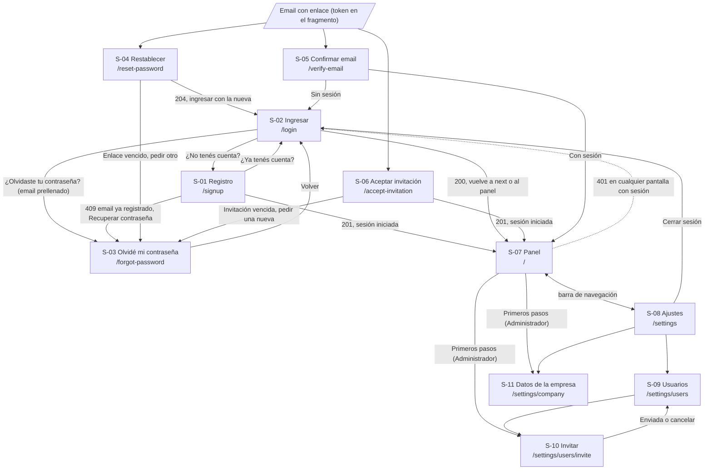
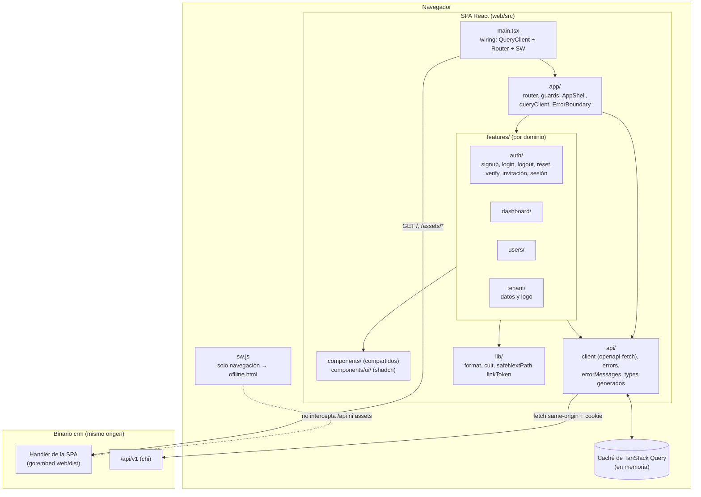
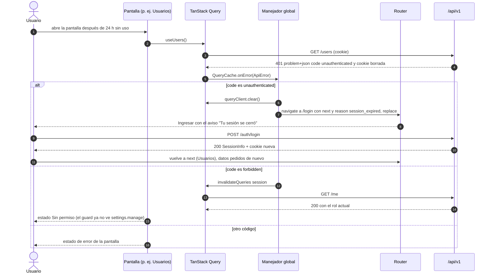
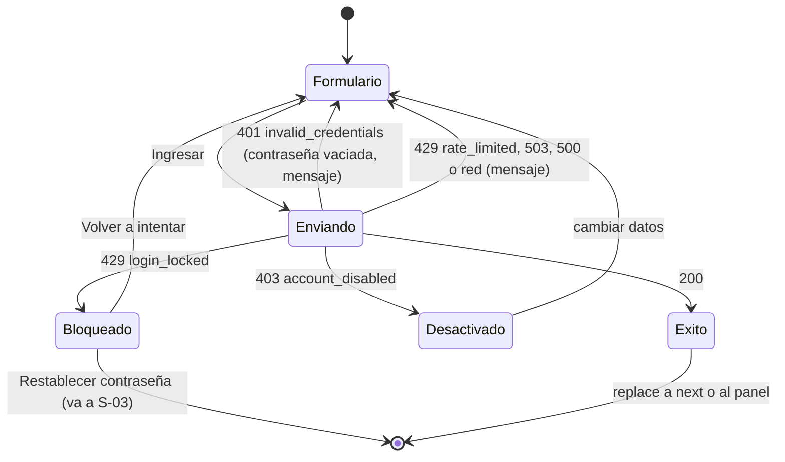
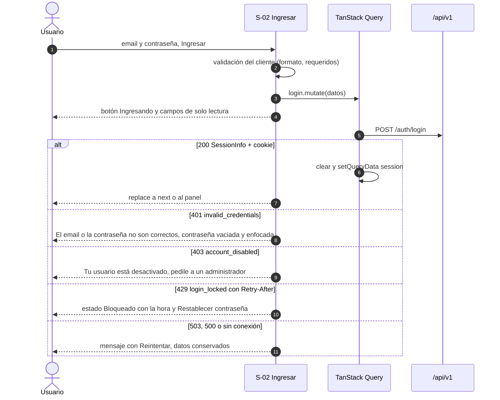
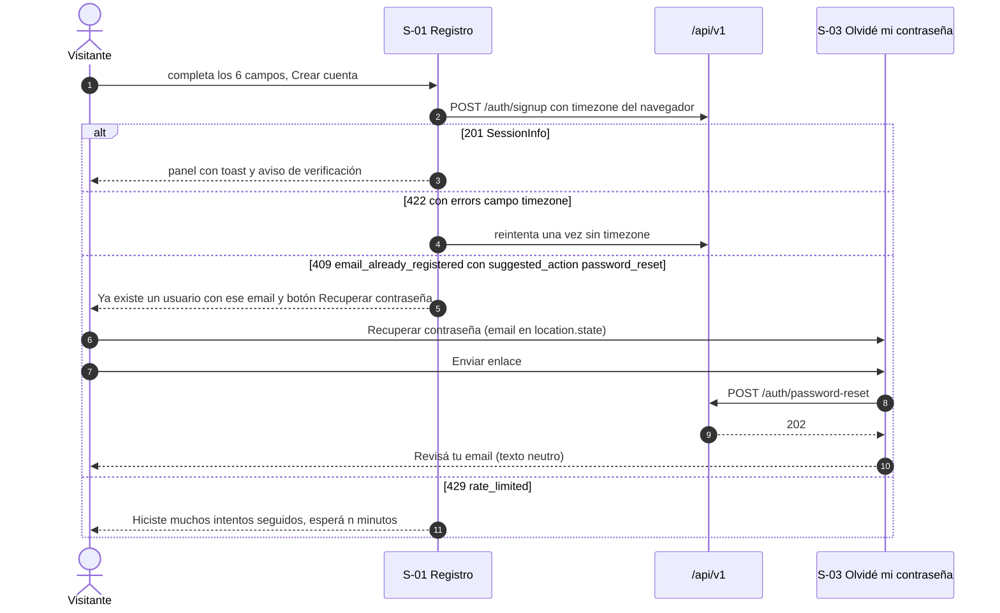
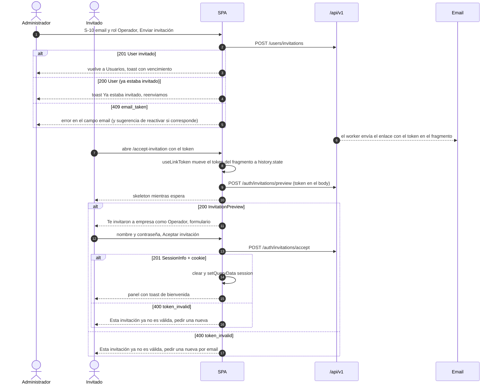

# UI (frontend): Empresas, usuarios y roles

**Spec**: [`spec.md`](spec.md) · **Rama**: `001-empresas-usuarios` · **Fecha**: 2026-09-29
**Autor**: `frontend-architect` · **Estado**: Propuesto (pendiente de aprobación del usuario)
**Contrato consumido**: [`contracts/openapi.yaml`](contracts/openapi.yaml) v0.2.0 (**canónico**)

| Archivo | Contenido |
|---|---|
| `ui.md` (este) | Pantallas, navegación, rutas, modelo de estado, matriz de estados de UI, errores, componentes, accesibilidad, sistema visual, PWA, distribución, `DD-F…` |
| [`research.md`](research.md) §Frontend | Alternativas evaluadas (`R-F01…`) |
| [`tasks.md`](tasks.md) §Frontend | Plan TDD del frontend (`T-F…`) |
| [`docs/adr/`](../../docs/adr/README.md) | ADR-015 a ADR-023: decisiones base del frontend |

---

## 0. Contexto y validación del stack

**Greenfield en frontend**: no hay código ni `package.json`. El backend de 001 está diseñado y
aprobado (`plan.md`, ADR-001 a ADR-014) y su contrato OpenAPI es la restricción más dura de este
diseño.

Diseño sobre este stack (decisiones del usuario marcadas con **(u)**; el resto son defaults
propuestos, cada uno con su ADR):

| Aspecto | Decisión | ADR |
|---|---|---|
| Lenguaje | React + TypeScript (constitución) | — |
| Build | Vite (última estable, ≥ 8), SPA sin SSR, código en `web/` | ADR-015 |
| Componentes y estilos | **shadcn/ui (sobre Radix) + Tailwind CSS v4 (u)** | ADR-016 |
| Router | **React Router v7 en modo SPA/librería (u)**, variante *data* (`createBrowserRouter`) | ADR-017 |
| Server state y cliente | **TanStack Query v5 + openapi-fetch, tipos con openapi-typescript (u)** | ADR-018 |
| Distribución | **SPA embebida en el binario Go (`go:embed`), mismo origen que `/api/v1`; proxy de Vite en desarrollo (u)** | ADR-019 |
| PWA | Manifest + service worker mínimo escrito a mano, sin offline | ADR-020 |
| Formularios | React Hook Form + Zod | ADR-021 |
| Tests | Vitest + Testing Library + MSW; Playwright para E2E | ADR-022 |
| Idioma y formato | es-AR sin librería de i18n; `Intl` con la zona horaria de la empresa; dinero en centavos formateado sin `float` | ADR-023 |

> Detecté un repositorio sin código de frontend, con un backend Go aprobado que sirve la API en
> `/api/v1` con sesión por cookie `HttpOnly` en el mismo origen. Diseño sobre el stack de la
> tabla; si algo va por otro lado, se corrige en el ADR correspondiente antes de la Fase F0.

**Arquetipo**: *SPA con sesión* (rutas protegidas, server state, navegación) con un componente de
*flujos por enlace* (reset, verificación, invitación: la pantalla arranca desde un email con un
token de un solo uso). El panel inicial de 001 es mínimo: las specs siguientes lo llenan.

---

## 1. Resumen ejecutivo

Una SPA React servida por el mismo binario Go que la API, desde el mismo origen, así la cookie de
sesión (`HttpOnly`) viaja sola y el cliente nunca toca un token. Todo dato del servidor vive en la
caché de TanStack Query y se obtiene con un cliente tipado (openapi-fetch) cuyos tipos se generan
del contrato canónico; no hay store global. Un único manejador convierte cualquier `401
unauthenticated` en "tu sesión se cerró" y vuelve al login recordando la pantalla. Cada `code` de
error del contrato tiene su mensaje en español rioplatense y su comportamiento, y el compilador
obliga a cubrir los códigos nuevos. La interfaz es mobile-first (barra de navegación inferior en el
celular, lateral en escritorio), accesible (WCAG 2.2 AA) e instalable como PWA, con un service
worker que **nunca** cachea la API y solo muestra una página de "sin conexión".

---

## 2. Constitution Check (frontend)

| Principio | Estado | Cómo se cumple |
|---|:---:|---|
| **I. Simplicidad** | ✅ | Registro y aceptación de invitación en **una pantalla** cada uno. Sin store global, sin i18n, sin SSR, sin librería de PWA. Invitar es una página simple (no un modal). Mensajes en lenguaje de negocio ("Tu sesión se cerró", no "401"). Se construye solo lo que pide 001 + las consecuencias confirmadas en el plan (reactivar, reenviar invitación). |
| **II. Genérico por configuración** | ✅ | El rubro se elige de `GET /industry-templates` (datos). Ninguna pantalla tiene texto o lógica de un rubro. Los nombres configurables de entidades llegan en 002. |
| **III. Aislamiento** | ✅ (N/A cliente) | El cliente no decide nada de aislamiento. Al cerrar o perder la sesión se **vacía toda la caché** (INV-F03) para que otro usuario del mismo dispositivo no vea datos anteriores. Hallazgo H-2 (logo cacheado entre empresas). |
| **IV. Integridad del dinero** | ✅ (N/A en 001) | 001 no muestra importes. ADR-023 fija para las specs siguientes: centavos enteros + moneda, formateo sin aritmética de punto flotante, nunca se suman monedas distintas en el cliente. |
| **V. SDD** | ✅ | Diseño derivado de `spec.md` + `plan.md` + contrato. Escenarios Dado/Cuando/Entonces trazados a tareas `[T]`. Huecos como supuestos (§25) o preguntas (§26). |
| **VI. Tests primero** | ✅ | Todas las fases del frontend son TDD; los tipos del cliente se derivan del contrato y el lint falla si están desactualizados. |
| **VII. Mobile-first / PWA** | ✅ | Diseño base 360×640, mínimo 320 px; objetivos táctiles ≥ 44 px; PWA instalable; **sin offline** (el service worker no cachea datos). |

---

## 3. Usuarios y contexto de uso

| Perfil | Dispositivo y situación | Consecuencia de diseño |
|---|---|---|
| Dueño que se registra (Administrador) | Celular, a veces en el taller, atención parcial; quiere entrar "ya" (SC-001: < 3 min) | Un solo formulario, 6 campos, teclado adecuado por campo, gestores de contraseñas y pegado permitidos |
| Administrador que gestiona usuarios y datos | Celular o PC de oficina | Listas como tarjetas en el celular; acciones con confirmación; lateral en escritorio |
| Operador invitado | Abre la invitación desde el email o WhatsApp en el celular | La invitación abre una pantalla que explica a qué empresa y con qué rol entra; define nombre y contraseña ahí mismo |
| Cualquiera en obra | Señal intermitente, sol, manos ocupadas | Aviso de "sin conexión", botones grandes, alto contraste, sin gestos obligatorios |

### Lenguaje de la interfaz (alineado con `docs/glosario.md`)

| Concepto (glosario) | Texto en la UI | No usar |
|---|---|---|
| Empresa (`Tenant`) | "empresa", "Datos de la empresa" | "tenant", "organización" |
| Usuario (`User`) | "usuario" | "cuenta" (salvo "cuenta" en "¿Ya tenés cuenta?") |
| Rol `admin` / `operator` | "Administrador" / "Operador" | "admin", "operator" |
| Estado `invited` / `active` / `disabled` | "Invitado" / "Activo" / "Desactivado" | "pendiente", "bloqueado" |
| Invitación | "invitación" | "link de acceso" |
| Sesión | "sesión" ("Cerrar sesión", "Tu sesión se cerró") | "token", "login" |
| Plantilla de rubro | Etiqueta "Rubro de tu empresa" + ayuda "Precargamos la configuración típica de tu rubro" | "template" |
| Moneda base | "Moneda base" + ayuda | "moneda funcional" |
| Verificación de email | "Confirmá tu email" | "verificar la dirección" |

---

## 4. Inventario de pantallas

| ID | Pantalla | Ruta | Acceso | Propósito | Historia |
|---|---|---|---|---|---|
| S-01 | Registro | `/signup` | Solo sin sesión | Crear empresa + primer Administrador eligiendo rubro y moneda base | US-1 |
| S-02 | Ingresar (incluye el estado **bloqueo temporal** y el de usuario desactivado) | `/login` | Solo sin sesión | Iniciar sesión | US-2.1, US-2.2 |
| S-03 | Olvidé mi contraseña | `/forgot-password` | Solo sin sesión | Pedir el enlace de restablecimiento (o la reemisión de la invitación, DD-20) | US-2.3 |
| S-04 | Restablecer contraseña | `/reset-password#token=…` | Público | Definir una contraseña nueva con el enlace del email | US-2.3 |
| S-05 | Confirmar email | `/verify-email#token=…` | Público | Verificar el email con el enlace | US-1.3 |
| S-06 | Aceptar invitación | `/accept-invitation#token=…` | Público | Ver a qué empresa invitan y definir nombre y contraseña | US-3.2 |
| S-07 | Panel inicial | `/` | Sesión | Bienvenida, empresa, rubro y primeros pasos | US-1 (prueba independiente) |
| S-08 | Ajustes | `/settings` | Sesión | Menú de ajustes según permisos + cerrar sesión | US-2 (cerrar sesión), FR-007 |
| S-09 | Usuarios | `/settings/users` | Sesión + `settings.manage` | Listar, cambiar rol, desactivar, reactivar, reenviar invitación | US-3, FR-005 |
| S-10 | Invitar usuario | `/settings/users/invite` | Sesión + `settings.manage` | Invitar un email con un rol | US-3.1 |
| S-11 | Datos de la empresa | `/settings/company` | Sesión + `settings.manage` | Editar datos fiscales y de contacto, zona horaria y logo | US-4 |
| S-12 | No encontrado | `*` | Público | Ruta inexistente | Casos borde |
| C-01 | Aviso "Confirmá tu email" (parte del shell) | — | Sesión | Recordar la verificación y reenviar el email (no bloquea, P-2) | US-1.3 |
| C-02 | Aviso "Sin conexión" (parte del shell y de las pantallas públicas) | — | Todos | Avisar que no hay internet | VII |

"Sin permiso" no es una ruta: es un **estado** que muestra el guard de permiso en la misma URL
(caso borde de la spec: "recibe un error de permiso"). "Bloqueo temporal" tampoco: es un estado de
S-02 (DD-F17).

---

## 5. Mapa de navegación



**Botón atrás del navegador**:

- Todas las pantallas son rutas reales: atrás siempre vuelve a la pantalla anterior, con
  `<ScrollRestoration />` restaurando la posición.
- Tras registro, login y aceptación de invitación se navega con `replace`: atrás **no** vuelve al
  formulario (evita reenviar o ver un formulario que ya no aplica).
- Tras cerrar sesión o perderla, `replace` al login; la caché ya está vacía, así que "atrás" hacia
  una pantalla con sesión vuelve a pedir `/me`, recibe `401` y redirige al login.
- En Invitar (S-10), "Cancelar" y el éxito vuelven a Usuarios con `navigate(-1)` si se llegó desde
  ahí, o con `replace` a `/settings/users` si se entró directo por URL.
- Datos de la empresa (S-11) con cambios sin guardar: al intentar salir se pide confirmación
  (`useBlocker`, BR-F10).

---

## 6. Rutas

### 6.1 Árbol

```text
/                                   RootLayout            (toasts, aviso sin conexión, foco al cambiar de ruta, ErrorBoundary raíz)
├── [PublicOnly]                                          (con sesión → redirige a next o a "/")
│   ├── login                       LoginPage             ?next=<ruta interna>&reason=session_expired|password_changed|logged_out
│   ├── signup                      SignupPage
│   └── forgot-password             ForgotPasswordPage    (state: { email? })
├── reset-password                  ResetPasswordPage     #token=<token>   (APP_LINK_RESET)
├── verify-email                    VerifyEmailPage       #token=<token>   (APP_LINK_VERIFY)
├── accept-invitation               AcceptInvitationPage  #token=<token>   (APP_LINK_INVITATION)
├── [RequireSession] → AppShell                           (sin sesión → /login?next=<ruta actual>)
│   ├── (index)                     DashboardPage
│   ├── settings                    SettingsPage
│   └── [RequirePermission settings.manage]               (sin permiso → estado "Sin permiso" en la misma URL)
│       ├── settings/company        CompanyPage
│       ├── settings/users          UsersPage
│       └── settings/users/invite   InviteUserPage
└── *                               NotFoundPage
```

### 6.2 Enlaces de email (lo que el backend recibe por `APP_LINK_*`, DD-14, S-10 del plan)

| Variable del backend | Valor | Enlace completo que arma el backend |
|---|---|---|
| `APP_LINK_RESET` | `/reset-password` | `{APP_BASE_URL}/reset-password#token={token}` |
| `APP_LINK_VERIFY` | `/verify-email` | `{APP_BASE_URL}/verify-email#token={token}` |
| `APP_LINK_INVITATION` | `/accept-invitation` | `{APP_BASE_URL}/accept-invitation#token={token}` |

- El token es base64url (`A-Z a-z 0-9 - _`), así que no necesita codificarse en el fragmento.
- El fragmento **no viaja al servidor** ni en `Referer`: al pedir `/reset-password` el backend
  sirve `index.html` sin ver el token (DD-14).
- **Manejo en la SPA** (`useLinkToken`, DD-F2): al montar la pantalla se lee `token` del
  fragmento, se reemplaza la entrada del historial por la misma ruta **sin** fragmento y con el
  token en `history.state` (`navigate(pathname, { replace: true, state: { linkToken } })`). El token
  deja de verse en la barra de direcciones y en el historial, no se puede copiar por error al
  compartir la URL, y sobrevive a una recarga en la misma pestaña. Se envía **solo** en el body de
  un `POST` (contrato). Nunca se loguea ni se guarda en `localStorage`/`sessionStorage`.

### 6.3 Parámetros y reglas

| Parámetro | Dónde | Regla |
|---|---|---|
| `next` | query de `/login` | Ruta interna a la que se vuelve tras ingresar. Solo se acepta si empieza con `/`, no empieza con `//` ni `/\`, y no contiene esquema (`safeNextPath`, INV-F07: evita *open redirect*). Si no es válida, se usa `/`. |
| `reason` | query de `/login` | `session_expired` (401 global), `password_changed` (tras restablecer), `logged_out` (tras cerrar sesión). Solo elige un aviso; valores desconocidos se ignoran. |
| `state.email` | `location.state` de `/forgot-password` | Email prellenado desde Ingresar o desde el `409` del Registro. **Nunca** por query string: la URL de la SPA se pide al servidor y quedaría el email en logs de acceso (DD-F9). |
| `state.linkToken` | `location.state` de las pantallas de enlace | Ver §6.2. |

### 6.4 Guards (UX, no seguridad)

> **La autorización real la hace el servidor en cada endpoint** (ADR-013). Los guards solo evitan
> mostrar pantallas que igual fallarían. Un usuario que manipule el cliente para ver una pantalla
> de Administrador recibe `403` del backend y no ve datos.

| Guard | Lee | Mientras carga | Sin sesión / sin permiso | Error de red o `5xx` |
|---|---|---|---|---|
| `RequireSession` | `['session']` | Pantalla de arranque (marca + spinner con `aria-busy`), sin parpadeo del login | `<Navigate to="/login?next=<ruta actual>" replace>` | Estado de error a pantalla completa con "Reintentar" |
| `PublicOnly` | `['session']` | Renderiza el formulario (el `GET /me` anónimo es rápido; no se bloquea la pantalla) | Con sesión → `<Navigate to={safeNextPath(next)} replace>` | Renderiza el formulario (el error de sesión no impide ingresar) |
| `RequirePermission` | `session.permissions` | — (ya hay sesión) | Estado **Sin permiso** en la misma URL: "No tenés acceso a esta sección" + "Pedile a un administrador si lo necesitás" + botón "Volver al inicio" | — |

Si `['session']` pasa de un usuario a `null` (por ejemplo, un refetch al volver a la pestaña
después de 24 h), se trata igual que el `401` global (§12.4): caché vacía y login con
`reason=session_expired`.

---

## 7. Reglas de UI (`BR-F`)

| ID | Regla | Fuente |
|---|---|---|
| BR-F01 | Acciones por usuario en S-09 según su estado (tabla de §13.9). | FR-005, plan §4.6 |
| BR-F02 | Si el usuario es el **único Administrador activo** (se cuenta en la lista: `role=admin` y `status=active`), "Cambiar a Operador" y "Desactivar" aparecen **deshabilitadas** con el motivo visible ("Tiene que quedar al menos un administrador activo"). Es UX: el servidor responde `409 last_admin` igual. | US-3.4, INV-10 |
| BR-F03 | La fila del usuario actual dice "(vos)". Bajarse a Operador o desactivarse a uno mismo pide una confirmación con advertencia explícita ("Vas a perder el acceso a Ajustes" / "Se va a cerrar tu sesión"). | US-3.3 |
| BR-F04 | La navegación muestra solo lo que el rol puede usar (`session.permissions`). En Ajustes, el Operador ve su nombre, email y rol, y "Cerrar sesión". | FR-007, ADR-013 |
| BR-F05 | Con `user.email_verified = false` se muestra el aviso C-01 en todas las pantallas con sesión; no bloquea nada; se puede ocultar hasta cerrar el navegador. | P-2, DD-4 |
| BR-F06 | Tras registrarse o aceptar una invitación se entra directo al panel (la sesión viene en la respuesta). Tras restablecer la contraseña se va al login con aviso (el backend no inicia sesión y cierra las demás). | DD-4, plan §4.5 |
| BR-F07 | `next` solo acepta rutas internas (§6.3). | INV-F07 |
| BR-F08 | Invitar un email que ya estaba invitado en la empresa (respuesta `200`) muestra "Ya estaba invitado: le reenviamos la invitación". | DD-5 |
| BR-F09 | La moneda base se muestra en Datos de la empresa como **solo lectura** ("No se puede cambiar"). | DD-15 |
| BR-F10 | Todo botón de envío queda deshabilitado y con texto de progreso mientras la operación está en curso (sin doble envío). Salir de Datos de la empresa con cambios sin guardar pide confirmación. | Casos borde |
| BR-F11 | Si el email de una invitación rechazada con `409 email_taken` coincide con un usuario **desactivado** de la lista, se sugiere "Es de {nombre}, que está desactivado. Podés reactivarlo desde la lista". | DD-21 |
| BR-F12 | Al aceptar una invitación con otra sesión abierta en el navegador se avisa: "Tenés una sesión abierta como {email}. Si aceptás, se va a cerrar." | Casos borde |

---

## 8. Requisitos no funcionales del frontend (`NFR-F`)

| ID | Requisito | Valor | Cómo se mide |
|---|---|---|---|
| NFR-F01 | Viewport | Diseño base 360×640; sin scroll horizontal desde **320 CSS px** (WCAG 1.4.10) | Playwright a 320 px en cada pantalla (T-F702) |
| NFR-F02 | Navegadores mínimos | Chrome/Edge ≥ 111, Safari/iOS ≥ 16.4, Firefox ≥ 128 (piso de Tailwind v4; Vite 8 apunta a Chrome 111 / Safari 16.4 / Firefox 114 por defecto). Samsung Internet basado en Chromium ≥ 111 (supuesto S-F4) | `build.target` explícito; E2E en Chromium y WebKit |
| NFR-F03 | LCP | ≤ 2,5 s (p75) en `/login` y `/` | Lighthouse *mobile* (red y CPU simuladas) sobre el binario, T-F704 |
| NFR-F04 | INP / CLS | INP ≤ 200 ms; CLS ≤ 0,1 | Lighthouse + inspección manual en un Android de gama media |
| NFR-F05 | Presupuesto de JS (gzip) | Ruta pública (`/login`): ≤ 200 KB. Hasta ver el panel: ≤ 250 KB acumulados. Cada chunk de ruta de Ajustes: ≤ 40 KB. **Objetivos, no mediciones** | Reporte de `vite build` (tamaños gzip) en T-F704 |
| NFR-F06 | Accesibilidad | WCAG 2.2 AA | axe en E2E por pantalla + checklist manual (T-F702, T-F705) |
| NFR-F07 | Objetivos táctiles | ≥ 44×44 CSS px, separados ≥ 8 px (WCAG 2.5.8 pide 24) | Revisión visual + tokens |
| NFR-F08 | Texto | Cuerpo 16 px; inputs ≥ 16 px (evita el zoom automático de iOS); zoom del navegador nunca bloqueado | Tokens + E2E |
| NFR-F09 | Almacenamiento local | Ningún dato de negocio ni token en `localStorage`, `IndexedDB` ni Cache Storage. `sessionStorage` solo para marcas de UI (aviso ocultado, recarga por versión nueva) | Revisión + test de SW (T-F703) |
| NFR-F10 | Seguridad del documento | CSP con `script-src 'self'` sin scripts inline (ADR-019) | E2E sin violaciones de CSP (T-F702) |
| NFR-F11 | Instalable | Chrome Android: "Instalar app"; iOS: "Agregar a inicio" con ícono y nombre correctos | T-F703 + prueba manual |
| NFR-F12 | SC-001 | Registro en una pantalla, 6 campos, 1 request | E2E cronometrado (< 10 s automatizado) + prueba con un usuario real (< 3 min) |

---

## 9. Arquitectura

### 9.1 Capas y módulos



Reglas de dependencia (se verifican con `no-restricted-imports` de ESLint, T-F001):

- `components/ui/` (shadcn) y `components/` no importan `api/`, `features/` ni `app/`: son
  **presentación pura** (todo por props).
- `features/X` no importa `features/Y` salvo `features/auth/session` (sesión y permisos, que son
  transversales). Si otra feature necesita algo de una hermana, se mueve a `components/` o `lib/`.
- Solo `api/` llama a `fetch`/openapi-fetch. Los componentes usan hooks de su feature.
- `api/generated/` es derivado: nunca se edita a mano.

### 9.2 Invariantes del diseño (`INV-F`)

Propiedades que se rompen **sin que falle la compilación**. Cada una tiene un test que la vigila.

| ID | Invariante | Test |
|---|---|---|
| INV-F01 | Ningún dato del servidor se copia a un store, Context, `useState` ni almacenamiento del navegador: se lee de la caché de TanStack Query. (Los formularios copian valores **iniciales** a React Hook Form; eso es estado de edición, no una segunda fuente de verdad.) | Revisión + T-F104 |
| INV-F02 | Todo `401` con `code = unauthenticated` en cualquier query o mutación dispara el mismo manejador global; `401 invalid_credentials` (login) **nunca** lo dispara. | T-F104, T-F301 |
| INV-F03 | Cerrar sesión, perderla (401) o iniciar una sesión nueva (login, registro, aceptar invitación) ejecuta `queryClient.clear()` **antes** de mostrar la pantalla siguiente. | T-F104, T-F303, T-F505 |
| INV-F04 | Toda mutación actualiza o invalida las queries que afecta (tabla §10.3). Ninguna pantalla muestra un dato que la mutación dejó viejo. | Tests de cada pantalla |
| INV-F05 | Los tipos de requests y responses salen de `api/generated/` (derivados del contrato). No hay interfaces de API escritas a mano. El mapa de mensajes es `Record<ErrorCode, …>`: si el contrato agrega un `code`, **no compila** hasta tener mensaje. | `npm run typecheck`, T-F004, T-F101 |
| INV-F06 | Ocultar una opción por permiso es UX: ninguna regla de autorización vive solo en el cliente; toda acción la valida el servidor y la UI maneja su `403`. | T-F104, T-F502 |
| INV-F07 | `next` solo redirige a rutas internas. | T-F103 |
| INV-F08 | El token de un enlace de email solo existe en el fragmento al llegar, luego en `history.state` y en el body del `POST`; nunca en query string, logs, `console`, `localStorage` ni en claves de caché persistentes. | T-F401 |
| INV-F09 | El service worker no intercepta ni cachea `/api/*` ni los assets de la app; su única caché es la página `offline.html`. | T-F703 |
| INV-F10 | Al cerrar un diálogo o menú, el foco vuelve al control que lo abrió; al cambiar de ruta, el foco va al `<h1>` de la pantalla nueva. | T-F106, T-F503 |
| INV-F11 | Todo campo tiene `<label>` asociado; todo error de campo está enlazado con `aria-describedby`; los errores generales se anuncian (`role="alert"`). | Tests por rol/nombre accesible + axe |
| INV-F12 | Ningún componente formatea fechas o dinero por su cuenta: usa `lib/format` con la zona horaria de la empresa (ADR-023). | Revisión + T-F502 |

---

## 10. Modelo de estado

### 10.1 Clasificación de cada pieza

| Pieza | Categoría | Dónde vive | Notas |
|---|---|---|---|
| Sesión: usuario, empresa resumida, permisos (`SessionInfo`) | Server state | Query `['session']` (`GET /me`; también se siembra con la respuesta de signup, login y accept) | `null` = anónimo (el `401` de esta query se mapea a `null`, DD-F4) |
| Datos de la empresa (`Tenant`) | Server state | Query `['tenant']` | Encabezado (nombre, logo), panel y S-11 |
| Lista de usuarios (`User[]`) | Server state | Query `['users']` | Solo Administrador |
| Plantillas de rubro | Server state | Query `['industry-templates']` | Pública; cambia muy poco |
| Vista previa de invitación | Server state | Query `['invitation-preview', token]` | `POST` de solo lectura (el token viaja en el body); `gcTime` corto |
| Permiso "¿puede X?" | Derivado | `useCan(p)` lee `['session']` | No se guarda |
| ¿Es el único admin activo? | Derivado | `countActiveAdmins(users)` | No se guarda |
| `next`, `reason` | URL state | Query string de `/login` | |
| Email prellenado, token del enlace | Estado de navegación | `location.state` | No es URL: no debe quedar en logs |
| Valores de formularios, errores de campo | Client local | React Hook Form dentro de la pantalla | |
| Diálogo de confirmación abierto, acción pendiente | Client local | `useState` del contenedor | |
| Mostrar/ocultar contraseña | Client local | `PasswordInput` | |
| Hay conexión | Client global (del navegador) | `useOnlineStatus()` sobre `online`/`offline` | No es un store: se lee del navegador |
| Aviso de verificación ocultado | Client local persistido | `sessionStorage` (`crm.verifyBanner.dismissed`) | Solo una marca booleana |
| Toasts | Client global | `sonner` (`<Toaster/>` en `RootLayout`) | Librería traída por shadcn |

**No hay store global** (ni Context propio de datos): la única información que varias ramas
necesitan (sesión, permisos, empresa) es server state y ya la comparte la caché (ADR-018).

### 10.2 Configuración de TanStack Query

| Opción | Valor | Por qué |
|---|---|---|
| `staleTime` por defecto | 30 s | Datos que cambian poco; evita refetch en cada montaje |
| `['session']` | `staleTime` 60 s, `refetchOnWindowFocus: true` | Detecta sesiones vencidas al volver a la app |
| `['tenant']` | `staleTime` 5 min | Cambia solo desde S-11 (que actualiza la caché) |
| `['industry-templates']` | `staleTime` 1 h | Catálogo estático |
| `['invitation-preview', token]` | `retry: false`, `gcTime` 0, `refetchOnWindowFocus: false` | Un token inválido no mejora reintentando |
| `retry` de queries | Hasta 2 reintentos **solo** si el error es de red o `503`; nunca en `4xx`, `429` ni `500` | Reintentar un rechazo definitivo no sirve (ADR-009) |
| `retry` de mutaciones | 0 | Los `POST` no son idempotentes |
| `networkMode` de queries | `online` (por defecto) | Sin conexión se pausan y se reanudan solas al volver |
| `networkMode` de mutaciones | `always` | Sin conexión fallan enseguida con un mensaje claro, en vez de quedar "enviando" indefinidamente (DD-F19) |
| `QueryCache.onError` / `MutationCache.onError` | Manejador global de `401 unauthenticated` y de `403 forbidden` (§12.4) | Un único lugar (INV-F02) |

### 10.3 Claves de caché e invalidación

```ts
// src/api/queryKeys.ts — contrato de claves (la única fuente de nombres de claves)
export const queryKeys = {
  session: ['session'] as const,
  tenant: ['tenant'] as const,
  users: ['users'] as const,
  industryTemplates: ['industry-templates'] as const,
  invitationPreview: (token: string) => ['invitation-preview', token] as const,
};
```

| Mutación | Endpoint | Efecto en la caché |
|---|---|---|
| Registrarse | `POST /auth/signup` | `clear()` → `setQueryData(session, respuesta)` |
| Ingresar | `POST /auth/login` | `clear()` → `setQueryData(session, respuesta)` |
| Aceptar invitación | `POST /auth/invitations/accept` | `clear()` → `setQueryData(session, respuesta)` |
| Cerrar sesión | `POST /auth/logout` | `clear()` (tras el `204`) |
| Restablecer contraseña | `POST /auth/password-reset/confirm` | `clear()` (el backend cerró todas las sesiones de ese usuario) |
| Confirmar email | `POST /auth/email-verification/confirm` | `invalidateQueries(session)` |
| Reenviar verificación | `POST /auth/email-verification/resend` | — |
| Pedir restablecimiento | `POST /auth/password-reset` | — |
| Editar empresa | `PATCH /tenant` | `setQueryData(tenant, respuesta)` + `invalidateQueries(session)` (nombre en `TenantSummary`) |
| Subir / quitar logo | `PUT` / `DELETE /tenant/logo` | `PUT`: `setQueryData(tenant, respuesta)`; `DELETE`: `invalidateQueries(tenant)`; ambos `invalidateQueries(session)` (`has_logo`) |
| Invitar / reenviar | `POST /users/invitations` | Reemplaza o agrega el `User` devuelto en `['users']` + `invalidateQueries(users)` |
| Cambiar rol / desactivar / reactivar | `PUT …/role`, `POST …/deactivate`, `POST …/reactivate` | Reemplaza el `User` devuelto en `['users']` + `invalidateQueries(users)`; si el afectado es el usuario actual, `invalidateQueries(session)` |
| Cualquier `404`/`409 invalid_state` en acciones de usuario | — | `invalidateQueries(users)` (la lista estaba vieja) |

---

## 11. Contrato de consumo del API

**Canónico**: `specs/001-empresas-usuarios/contracts/openapi.yaml`. Los tipos del cliente se
**generan** de él (ADR-018); si este documento y el YAML difieren, manda el YAML y este documento
quedó desactualizado. Convención de los ejemplos: el valor es el tipo.

### 11.1 Endpoints consumidos

| Método | Ruta (`/api/v1`) | Pantallas | Hook | Tipo de respuesta |
|---|---|---|---|---|
| GET | `/industry-templates` | S-01, S-07 | `useIndustryTemplates` | `{ items: IndustryTemplate[] }` |
| POST | `/auth/signup` | S-01 | `useSignup` | `SessionInfo` (201) |
| POST | `/auth/login` | S-02 | `useLogin` | `SessionInfo` (200) |
| POST | `/auth/logout` | S-08, menú de escritorio | `useLogout` | — (204) |
| POST | `/auth/password-reset` | S-03 | `useRequestPasswordReset` | — (202) |
| POST | `/auth/password-reset/confirm` | S-04 | `useConfirmPasswordReset` | — (204) |
| POST | `/auth/email-verification/confirm` | S-05 | `useConfirmEmailVerification` | — (204) |
| POST | `/auth/email-verification/resend` | C-01 | `useResendEmailVerification` | — (202) |
| POST | `/auth/invitations/preview` | S-06 | `useInvitationPreview` | `InvitationPreview` |
| POST | `/auth/invitations/accept` | S-06 | `useAcceptInvitation` | `SessionInfo` (201) |
| GET | `/me` | Guards, shell, todas las pantallas con sesión | `useSession` | `SessionInfo` |
| GET | `/tenant` | Shell (nombre y logo), S-07, S-11 | `useTenant` | `Tenant` |
| PATCH | `/tenant` | S-11 | `useUpdateTenant` | `Tenant` |
| GET | `/tenant/logo` | Shell, S-11 (como ``) | — (lo pide el navegador) | `image/png` o `image/jpeg` |
| PUT | `/tenant/logo` | S-11 | `useUploadLogo` | `Tenant` |
| DELETE | `/tenant/logo` | S-11 | `useDeleteLogo` | — (204) |
| GET | `/users` | S-09, S-10 (para BR-F11) | `useUsers` | `{ items: User[] }` |
| POST | `/users/invitations` | S-10, S-09 (reenviar) | `useInviteUser` | `User` (201 nuevo / 200 reemitida) |
| PUT | `/users/{userId}/role` | S-09 | `useChangeUserRole` | `User` |
| POST | `/users/{userId}/deactivate` | S-09 | `useDeactivateUser` | `User` |
| POST | `/users/{userId}/reactivate` | S-09 | `useReactivateUser` | `User` |

No se consumen `/healthz` ni `/readyz`.

**¿El API manda algo que el cliente no debería ver?** Revisado: `User` no incluye hashes, tokens
ni sesiones; `InvitationPreview` muestra nombre de empresa, email y rol solo a quien tiene el token
(correcto: es el destinatario); el `409 email_already_registered` no trae datos de la cuenta
(INV-20). Sin hallazgos de filtración. El único punto sensible es el logo cacheado entre
empresas (H-2).

### 11.2 Tipos derivados

```ts
// src/api/types.ts — alias de los tipos generados; nunca se escriben a mano
import type { components } from './generated/001';
type S = components['schemas'];

export type SessionInfo = S['SessionInfo'];
export type CurrentUser = S['CurrentUser'];
export type TenantSummary = S['TenantSummary'];
export type Tenant = S['Tenant'];
export type TenantUpdate = S['TenantUpdate'];
export type User = S['User'];
export type UserStatus = S['UserStatus'];         // 'invited' | 'active' | 'disabled'
export type Role = S['Role'];                     // 'admin' | 'operator'
export type Permission = S['Permission'];
export type IndustryTemplate = S['IndustryTemplate'];
export type Currency = S['Currency'];             // 'ARS' | 'USD'
export type InvitationPreview = S['InvitationPreview'];
export type Problem = S['Problem'];
export type ValidationProblem = S['ValidationProblem'];
export type FieldError = S['FieldError'];
export type FieldErrorCode = FieldError['code'];
export type ErrorCode = S['ErrorCode'];
export type SuggestedAction = S['SuggestedAction'];
export type SignupRequest = S['SignupRequest'];
export type LoginRequest = S['LoginRequest'];
export type PasswordResetRequest = S['PasswordResetRequest'];
export type PasswordResetConfirmRequest = S['PasswordResetConfirmRequest'];
export type InvitationAcceptRequest = S['InvitationAcceptRequest'];
export type InvitationRequest = S['InvitationRequest'];
```

Ejemplo de forma (el valor es el tipo):

```json
{
  "user": { "id": "string (uuid)", "name": "string", "email": "string (email)", "role": "admin | operator",
            "status": "invited | active | disabled", "email_verified": "boolean" },
  "tenant": { "id": "string (uuid)", "name": "string", "base_currency": "ARS | USD",
              "timezone": "string (IANA)", "has_logo": "boolean" },
  "permissions": ["string (Permission)"]
}
```

### 11.3 Cliente HTTP y normalización de errores

```ts
// src/api/client.ts — firma (openapi-fetch)
import type { paths } from './schema';
export const api: import('openapi-fetch').Client<paths>;
// baseUrl = `${window.location.origin}/api/v1` (absoluta: funciona también en jsdom/MSW, supuesto S-F2)
// credentials: 'same-origin' (por defecto de fetch): el navegador manda la cookie sola.

// src/api/errors.ts — firmas
export type ApiErrorKind = 'problem' | 'network' | 'unexpected';

export interface ApiError extends Error {
  readonly kind: ApiErrorKind;          // problem: problem+json válido; network: sin respuesta; unexpected: respuesta no problem+json (p. ej. 502 HTML de un proxy)
  readonly status: number | null;       // null si no hubo respuesta
  readonly code: ErrorCode | null;      // null si kind ≠ 'problem'
  readonly problem: Problem | null;
  readonly fieldErrors: FieldError[];   // [] salvo validation_failed
  readonly suggestedAction: SuggestedAction | null;
  readonly retryAfterSeconds: number | null; // cabecera Retry-After (legible: mismo origen)
  readonly requestId: string | null;    // problem.instance, para soporte
}

export function toApiError(input: { response?: Response; body?: unknown; cause?: unknown }): ApiError;
export function isApiError(value: unknown): value is ApiError;
/** Devuelve data o lanza ApiError. Todas las queryFn/mutationFn pasan por acá. */
export function unwrap<T>(result: { data?: T; error?: unknown; response: Response }): T;
/** true para errores de red y 503 (se reintentan); false para el resto. */
export function isRetryable(error: unknown): boolean;
```

Subida del logo (`PUT /tenant/logo`, `multipart/form-data`): función `putTenantLogo(file: File):
Promise<Tenant>` en `features/tenant/api.ts`. Si el tipo generado del body (`file: string`) no
acepta un `File`, esa única función usa `fetch` nativo con `FormData` (sin fijar `Content-Type`,
para que el navegador ponga el *boundary*) y la misma normalización `toApiError`.

### 11.4 Paso de *bundle* multi-spec (DD-17 del plan)

A partir de 002, cada spec tiene su contrato y referencia los componentes compartidos de 001 con
`$ref` externo. El frontend genera **un archivo de tipos por spec** y los combina por
intersección:

1. `web/redocly.yaml` declara una entrada `apis` por spec (`root: ../specs/NNN-…/contracts/openapi.yaml`,
   `x-openapi-ts.output: ./src/api/generated/NNN.ts`).
2. `npm run gen:api` corre `openapi-typescript`, que lee `redocly.yaml` y resuelve los `$ref`
   externos (supuesto S-F1, se valida en T-F004 con un contrato de prueba que referencia a 001).
   **Si no los resolviera**, el mismo script agrega un paso previo `redocly bundle` a
   `web/.api-bundle/NNN.yaml` (ignorado por git) y las entradas apuntan ahí.
3. `src/api/schema.ts` combina: `export type paths = Paths001 & Paths002 & …`. Los componentes
   compartidos se importan siempre desde `generated/001`.
4. Un test de tipos (`schema.test-d.ts`) afirma que las claves de `paths` de cada spec son
   **disjuntas** (una ruta en dos specs sería un error del contrato) y que los tipos clave
   (`SessionInfo`, `ErrorCode`) son los esperados.
5. Los archivos generados **se versionan** (se revisan en el PR) y `npm run lint` falla si
   regenerarlos produce diferencias.

Agregar una spec = una entrada en `redocly.yaml` + un `&` en `schema.ts`.

---

## 12. Errores

### 12.1 Taxonomía y comportamiento general

| Clase | Detección | Qué ve el usuario | ¿Se reintenta solo? |
|---|---|---|---|
| Sin conexión | `navigator.onLine = false` o `fetch` rechaza (`kind: 'network'`) | Aviso C-02 arriba ("Sin conexión. Revisá tu internet.") + en la acción: "No hay conexión. Revisá tu internet y probá de nuevo." | Queries: se pausan y reanudan al volver la conexión. Mutaciones: no, botón "Reintentar" |
| `4xx` de validación (`422`) | `code = validation_failed` | Error debajo de cada campo (`fieldErrors`) + foco en el primero | No |
| `401 unauthenticated` | Manejador global | Login con "Tu sesión se cerró. Ingresá de nuevo para seguir." | No |
| `403 forbidden` | Manejador global + pantalla | Mensaje de permiso; se refresca la sesión (el rol pudo cambiar) | No |
| `404` | Por pantalla | Recurso de lista: "Ese usuario ya no está en tu empresa" + refresco. Ruta: S-12 | No |
| `409` | Por `code` | Mensaje específico (§12.2) | No |
| `429` | `login_locked` / `rate_limited` + `Retry-After` | Hora a partir de la cual se puede reintentar | No (el usuario decide) |
| `503` | `service_unavailable` | "El servicio no está disponible…" + "Reintentar" | Queries: hasta 2 veces con *backoff* |
| `500` | `internal` | "Algo salió mal de nuestro lado…" + código de referencia (`requestId`) | No |
| Respuesta no problem+json | `kind: 'unexpected'` | Mensaje genérico según status (5xx como `503`, 4xx como `internal`) | Según status |
| Error de render | `ErrorBoundary` de la ruta raíz | "Algo salió mal al mostrar esta pantalla" + "Recargar" + "Ir al inicio" | No |
| Chunk inexistente tras un deploy | `vite:preloadError` | Recarga automática una vez por sesión (marca en `sessionStorage`); si vuelve a fallar, "Hay una versión nueva de la app" + "Actualizar" | Una vez |

### 12.2 Mapa `code` → mensaje (es-AR) → comportamiento

Se implementa como `Record<ErrorCode, …>` (INV-F05). El texto depende del **contexto** de la
pantalla cuando hace falta; la tabla muestra el texto por defecto y las variantes.

| `code` | HTTP | Título (y descripción) | Comportamiento |
|---|---|---|---|
| `malformed_request` | 400 | "No pudimos procesar el pedido." / "Recargá la página y probá de nuevo." | Error general del formulario. Es un bug del cliente: muestra `requestId` |
| `validation_failed` | 422 | "Revisá los datos marcados." | `fieldErrors` → `setError` por campo (nombres = propiedades del contrato, `snake_case`) + foco en el primero. Campos desconocidos → error general |
| `unsupported_media_type` | 415 | Logo: "El logo tiene que ser una imagen PNG o JPG." · Resto: como `malformed_request` | Logo: error en el control de archivo |
| `payload_too_large` | 413 | Logo: "La imagen pesa más de 2 MB. Elegí una más liviana." · Resto: como `malformed_request` | Idem |
| `unauthenticated` | 401 | En el login: "Tu sesión se cerró. Ingresá de nuevo para seguir." + ayuda "Las sesiones se cierran solas después de 24 horas sin uso o a los 7 días." | **Global** (§12.4) |
| `invalid_credentials` | 401 | "El email o la contraseña no son correctos." | En S-02: se conserva el email, se vacía la contraseña y se enfoca. **No** dispara el manejador global |
| `account_disabled` | 403 | "Tu usuario está desactivado." / "Pedile a un administrador de tu empresa que lo reactive." | En S-02: aviso persistente; no es "sin permiso" (no invalida sesión: no hay) |
| `forbidden` | 403 | "No tenés permiso para hacer esto." / "Si lo necesitás, pedíselo a un administrador." | Global: `invalidateQueries(session)`; la pantalla muestra el mensaje o el guard pasa a "Sin permiso" |
| `not_found` | 404 | Acciones de usuario: "Ese usuario ya no está en tu empresa. Actualizamos la lista." · Logo (`GET`): sin mensaje (se muestran iniciales) · Resto: "No encontramos lo que buscás." | Refresca la lista afectada |
| `email_already_registered` | 409 | "Ya existe un usuario con ese email." / "¿Querés recuperar la contraseña?" | Si `suggested_action = password_reset`: botón **"Recuperar contraseña"** → `/forgot-password` con el email en `location.state` (DD-F18). Botón secundario "Usar otro email" enfoca el campo email |
| `email_taken` | 409 | "Ese email ya tiene un usuario en el sistema." / "Usá otro email." | Error en el campo email de S-10; BR-F11 si es un desactivado de la empresa |
| `last_admin` | 409 | "Tiene que quedar al menos un administrador activo." / "Nombrá a otra persona como administrador antes de hacer este cambio." | Cierra el diálogo, toast de error, refresca la lista |
| `invalid_state` | 409 | "El estado de este usuario cambió mientras tanto. Actualizamos la lista." | Refresca la lista |
| `token_invalid` | 400 | Reset: "Este enlace ya no sirve." / "Vence a la hora o ya se usó. Pedí uno nuevo." · Verificación: "Este enlace de confirmación ya no sirve." / "Vence a las 48 horas o ya se usó." · Invitación: "Esta invitación ya no es válida." / "Venció, ya se usó o la reemplazó una más nueva." | Estado de "enlace inválido" de la pantalla con su salida (§13) |
| `login_locked` | 429 | "Por seguridad, pausamos el ingreso con este email." / "Hubo varios intentos fallidos. Podés volver a intentar a las {HH:MM} (en {n} minutos) o restablecer tu contraseña ahora." | S-02 pasa al estado Bloqueado (DD-F17) |
| `rate_limited` | 429 | "Hiciste muchos intentos seguidos." / "Esperá {n} minutos y probá de nuevo." | Error general; `n` = `ceil(Retry-After / 60)`, mínimo 1 |
| `service_unavailable` | 503 | "El servicio no está disponible en este momento." / "Probá de nuevo en unos minutos." | Botón "Reintentar"; conserva lo cargado en el formulario |
| `internal` | 500 | "Algo salió mal de nuestro lado." / "Probá de nuevo. Si sigue pasando, avisanos con este código: {requestId}." | Botón "Reintentar"; conserva lo cargado |
| (sin respuesta) | — | "No hay conexión." / "Revisá tu internet y probá de nuevo." | Botón "Reintentar"; conserva lo cargado |

### 12.3 Errores de campo (`FieldError.code`) → texto

| Código | Texto por defecto | Variantes por campo |
|---|---|---|
| `required` | "Completá este campo." | `industry_template_code`: "Elegí el rubro de tu empresa." · `base_currency`: "Elegí la moneda base." |
| `invalid_format` | "El formato no es válido." | `email`: "Ingresá un email válido, por ejemplo nombre@empresa.com" · `tax_id`: "El CUIT tiene 11 números (podés escribirlo con o sin guiones)." |
| `too_short` | "Es demasiado corto." | `password`: "La contraseña tiene que tener al menos 10 caracteres." |
| `too_long` | "Es demasiado largo (máximo {n} caracteres)." | `n` sale de las constantes del contrato por campo (`name`/`company_name` 120, `legal_name` 200, `address` 300, `phone` 50, `email` 254, `password` 128) |
| `invalid_value` | "Elegí una opción de la lista." | |
| `invalid_tax_id` | "El CUIT no es válido. Revisá los números." | |
| `same_as_email` | "La contraseña no puede ser igual a tu email." | |
| `unknown_template` | "Elegí un rubro de la lista." | Además se refresca `['industry-templates']` |
| `invalid_timezone` | "Elegí una zona horaria de la lista." | En el registro no se muestra: reintento único sin `timezone` (DD-F10) |

### 12.4 Sesión vencida (`401`) y permisos (`403`) globales



Detalles:

- El manejador se inyecta al crear el `QueryClient` (`createAppQueryClient({ onUnauthenticated,
  onForbidden })`), así no depende de importar el router y se prueba solo.
- Dispara con **cualquier** query o mutación salvo la propia `['session']` (que mapea `401` a
  `null`) y salvo los endpoints públicos (`/auth/login`, `/auth/signup`, etc.), cuyos `401`
  tienen otro `code`.
- Si varias queries fallan a la vez, la navegación ocurre una sola vez (la segunda llamada ve que
  ya está en `/login`).
- `next` = ruta + query de la pantalla actual (sin fragmento).
- **Lo que se pierde** (DD-F5): si el `401` llega al **enviar** un formulario, lo cargado se
  pierde en 001 (formularios de ≤ 7 campos); `next` devuelve a la misma pantalla. Las specs con
  formularios largos (005 presupuestos, 007 operaciones) definen en su `ui.md` un borrador en
  `sessionStorage`; ADR-006 pedía definirlo acá: para 001 se acepta la pérdida.

### 12.5 Límites de error (*error boundaries*)

- Uno en la ruta raíz (`ErrorBoundary` de React Router): errores de render y de carga de chunks.
- Los errores de datos **no** van a boundaries: cada pantalla los muestra en su matriz de estados
  (queries sin `throwOnError`).

---

## 13. Pantallas

Convenciones de todas las pantallas:

- Un solo `<h1>` por pantalla (en `PageHeader`), foco al `<h1>` al llegar (INV-F10) y
  `document.title` = "{Pantalla} · {Empresa o 'CRM'}".
- Formularios: validación del cliente **al enviar** y, después del primer intento, al cambiar cada
  campo (`mode: 'onSubmit'`, `reValidateMode: 'onChange'`), ADR-021. Errores debajo del campo con
  `aria-describedby`; error general en un `FormAlert` con `role="alert"` arriba del botón.
- Botón primario a lo ancho en el celular, alto 44 px, texto de progreso mientras envía
  ("Creando cuenta…").
- Leyenda de los wireframes: `[___]` campo, `( )`/`(•)` opción, `[ Botón ]`, `⋮` menú de acciones,
  letras = zonas descritas debajo.

### 13.1 S-01 Registro (`/signup`) · US-1, FR-001, FR-002, SC-001

```text
┌──────────────────────────────────┐
│ A  [ícono app]                   │
│ B  Creá tu cuenta                │
│    Registrá tu empresa y empezá  │
│    a usar el sistema.            │
│ C  ── Tus datos ──────────────── │
│    Tu nombre                     │
│    [____________________________]│
│    Email                         │
│    [____________________________]│
│    Contraseña          [Mostrar] │
│    [____________________________]│
│    Mínimo 10 caracteres.         │
│ D  ── Tu empresa ─────────────── │
│    Nombre de la empresa          │
│    [____________________________]│
│    Rubro de tu empresa           │
│    Precargamos la configuración  │
│    típica de tu rubro.           │
│    ( ) Carpintería de aluminio   │
│    ( ) Genérico                  │
│    Moneda base                   │
│    (•) Pesos (ARS)  ( ) Dólares  │
│    La usamos para totales y      │
│    reportes. No se puede cambiar │
│    después.                      │
│ E  [! Aviso de error general   ] │
│ F  [        Crear cuenta        ]│
│ G  ¿Ya tenés cuenta? Ingresá     │
└──────────────────────────────────┘
```

A: ícono de la app. B: `<h1>` y bajada. C y D: `<fieldset>` con `<legend>`. E: `FormAlert`
(solo si hay error general). F: botón primario. G: enlace a `/login`.

| Campo | Propiedad del contrato | Control | Reglas en el cliente (replican el contrato) | `autocomplete` |
|---|---|---|---|---|
| Tu nombre | `name` | `input` | requerido, trim, 1–120 | `name` |
| Email | `email` | `input type=email` | requerido, trim + minúsculas, formato email, ≤ 254 | `email` |
| Contraseña | `password` | `PasswordInput` | 10–128, distinta del email (sin reglas de composición, DD-6) | `new-password` |
| Nombre de la empresa | `company_name` | `input` | requerido, trim, 1–120 | `organization` |
| Rubro de tu empresa | `industry_template_code` | `RadioGroup` con `items` de `/industry-templates` | requerido (sin opción preseleccionada) | — |
| Moneda base | `base_currency` | `RadioGroup` | `ARS` (preseleccionada) o `USD` | — |
| (oculto) | `timezone` | — | `Intl.DateTimeFormat().resolvedOptions().timeZone` | — |

| Estado | Qué ve el usuario |
|---|---|
| Carga | Formulario visible de inmediato; el grupo "Rubro" muestra 2 *skeletons* de opción mientras llega `/industry-templates`; "Crear cuenta" deshabilitado hasta que carguen |
| Vacío | `items` vacío (no debería pasar): en el grupo Rubro "No pudimos cargar los rubros." + "Reintentar" |
| Error | Rubros: error en línea en el grupo con "Reintentar" (el resto del formulario sigue usable). Envío: §12.2 (`409` con "Recuperar contraseña", `422` por campo, `429` con minutos, `503`/`500`/red con "Reintentar" conservando lo cargado) |
| Enviando | Botón "Creando cuenta…" deshabilitado; campos `readOnly` |
| Éxito | `201` → caché con la sesión → `replace` a `/` + toast "¡Listo! Tu empresa quedó creada." + aviso C-01 de verificación |
| Sin permiso | N/A |
| Sesión vencida | N/A (con sesión vigente, `PublicOnly` redirige al panel) |

### 13.2 S-02 Ingresar (`/login`) · US-2.1, US-2.2, FR-003

```text
┌──────────────────────────────────┐        Estado Bloqueado (misma ruta)
│ A  [ícono app]                   │        ┌──────────────────────────────────┐
│ B  Ingresá a tu cuenta           │        │ Por seguridad, pausamos el       │
│ C  [i Tu sesión se cerró. …    ] │        │ ingreso con este email.          │
│    Email                         │        │ Hubo varios intentos fallidos.   │
│    [____________________________]│        │ Podés volver a intentar a las    │
│    Contraseña          [Mostrar] │        │ 14:35 (en 15 minutos) o          │
│    [____________________________]│        │ restablecer tu contraseña ahora. │
│    ¿Olvidaste tu contraseña?     │        │ [ Restablecer contraseña       ] │
│ D  [! El email o la contraseña…] │        │ [ Volver a intentar            ] │
│ E  [          Ingresar          ]│        └──────────────────────────────────┘
│ F  ¿No tenés cuenta? Registrá tu │
│    empresa                       │
└──────────────────────────────────┘
```

C: aviso según `reason` (`session_expired`: "Tu sesión se cerró. Ingresá de nuevo para seguir.";
`password_changed`: "Listo, cambiaste tu contraseña. Ingresá con la nueva."; `logged_out`:
"Cerraste sesión."). D: error general. "¿Olvidaste tu contraseña?" lleva el email escrito en
`location.state`.



| Estado | Qué ve el usuario |
|---|---|
| Carga | Formulario inmediato (la comprobación de sesión no bloquea la pantalla) |
| Vacío | N/A |
| Error | §12.2: `invalid_credentials` (mensaje único, nunca dice si el email existe), `account_disabled` (aviso persistente), `rate_limited`, `503`/`500`/red |
| Bloqueado | Panel de la derecha. Hora = ahora + `Retry-After`, en la zona del navegador, redondeada al minuto siguiente. "Volver a intentar" siempre habilitado (reintentar durante el bloqueo no lo extiende, DD-7). "Restablecer contraseña" lleva el email (el reset levanta el bloqueo) |
| Enviando | "Ingresando…" |
| Éxito | `clear()` + sesión en caché → `replace` a `safeNextPath(next)` |
| Sin permiso / Sesión vencida | N/A (el aviso de sesión vencida es la zona C) |

### 13.3 S-03 Olvidé mi contraseña (`/forgot-password`) · US-2.3, FR-004, DD-20

```text
┌──────────────────────────────────┐   Estado Enviado
│ ← Volver                         │   ┌──────────────────────────────────┐
│ Recuperá tu contraseña           │   │ Revisá tu email                  │
│ Te mandamos un enlace para crear │   │ Si {email} tiene un usuario, en  │
│ una nueva.                       │   │ unos minutos te llega un enlace  │
│ Email                            │   │ para crear una contraseña nueva  │
│ [____________________________]   │   │ (o tu invitación, si todavía no  │
│ [ Enviar enlace ]                │   │ la aceptaste). El enlace vence   │
└──────────────────────────────────┘   │ en 1 hora.                       │
                                       │ Revisá también el correo no      │
                                       │ deseado.                         │
                                       │ [ Volver a Ingresar ]            │
                                       │ ¿No llegó? Pedilo de nuevo       │
                                       └──────────────────────────────────┘
```

| Estado | Qué ve el usuario |
|---|---|
| Carga / Vacío | N/A (el email puede venir prellenado desde `location.state`) |
| Error | `422` email inválido en el campo; `429` "Hiciste muchos intentos…"; `503`/`500`/red con "Reintentar" |
| Enviando | "Enviando…" |
| Éxito | Siempre el mismo texto neutro ante `202` (el backend responde igual exista o no el email, INV-13); el foco va al título "Revisá tu email". "Pedilo de nuevo" vuelve al formulario con el email cargado |
| Sin permiso / Sesión vencida | N/A |

### 13.4 S-04 Restablecer contraseña (`/reset-password#token=`) · US-2.3

```text
┌──────────────────────────────────┐
│ Creá una contraseña nueva        │
│ Nueva contraseña       [Mostrar] │
│ [____________________________]   │
│ Mínimo 10 caracteres.            │
│ Al guardarla se cierran tus      │
│ sesiones abiertas en otros       │
│ dispositivos.                    │
│ [ Guardar contraseña ]           │
└──────────────────────────────────┘
```

Sin campo "repetir contraseña": el control de mostrar/ocultar cumple esa función con un campo menos
(DD-F16). `autocomplete="new-password"`.

| Estado | Qué ve el usuario |
|---|---|
| Sin token en la URL ni en `history.state` | "Este enlace está incompleto." / "Abrilo de nuevo desde el email o pedí uno nuevo." + "Pedir un enlace nuevo" (→ S-03) |
| Carga | N/A (no hay vista previa: el token se valida al enviar) |
| Error | `token_invalid` → estado Enlace inválido: "Este enlace ya no sirve. Vence a la hora o ya se usó." + "Pedir un enlace nuevo". `422` (`too_short`, `same_as_email`) en el campo; `429`, `503`, `500`, red |
| Enviando | "Guardando…" |
| Éxito | `204` → `clear()` → `replace` a `/login?reason=password_changed` |
| Sin permiso / Sesión vencida | N/A (si había una sesión del mismo usuario, el backend la cerró; por eso `clear()`) |

### 13.5 S-05 Confirmar email (`/verify-email#token=`) · US-1.3, DD-13

```text
┌──────────────────────────────────┐   Éxito
│ Confirmá tu email                │   ┌──────────────────────────────────┐
│ Tocá el botón para confirmar     │   │ ¡Listo! Tu email quedó           │
│ que este email es tuyo.          │   │ confirmado.                      │
│ [ Confirmar mi email ]           │   │ [ Ir al inicio ] / [ Ingresar ]  │
└──────────────────────────────────┘   └──────────────────────────────────┘
```

Confirmación con **botón** y no automática al abrir (DD-F3).

| Estado | Qué ve el usuario |
|---|---|
| Sin token | "Este enlace está incompleto." + con sesión: "Reenviar email de confirmación"; sin sesión: "Ingresar" |
| Error | `token_invalid`: "Este enlace de confirmación ya no sirve. Vence a las 48 horas o ya se usó." + con sesión: "Reenviar email de confirmación" (C-01); sin sesión: "Ingresá y pedí uno nuevo desde el aviso" + "Ingresar". `429`, `503`, `500`, red |
| Enviando | "Confirmando…" |
| Éxito | `204` → `invalidateQueries(session)`; con sesión "Ir al inicio", sin sesión "Ingresar" |
| Sin permiso / Sesión vencida | N/A (funciona con o sin sesión) |

### 13.6 S-06 Aceptar invitación (`/accept-invitation#token=`) · US-3.2, DD-1, DD-4

```text
┌──────────────────────────────────┐
│ A  Te invitaron a                │
│    Aberturas Norte               │  ← tenant_name
│    como Operador                 │  ← role
│    La invitación vence el 6/10.  │  ← expires_at (zona del navegador)
│ B  [! Tenés una sesión abierta …]│  (BR-F12, solo si hay sesión)
│    Email                         │
│    [juan@…          ] (solo lect.)│
│    Tu nombre                     │
│    [____________________________]│
│    Contraseña          [Mostrar] │
│    [____________________________]│
│ C  [    Aceptar invitación     ] │
└──────────────────────────────────┘
```

| Estado | Qué ve el usuario |
|---|---|
| Sin token | "Este enlace está incompleto." / "Abrilo de nuevo desde el email." |
| Carga | *Skeleton* de la zona A y del formulario (`POST /auth/invitations/preview`) |
| Error de vista previa | `token_invalid`: "Esta invitación ya no es válida. Venció, ya se usó o la reemplazó una más nueva." + "Si todavía no la aceptaste, pedí una nueva con tu email" (→ S-03: el backend reemite la invitación, DD-20) + "¿Ya tenés usuario? Ingresá". `429`, `503`/red con "Reintentar" |
| Error al aceptar | `token_invalid` (venció entre la vista previa y el envío) → mismo estado inválido. `422` por campo (`same_as_email` se valida también en el cliente con el email de la vista previa) |
| Enviando | "Aceptando…" |
| Éxito | `201` → `clear()` → sesión en caché → `replace` a `/` + toast "¡Bienvenido/a a {empresa}!" |
| Sin permiso / Sesión vencida | N/A |

### 13.7 S-07 Panel inicial (`/`) · US-1 (prueba independiente)

```text
┌──────────────────────────────────┐
│ H [logo] Aberturas Norte         │  ← shell (encabezado)
│ V [Confirmá tu email: …  Reenviar ×]│ ← C-01 si corresponde
│ B  Hola, Ana                     │
│    ┌──────────────────────────┐  │
│    │ Aberturas Norte          │  │
│    │ Rubro: Carpintería de    │  │
│    │ aluminio                 │  │
│    │ Moneda base: Pesos (ARS) │  │
│    └──────────────────────────┘  │
│ P  Primeros pasos (solo Admin.)  │
│    [> Completá los datos de tu  ]│
│    [  empresa (para los         ]│
│    [  presupuestos)             ]│
│    [> Invitá a tu equipo        ]│
│ N  [ Inicio ]      [ Ajustes ]   │  ← barra inferior (shell)
└──────────────────────────────────┘
```

| Estado | Qué ve el usuario |
|---|---|
| Carga | Saludo con el nombre de `['session']` (ya cargada por el guard); tarjeta de empresa en *skeleton* hasta `['tenant']` y `['industry-templates']` |
| Vacío | N/A. Si el código de rubro no está en el catálogo, se muestra el código tal cual |
| Error | Tarjeta de empresa: "No pudimos cargar los datos de tu empresa." + "Reintentar" (el resto de la pantalla sigue) |
| Éxito | Como el wireframe. El Operador ve la tarjeta sin "Primeros pasos" |
| Sin permiso | N/A (todos los roles ven el panel) |
| Sesión vencida | §12.4 |

### 13.8 S-08 Ajustes (`/settings`) · FR-007, US-2

```text
┌──────────────────────────────────┐
│ Ajustes                          │
│ ┌──────────────────────────────┐ │
│ │ Ana Pérez                    │ │
│ │ ana@… · Administrador        │ │
│ └──────────────────────────────┘ │
│ Tu empresa        (solo Admin.)  │
│ [> Datos de la empresa         ] │
│ [> Usuarios                    ] │
│                                  │
│ ──────────────────────────────── │
│ [  Cerrar sesión               ] │  ← separado, estilo destructivo suave
└──────────────────────────────────┘
```

| Estado | Qué ve el usuario |
|---|---|
| Carga / Vacío | N/A (usa `['session']`) |
| Error | Cerrar sesión con error de red: toast "No pudimos cerrar la sesión. Revisá tu conexión." y se queda (la cookie sigue válida en el servidor: no se finge un cierre) |
| Enviando | "Cerrando sesión…" |
| Éxito | `204` → `clear()` → `replace` a `/login?reason=logged_out` |
| Sin permiso | El Operador no ve la sección "Tu empresa" (BR-F04) |
| Sesión vencida | §12.4 |

En escritorio, "Cerrar sesión" también está en el menú del usuario de la barra lateral.

### 13.9 S-09 Usuarios (`/settings/users`) · US-3, FR-005, FR-008

```text
┌──────────────────────────────────┐
│ ← Ajustes                        │
│ Usuarios              [+ Invitar]│
│ ┌──────────────────────────────┐ │
│ │ Ana Pérez (vos)          [⋮] │ │
│ │ ana@…                        │ │
│ │ Administrador · [Activo]     │ │
│ ├──────────────────────────────┤ │
│ │ juan@…                   [⋮] │ │
│ │ Operador · [Invitado]        │ │
│ │ La invitación vence el 6/10, │ │
│ │ 14:30                        │ │
│ ├──────────────────────────────┤ │
│ │ Luis Gómez               [⋮] │ │
│ │ luis@…                       │ │
│ │ Operador · [Desactivado]     │ │
│ └──────────────────────────────┘ │
└──────────────────────────────────┘
```

Lista semántica (`<ul>`) de tarjetas en todos los tamaños (una sola estructura; en escritorio se
ensancha). Estado con texto, no solo color. El menú `⋮` es un `DropdownMenu` con nombre accesible
"Acciones para {nombre o email}". Nombres largos y emails largos hacen *wrap*
(`overflow-wrap: anywhere`), sin truncar.

**Acciones por estado (BR-F01 a BR-F03)**, calculadas por la función pura `availableUserActions`:

| Estado del usuario | Acciones | Confirmación |
|---|---|---|
| `active` + `admin` | "Cambiar a Operador", "Desactivar" (ambas deshabilitadas si es el único admin activo, con el motivo) | Sí, ambas |
| `active` + `operator` | "Hacer Administrador", "Desactivar" | Sí |
| `invited` | "Reenviar invitación", "Cambiar a Operador"/"Hacer Administrador", "Desactivar" (su invitación deja de funcionar) | Reenviar: no. Resto: sí |
| `disabled` | "Reactivar" | Sí ("Si nunca aceptó la invitación, le enviamos una nueva") |

Textos de confirmación (`ConfirmDialog`, `AlertDialog` accesible):

| Acción | Título | Descripción | Botón |
|---|---|---|---|
| Hacer Administrador | "¿Hacer Administrador a {nombre}?" | "Va a poder ver toda la información de la empresa y gestionar usuarios." | "Hacer Administrador" |
| Cambiar a Operador | "¿Cambiar a {nombre} a Operador?" | "Deja de ver finanzas, reportes y ajustes." (propio: "Vas a perder el acceso a Ajustes.") | "Cambiar a Operador" |
| Desactivar | "¿Desactivar a {nombre}?" | "No va a poder ingresar y se cierran sus sesiones abiertas. Podés reactivarlo después." (propio: "Se va a cerrar tu sesión.") | "Desactivar" (destructivo) |
| Reactivar | "¿Reactivar a {nombre}?" | "Va a poder ingresar de nuevo con su contraseña. Si nunca aceptó la invitación, le enviamos una nueva." | "Reactivar" |

| Estado | Qué ve el usuario |
|---|---|
| Carga | 3 tarjetas *skeleton* con `aria-busy` |
| Vacío | Solo está el usuario actual: debajo de su tarjeta, `EmptyState` "Todavía sos el único usuario." / "Invitá a alguien de tu equipo para que cargue clientes y proyectos." + "Invitar" |
| Error | `ErrorState` "No pudimos cargar los usuarios." + "Reintentar" (con `requestId` en `500`) |
| Acción en curso | El ítem del menú y el botón del diálogo muestran progreso; el resto de la lista sigue usable |
| Éxito de acción | Diálogo cerrado, foco de vuelta al `⋮` de esa fila, toast: "{nombre} ahora es Administrador" / "…ahora es Operador" / "Desactivaste a {nombre}" / "Reactivaste a {nombre}" o "Le enviamos una invitación nueva a {email}" (si volvió a `invited`) / "Reenviamos la invitación a {email}" |
| Error de acción | `last_admin`, `invalid_state`, `not_found` según §12.2 (con refresco de la lista); `403` → Sin permiso |
| Sin permiso | Guard: "No tenés acceso a esta sección" (Operador por URL, o Administrador al que le bajaron el rol mientras miraba) |
| Sesión vencida | §12.4. Si el Administrador se desactivó a sí mismo, el siguiente request da `401` y cae acá |

### 13.10 S-10 Invitar usuario (`/settings/users/invite`) · US-3.1, DD-5, DD-21

```text
┌──────────────────────────────────┐
│ ← Usuarios                       │
│ Invitar a alguien                │
│ Le mandamos un email para que    │
│ cree su contraseña. La invitación│
│ vence en 7 días.                 │
│ Email                            │
│ [____________________________]   │
│ Rol                              │
│ (•) Operador                     │
│     Carga clientes, proyectos,   │
│     presupuestos y cobros. No ve │
│     finanzas ni ajustes.         │
│ ( ) Administrador                │
│     Ve y gestiona todo.          │
│ [ Enviar invitación ]            │
│ [ Cancelar ]                     │
└──────────────────────────────────┘
```

| Estado | Qué ve el usuario |
|---|---|
| Carga / Vacío | N/A (formulario; `['users']` se usa solo para BR-F11 si ya está en caché) |
| Error | `409 email_taken` en el campo email (+ BR-F11); `422` por campo; `503`/`500`/red con "Reintentar" |
| Enviando | "Enviando…" |
| Éxito | `201`: vuelve a Usuarios + toast "Invitación enviada a {email}. Vence el {fecha}." · `200`: toast "{email} ya estaba invitado: le reenviamos la invitación." |
| Sin permiso / Sesión vencida | Guard / §12.4 |

### 13.11 S-11 Datos de la empresa (`/settings/company`) · US-4, DD-11, DD-15, DD-16

```text
┌──────────────────────────────────┐
│ ← Ajustes                        │
│ Datos de la empresa              │
│ Se usan en los PDF de tus        │
│ presupuestos.                    │
│ L  ── Logo ───────────────────── │
│    [ imagen 96×96 o iniciales ]  │
│    PNG o JPG, hasta 2 MB y       │
│    2000 × 2000 px.               │
│    [ Cambiar logo ] [ Quitar ]   │
│ F  ── Datos ──────────────────── │
│    Nombre de la empresa *        │
│    [____________________________]│
│    Razón social                  │
│    [____________________________]│
│    CUIT                          │
│    [____________________________]│
│    11 números, con o sin guiones.│
│    Dirección                     │
│    [____________________________]│
│    Teléfono                      │
│    [____________________________]│
│    Email de contacto             │
│    [____________________________]│
│    Zona horaria                  │
│    [ America/Argentina/Buenos_… v]│
│    Moneda base: Pesos (ARS)      │
│    No se puede cambiar.          │
│ S  [ Guardar cambios ]           │
└──────────────────────────────────┘
```

- El logo se sube **al elegir el archivo** (acción independiente del formulario de datos), con
  validación previa en el cliente: tipo `image/png` o `image/jpeg` y tamaño ≤ 2 MB. Las
  dimensiones las valida el servidor (`422`). Sin redimensionar en el navegador (DD-F11, P-F2).
- La imagen se muestra con `src="/api/v1/tenant/logo?v={tenant.id}-{tenant.updated_at}"`
  (DD-F12, depende de H-2) y `alt="Logo de {empresa}"`; si falla, iniciales de la empresa.
- `PATCH` envía **solo los campos modificados** (`dirtyFields`); un campo opcional vaciado se
  envía como `null` (borra el dato, contrato). CUIT: se valida formato y dígito verificador en el
  cliente (`isValidCuit`, mismo algoritmo y casos que T-B701) y se envía como se escribió (el
  backend normaliza).
- Zona horaria: `Select` con las zonas `America/Argentina/*` primero y luego el resto de
  `Intl.supportedValuesOf('timeZone')`.

| Estado | Qué ve el usuario |
|---|---|
| Carga | *Skeleton* de logo y campos |
| Vacío | Campos opcionales vacíos con su ayuda; logo con iniciales y "Todavía no subiste un logo" |
| Error de carga | `ErrorState` "No pudimos cargar los datos de tu empresa." + "Reintentar" |
| Error al guardar | `422` por campo (`invalid_tax_id`, `invalid_format`, `too_long`, `invalid_timezone`); `503`/`500`/red con "Reintentar" y lo cargado intacto |
| Error de logo | Cliente: "El logo tiene que ser una imagen PNG o JPG." / "La imagen pesa más de 2 MB. Elegí una más liviana." · Servidor: `413`, `415`, `422` ("La imagen no se pudo leer o supera 2000 × 2000 px"), `503` |
| Enviando | "Guardando…" / "Subiendo logo…" / "Quitando logo…" |
| Éxito | Toast "Guardamos los datos de la empresa." / "Logo actualizado." / "Quitamos el logo."; el encabezado se actualiza sin recargar |
| Cambios sin guardar | Al salir: "Tenés cambios sin guardar. ¿Salir igual?" (`useBlocker`) |
| Sin permiso / Sesión vencida | Guard / §12.4 (DD-F5) |

### 13.12 S-12 No encontrado (`*`)

"No encontramos esta página." + "Ir al inicio" (lleva a `/`, que manda al login si no hay sesión).
Sin shell.

### 13.13 Shell (`AppShell`) y avisos

```text
Celular (< 1024 px)                          Escritorio (≥ 1024 px)
┌──────────────────────────────────┐         ┌────────────┬───────────────────────────────┐
│ H [logo] Aberturas Norte         │         │ [logo]     │ V [Confirmá tu email …      ] │
│ O [Sin conexión. Revisá …      ] │         │ Aberturas  │                               │
│ V [Confirmá tu email … Reenviar ×]│        │ Norte      │  <contenido, máx. 768 px>     │
│                                  │         │            │                               │
│   <contenido>                    │         │ > Inicio   │                               │
│                                  │         │ > Ajustes  │                               │
│                                  │         │            │                               │
│ N  [⌂ Inicio]      [⚙ Ajustes]   │         │ Ana Pérez ▾│                               │
└──────────────────────────────────┘         └────────────┴───────────────────────────────┘
```

H: encabezado con logo (o iniciales) y nombre de la empresa (`['tenant']`, con *fallback* a
`session.tenant.name` mientras carga). O: C-02 (`role="status"`). V: C-01. N: barra inferior fija
con íconos **y** texto, respetando `env(safe-area-inset-bottom)`; el contenido reserva ese alto y
`scroll-padding-bottom` para que el foco nunca quede tapado (WCAG 2.4.11). Enlace "Saltar al
contenido" como primer elemento enfocable. El menú del usuario (escritorio) tiene nombre, rol y
"Cerrar sesión".

**C-01 Aviso "Confirmá tu email"** (BR-F05): "Confirmá tu email: te mandamos un enlace a
{email}." + "Reenviar" (→ `202`: "Listo, te lo reenviamos. Revisá también el correo no deseado.";
`429`: "Ya te lo mandamos hace poco. Esperá {n} minutos.") + botón "Ocultar" con nombre accesible.
Anuncio del resultado en región `aria-live="polite"`.

**C-02 Aviso "Sin conexión"**: aparece con el evento `offline`, desaparece con `online`.

---

## 14. Secuencias principales

### 14.1 Ingresar con bloqueo por intentos (US-2.1, US-2.2)



### 14.2 Registro con email ya registrado (US-1.2, DD-19, DD-21)



### 14.3 Invitación de punta a punta (US-3.1, US-3.2)



---

## 15. Componentes

Presentación (sin red, todo por props) en `src/components/`; contenedores (páginas y secciones
que usan hooks) en cada feature. Los componentes de `components/ui/` son los de shadcn tal como los
genera su CLI (se ajustan solo tokens y variantes).

### 15.1 Presentación compartida

```ts
// src/components/PageHeader.tsx
export interface PageHeaderProps {
  title: string;                 // <h1 tabIndex={-1}> que recibe el foco al navegar
  description?: string;
  back?: { to: string; label: string };   // "← Ajustes"
  actions?: React.ReactNode;     // p. ej. botón "Invitar"
}

// src/components/PasswordInput.tsx — controlado por el formulario (ref reenviada)
export interface PasswordInputProps
  extends Omit<React.ComponentProps<'input'>, 'type'> {
  autoComplete: 'current-password' | 'new-password';
  // Estado interno: visible/oculta. Botón "Mostrar"/"Ocultar" con aria-pressed y aria-controls.
}

// src/components/SubmitButton.tsx
export interface SubmitButtonProps {
  pending: boolean;              // deshabilita y muestra pendingLabel + spinner (aria-hidden)
  children: React.ReactNode;     // "Crear cuenta"
  pendingLabel: string;          // "Creando cuenta…"
  variant?: 'default' | 'destructive';
}

// src/components/FormAlert.tsx — role="alert" si variant = error; si no, role="status"
export interface FormAlertProps {
  variant: 'error' | 'warning' | 'info' | 'success';
  title: string;
  description?: string;
  requestId?: string | null;     // "Código: …" para soporte
  action?: { label: string; onClick: () => void };
  secondaryAction?: { label: string; onClick: () => void };
}

// src/components/ErrorState.tsx — error de carga de una sección o pantalla
export interface ErrorStateProps {
  message: UserMessage;          // de messageForError
  onRetry?: () => void;
  retrying?: boolean;
}

// src/components/EmptyState.tsx
export interface EmptyStateProps {
  title: string;
  description?: string;
  action?: { label: string; to: string } | { label: string; onClick: () => void };
}

// src/components/ForbiddenState.tsx — sin props: texto fijo + "Volver al inicio"

// src/components/ConfirmDialog.tsx — AlertDialog de shadcn; controlado desde afuera
export interface ConfirmDialogProps {
  open: boolean;
  onOpenChange: (open: boolean) => void;   // al cerrar, Radix devuelve el foco al disparador
  title: string;
  description: string;
  confirmLabel: string;
  pendingLabel: string;
  destructive?: boolean;
  pending: boolean;                        // deshabilita confirmar y cancelar
  onConfirm: () => void;
}

// src/components/LockedNotice.tsx (S-02)
export interface LockedNoticeProps {
  retryAt: Date;                 // ahora + Retry-After
  onResetPassword: () => void;
  onRetry: () => void;
}

// src/components/EmailVerificationBanner.tsx (C-01)
export interface EmailVerificationBannerProps {
  email: string;
  resendStatus: 'idle' | 'pending' | 'sent' | 'error';
  errorMessage?: string;
  onResend: () => void;
  onDismiss: () => void;
}

// src/components/OfflineBanner.tsx (C-02) — sin props; usa useOnlineStatus()

// src/components/AppBrand.tsx — logo o iniciales + nombre
export interface AppBrandProps {
  name: string;
  logoSrc: string | null;        // null → iniciales
}
```

### 15.2 Presentación por feature

```ts
// src/features/users/components/UserListItem.tsx
export interface UserListItemProps {
  user: User;
  isCurrentUser: boolean;                        // agrega "(vos)"
  actions: UserActionAvailability[];             // de availableUserActions
  timeZone: string;                              // session.tenant.timezone, para la fecha de vencimiento
  pendingAction: UserAction | null;
  onAction: (action: UserAction) => void;
}

// src/features/users/components/UserStatusBadge.tsx
export interface UserStatusBadgeProps {
  status: UserStatus;                            // texto siempre visible, no solo color
  invitationExpiresAt: string | null;            // ISO-8601; si está vencida: "Invitación vencida"
  timeZone: string;
  now?: Date;                                    // inyectable para tests
}

// src/features/users/rules.ts — funciones puras (BR-F01..03)
export type UserAction = 'makeAdmin' | 'makeOperator' | 'deactivate' | 'reactivate' | 'resendInvitation';
export interface UserActionAvailability {
  action: UserAction;
  enabled: boolean;
  disabledReason?: 'last_admin';
  requiresConfirmation: boolean;
  selfWarning?: 'lose_settings_access' | 'end_own_session';
}
export function countActiveAdmins(users: User[]): number;
export function availableUserActions(
  user: User,
  ctx: { currentUserId: string; activeAdminCount: number },
): UserActionAvailability[];

// src/features/auth/components/IndustryTemplatePicker.tsx
export interface IndustryTemplatePickerProps {
  templates: IndustryTemplate[] | undefined;
  status: 'pending' | 'error' | 'success';
  onRetry: () => void;
  value: string | undefined;
  onChange: (code: string) => void;
  error?: string;                                // texto del error de campo
  name: string;                                  // "industry_template_code"
}

// src/features/auth/components/CurrencyPicker.tsx
export interface CurrencyPickerProps {
  value: Currency;
  onChange: (value: Currency) => void;
  error?: string;
  name: string;                                  // "base_currency"
}

// src/features/tenant/components/LogoUploader.tsx
export interface LogoUploaderProps {
  companyName: string;
  logoSrc: string | null;                        // null si has_logo = false
  pending: 'upload' | 'remove' | null;
  error: string | null;
  onSelectFile: (file: File) => void;            // el contenedor valida tipo/tamaño y sube
  onRemove: () => void;                          // el contenedor pide confirmación
}
```

### 15.3 Contenedores y shell

| Componente | Responsabilidad | Hooks que usa |
|---|---|---|
| `RootLayout` | `<Outlet/>`, `<Toaster/>`, `<OfflineBanner/>`, `<ScrollRestoration/>`, foco al `<h1>` al cambiar de ruta | `useLocation` |
| `RequireSession`, `PublicOnly`, `RequirePermission` | Guards (§6.4) | `useSession`, `useCan` |
| `AppShell` | Encabezado, avisos, navegación inferior/lateral, `<main id="main">` | `useSession`, `useTenant`, `useCan`, `useResendEmailVerification` |
| `SignupPage`, `LoginPage`, `ForgotPasswordPage`, `ResetPasswordPage`, `VerifyEmailPage`, `AcceptInvitationPage` | Pantallas S-01..S-06 | los de §15.4 |
| `DashboardPage`, `SettingsPage`, `UsersPage`, `InviteUserPage`, `CompanyPage`, `NotFoundPage` | Pantallas S-07..S-12 | los de §15.4 |

### 15.4 Hooks y funciones (firmas)

```ts
// features/auth/session.ts
export function useSession(): UseQueryResult<SessionInfo | null, ApiError>;  // 401 → null
export function useCurrentSession(): SessionInfo;   // solo dentro de RequireSession; lanza si no hay
export function useCan(permission: Permission): boolean;

// features/auth/api.ts (mutaciones y queries de auth)
export function useIndustryTemplates(): UseQueryResult<IndustryTemplate[], ApiError>;
export function useSignup(): UseMutationResult<SessionInfo, ApiError, SignupRequest>;
export function useLogin(): UseMutationResult<SessionInfo, ApiError, LoginRequest>;
export function useLogout(): UseMutationResult<void, ApiError, void>;
export function useRequestPasswordReset(): UseMutationResult<void, ApiError, PasswordResetRequest>;
export function useConfirmPasswordReset(): UseMutationResult<void, ApiError, PasswordResetConfirmRequest>;
export function useConfirmEmailVerification(): UseMutationResult<void, ApiError, { token: string }>;
export function useResendEmailVerification(): UseMutationResult<void, ApiError, void>;
export function useInvitationPreview(token: string | null): UseQueryResult<InvitationPreview, ApiError>; // deshabilitada si token = null
export function useAcceptInvitation(): UseMutationResult<SessionInfo, ApiError, InvitationAcceptRequest>;

// features/tenant/api.ts
export function useTenant(): UseQueryResult<Tenant, ApiError>;
export function useUpdateTenant(): UseMutationResult<Tenant, ApiError, TenantUpdate>;
export function useUploadLogo(): UseMutationResult<Tenant, ApiError, File>;
export function useDeleteLogo(): UseMutationResult<void, ApiError, void>;
export function logoUrl(tenant: Pick<Tenant, 'id' | 'updated_at' | 'has_logo'>): string | null;

// features/users/api.ts
export function useUsers(): UseQueryResult<User[], ApiError>;
export function useInviteUser(): UseMutationResult<{ user: User; reissued: boolean }, ApiError, InvitationRequest>; // reissued = status 200
export function useChangeUserRole(): UseMutationResult<User, ApiError, { userId: string; role: Role }>;
export function useDeactivateUser(): UseMutationResult<User, ApiError, { userId: string }>;
export function useReactivateUser(): UseMutationResult<User, ApiError, { userId: string }>;

// app/queryClient.ts
export interface AppQueryClientOptions {
  onUnauthenticated: () => void;   // limpia y navega (§12.4)
  onForbidden: () => void;         // invalida la sesión
}
export function createAppQueryClient(options: AppQueryClientOptions): QueryClient;

// api/errorMessages.ts
export interface UserMessage {
  title: string;
  description?: string;
  retryable: boolean;
  requestId?: string;
}
export type ErrorContext =
  | 'signup' | 'login' | 'passwordReset' | 'resetConfirm' | 'verifyEmail'
  | 'invitationPreview' | 'invitationAccept' | 'users' | 'userAction' | 'invite'
  | 'tenant' | 'logo' | 'generic';
export function messageForError(error: unknown, context: ErrorContext): UserMessage;
export function fieldErrorMessage(field: string, code: FieldErrorCode): string;
/** Pasa los FieldError del servidor a React Hook Form; devuelve los que no corresponden a ningún campo. */
export function applyServerFieldErrors<T extends FieldValues>(
  setError: UseFormSetError<T>, fieldErrors: FieldError[], knownFields: ReadonlyArray<Path<T>>,
): FieldError[];

// lib/*
export function safeNextPath(raw: string | null): string;                 // '/' si no es interna
export function useLinkToken(): string | null;                            // §6.2
export function useOnlineStatus(): boolean;
export function useDocumentTitle(title: string): void;
export function isValidCuit(raw: string): boolean;                        // 11 dígitos + módulo 11
export function formatDateTime(iso: string, timeZone: string, now?: Date): string; // "6/10, 14:30" (año si difiere)
export function formatRetryAt(retryAfterSeconds: number, now: Date): { time: string; minutes: number };
```

---

## 16. Formularios y validación

- **Principio**: la validación del cliente es UX inmediata; **la del servidor es la autoridad**.
  Toda regla replicada en el cliente sale del contrato (longitudes, formato, enum) o de un `DD`
  del plan (DD-6 contraseña, DD-16 CUIT) y tiene su test; ninguna regla vive solo en el cliente.
- Esquemas Zod por formulario en la feature (`features/auth/schemas.ts`, etc.). Cada esquema se
  declara contra el tipo del contrato (`satisfies z.ZodType<SignupRequest>` o equivalente): si el
  contrato cambia un campo, **no compila**.
- Los nombres de los campos del formulario son las propiedades del contrato (`snake_case`), así
  los `FieldError.field` del `422` se aplican directo con `setError` (`applyServerFieldErrors`).
- Normalización antes de enviar: `trim` en textos; email en minúsculas (el backend igual
  normaliza).
- Cuándo se valida: al enviar; tras el primer intento, al cambiar el campo (el error se va apenas
  se corrige). Nunca se valida en cada tecla antes del primer envío.
- Foco: tras un envío fallido, al primer campo con error (React Hook Form lo hace por defecto; se
  mantiene tras aplicar errores del servidor).

| Formulario | Reglas del cliente | Solo el servidor decide |
|---|---|---|
| Registro | Requeridos; email; contraseña 10–128 y ≠ email; longitudes | Email existente (`409`), rubro válido, zona horaria |
| Ingresar | Email con formato; contraseña 1–128 | Credenciales, bloqueo, desactivado |
| Olvidé mi contraseña | Email | Todo lo demás (respuesta neutra) |
| Restablecer | Contraseña 10–128 | Token; `same_as_email` (el cliente no conoce el email) |
| Aceptar invitación | Nombre 1–120; contraseña 10–128 y ≠ email de la vista previa | Token |
| Invitar | Email; rol | Email en uso (`409`) |
| Datos de la empresa | Nombre 1–120; longitudes; email de contacto; CUIT (formato + dígito verificador) | Zona horaria válida; todo lo anterior otra vez |

---

## 17. Autenticación en el cliente

- **Dónde vive la sesión**: en la cookie `__Host-crm_session` (`HttpOnly`), que el navegador envía
  sola a `/api/v1` porque la SPA es del mismo origen (ADR-006, ADR-019). **El cliente nunca lee,
  guarda ni envía un token de sesión.** No hay `Authorization` ni `localStorage`.
- **Qué sabe el cliente**: `SessionInfo` en la caché (`['session']`), para mostrar nombre, empresa
  y opciones. Es información de presentación, **no** una prueba de identidad.
- **Autorización**: la hace el servidor en cada request. Los permisos de `/me` solo ocultan
  opciones (ADR-013, INV-F06).
- **Vencimiento**: 24 h sin uso o 7 días (DD-10). El cliente no lleva un reloj propio: se entera
  por el `401` del siguiente request o del refetch de `/me` al volver a la pestaña (§12.4). No hay
  refresco silencioso: la política del backend no lo contempla (la sesión se extiende sola con el
  uso, hasta los 7 días).
- **CSRF**: lo resuelve el backend (`Sec-Fetch-Site`/`Origin`, `SameSite=Lax`, JSON obligatorio).
  El cliente solo tiene que mandar `Content-Type: application/json` (openapi-fetch lo hace) y
  nunca llamar a la API desde otro origen.
- **Al salir**: `POST /auth/logout` → `queryClient.clear()` → login. No hay nada más que limpiar:
  no se guardan datos en el navegador (NFR-F09) y el service worker no cachea la API.
- **Varias pestañas**: sin coordinación en el MVP; cada pestaña se entera en su próximo request o
  al recibir el foco.

---

## 18. Accesibilidad (WCAG 2.2 AA)

| Tema | Decisión | Criterio |
|---|---|---|
| Semántica | HTML nativo primero (`<form>`, `<fieldset>`, `<legend>`, `<button>`, `<ul>`, `<nav>`, `<main>`); Radix aporta los patrones ARIA de diálogos, menús y radios | 1.3.1, 4.1.2 |
| Teclado | Todo operable con teclado; orden de foco = orden visual; menús `⋮` con flechas, Esc y Enter; diálogos atrapan el foco y lo devuelven al cerrar (INV-F10) | 2.1.1, 2.4.3 |
| Foco visible | Anillo de foco de 2 px con el token `ring` (contraste ≥ 3:1), nunca `outline: none` sin reemplazo | 2.4.7, 2.4.11 |
| Foco no tapado | La barra inferior fija reserva su alto y `scroll-padding-bottom`; los toasts no tapan controles enfocados | 2.4.11 |
| Saltar navegación | "Saltar al contenido" al inicio | 2.4.1 |
| Cambio de ruta | Foco al `<h1>` + `document.title` por pantalla | 2.4.2, 2.4.3 |
| Formularios | `<label>` visible en cada campo (nunca solo *placeholder*); ayuda persistente con `aria-describedby`; errores de campo junto al campo y enlazados; error general `role="alert"`; requeridos marcados | 1.3.1, 3.3.1, 3.3.2 |
| Autenticación accesible | Se permite pegar y usar gestores de contraseñas (`autocomplete` correcto); sin CAPTCHA ni pruebas cognitivas | 3.3.8 |
| Entrada redundante | El email escrito pasa a "Olvidé mi contraseña" (Ingresar y Registro) | 3.3.7 |
| Cambios dinámicos | Toasts y resultados en regiones `aria-live="polite"`; errores en `role="alert"`; *skeletons* con `aria-busy` | 4.1.3 |
| Contraste | Texto ≥ 4,5:1; bordes de campos e íconos con significado ≥ 3:1 (tokens §19) | 1.4.3, 1.4.11 |
| Color | Estados de usuario con texto; errores con ícono + texto | 1.4.1 |
| Tamaño de objetivos | ≥ 44×44 CSS px | 2.5.8 (supera) |
| Reflow y zoom | Sin scroll horizontal a 320 px; zoom del navegador permitido (sin `maximum-scale`) | 1.4.10, 1.4.4 |
| Movimiento | Animaciones cortas y funcionales; `prefers-reduced-motion` las desactiva | 2.3.3 (buena práctica) |
| Idioma | `<html lang="es-AR">` | 3.1.1 |
| Imágenes | Logo con `alt="Logo de {empresa}"`; íconos decorativos junto a texto con `aria-hidden` | 1.1.1 |

**Lo que no se garantiza automáticamente**: axe detecta una parte de los problemas; la
navegación con lector de pantalla (TalkBack/VoiceOver en el celular, NVDA en escritorio) se
verifica a mano en T-F705 con un checklist. Nada de 001 queda por debajo de AA a sabiendas.

---

## 19. Sistema visual

Estilo: plano y sobrio (catálogo `ui-ux-pro-max`: "CRM & Client Management" → *Flat Design +
Minimalism*, azul profesional). Tema **solo claro** en el MVP (DD-F13): mejor legibilidad al sol;
las variables de shadcn dejan el tema oscuro para después sin tocar componentes.

### 19.1 Tokens de color (variables CSS de shadcn)

Valores en hex para leerlos; el archivo de estilos puede expresarlos en OKLCH equivalentes.
Contrastes calculados contra el fondo indicado (a verificar con herramienta en T-F705).

| Token | Valor | Uso | Contraste |
|---|---|---|---|
| `--background` | `#F8FAFC` | Fondo de la app | — |
| `--foreground` | `#0F172A` | Texto principal | 17:1 sobre `background` |
| `--card` / `--popover` | `#FFFFFF` | Tarjetas, menús, diálogos | — |
| `--card-foreground` / `--popover-foreground` | `#0F172A` | Texto sobre tarjetas | 17,8:1 |
| `--primary` | `#2563EB` | Botón primario, enlaces, selección | 5,2:1 sobre blanco |
| `--primary-foreground` | `#FFFFFF` | Texto sobre `primary` | 5,2:1 |
| `--secondary` | `#F1F5F9` | Botones secundarios | — |
| `--secondary-foreground` | `#0F172A` | Texto sobre `secondary` | 16:1 |
| `--muted` | `#F1F5F9` | Fondos atenuados, *skeletons* | — |
| `--muted-foreground` | `#475569` | Texto secundario, ayudas | 7,2:1 sobre `background` |
| `--accent` | `#EFF6FF` | Hover/ítem activo de navegación | — |
| `--accent-foreground` | `#1E40AF` | Texto del ítem activo | 8,1:1 sobre `accent` |
| `--destructive` | `#DC2626` | Acciones destructivas, errores | 4,8:1 sobre blanco |
| `--border` | `#E2E8F0` | Separadores decorativos | (decorativo) |
| `--input` | `#64748B` | Borde de campos | 4,8:1 sobre blanco (≥ 3:1, 1.4.11) |
| `--ring` | `#2563EB` | Anillo de foco | 5,2:1 |
| `--success` (propio) | `#047857` | Texto/íconos de éxito, estado "Activo" | 5,5:1 sobre blanco |
| `--success-muted` (propio) | `#ECFDF5` | Fondo de éxito | — |
| `--warning` (propio) | `#92400E` | Texto de avisos (C-01, "Invitado") | 7:1 sobre `warning-muted` |
| `--warning-muted` (propio) | `#FFFBEB` | Fondo de avisos | — |

### 19.2 Tipografía, espaciado y forma

| Token | Valor | Uso |
|---|---|---|
| `font.sans` | Fuente del sistema: `ui-sans-serif, system-ui, -apple-system, "Segoe UI", Roboto, "Helvetica Neue", Arial, sans-serif` (DD-F14) | Todo (0 KB de descarga) |
| `text.sm` | 14 px / 20 px | Ayudas, metadatos |
| `text.base` | 16 px / 24 px | Cuerpo, inputs, botones |
| `text.lg` | 18 px / 28 px | Títulos de sección |
| `text.xl` | 20 px / 28 px | `<h1>` en celular |
| `text.2xl` | 24 px / 32 px | `<h1>` en escritorio |
| `font.weight` | 400 cuerpo, 500 etiquetas y botones, 600 títulos | |
| `numeric` | `tabular-nums` en cifras (fechas, y dinero en specs siguientes) | |
| `space` | Escala de 4 px de Tailwind; separación entre campos 16 px; entre secciones 24–32 px; márgenes laterales 16 px (celular), 24 px (≥ 768) | |
| `--radius` | 0,5 rem (8 px) | Botones, campos, tarjetas |
| `shadow` | Solo `shadow-sm` en tarjetas y `shadow-lg` en diálogos/menús | |
| `size.touch` | 44 px de alto mínimo en botones, campos e ítems de menú y navegación | NFR-F07 |
| `icon` | lucide-react (el set de shadcn), 20 px en navegación, 16 px junto a texto, trazo 2 | |
| `motion` | 150–200 ms, solo opacidad/transform; desactivado con `prefers-reduced-motion` | |
| `z` | contenido 0, barra inferior 40, avisos 50, menús/diálogos 100 (los de Radix), toasts 200 | |

### 19.3 Breakpoints y *responsive*

| Breakpoint (Tailwind) | Ancho | Cambio |
|---|---|---|
| base | < 640 px (diseño en 360; soporta 320) | Una columna; botón primario a lo ancho; barra inferior |
| `sm` | ≥ 640 px | Formularios públicos centrados, ancho máx. 28 rem (448 px) |
| `md` | ≥ 768 px | Márgenes de 24 px; lista de usuarios con más datos por fila |
| `lg` | ≥ 1024 px | Barra lateral (240 px) en lugar de la inferior; contenido máx. 48 rem (768 px) |

Metadatos del documento: `<meta name="viewport" content="width=device-width, initial-scale=1,
viewport-fit=cover">` (sin bloquear el zoom), `<meta name="theme-color" content="#2563EB">`,
`<html lang="es-AR">`, `<noscript>Para usar la app tenés que activar JavaScript.</noscript>`.

---

## 20. PWA

| Pieza | Decisión (ADR-020) |
|---|---|
| Manifest (`/manifest.webmanifest`) | `id: "/"`, `name` y `short_name` (P-F1, provisorio "CRM"), `lang: "es-AR"`, `start_url: "/"`, `scope: "/"`, `display: "standalone"`, `background_color: "#F8FAFC"`, `theme_color: "#2563EB"`, íconos 192 y 512 (`any`) + 512 `maskable`; `apple-touch-icon` 180 en `index.html` |
| Service worker (`/sw.js`) | Escrito a mano, ~30 líneas, sin librerías. **Solo** atiende navegaciones (`request.mode === 'navigate'`) fuera de `/api/`: va a la red y, si la red falla, responde `offline.html` desde su caché |
| Qué cachea | Únicamente `offline.html` (autocontenida: CSS inline, sin scripts, ícono SVG inline) en la caché `crm-offline-v1` |
| Qué **nunca** cachea | `/api/*` (ni siquiera la intercepta), `index.html`, `/assets/*` (los cachea el navegador por HTTP con `immutable`), el logo, el manifest, `sw.js` |
| Registro | En `main.tsx`, solo en producción, después de `load`: `navigator.serviceWorker.register('/sw.js', { scope: '/' })` |
| Actualización | `skipWaiting()` + `clients.claim()`: como el SW no sirve código de la app, activarlo enseguida no produce versiones mezcladas. Cambiar `offline.html` = subir el número de la caché y borrar las viejas en `activate` |
| Offline | **No hay** funcionamiento offline (constitución VII). Sin conexión: aviso C-02 en la app abierta; al navegar o abrir la app instalada, `offline.html` ("Sin conexión. Para usar la app necesitás internet." + enlace "Reintentar" a `/`) |
| Botón "Instalar" propio | No en el MVP: se instala desde el menú del navegador (Chrome) o "Agregar a inicio" (iOS). Tener un *fetch handler* real mantiene la elegibilidad para la sugerencia automática de Chrome |

---

## 21. Distribución y build (ADR-019)

- `web/` contiene la SPA; `npm run build` genera `web/dist/`. El paquete Go `web` (`web/embed.go`)
  embebe `dist` con `//go:embed all:dist` y expone el handler. `web/dist/` está en `.gitignore`
  salvo un marcador (`web/dist/.gitkeep`) para que el backend compile sin haber compilado el
  frontend; sin `index.html`, el handler responde `503` "La interfaz no está compilada (correr
  `make web-build`)".
- **Montaje** (hallazgo H-1): la SPA **no** se registra en el router chi de la API. `internal/app`
  arma un mux raíz: `/api/` → router chi; `/healthz`, `/readyz` → ops; todo lo demás → handler de
  la SPA. Así `chi.Walk` y el test de rutas contra el contrato no ven la SPA, y un `/api/…`
  inexistente sigue siendo `404 problem+json`. Los middlewares de request id, recover, logging y
  cabeceras de seguridad envuelven también a la SPA.

### 21.1 Reglas del handler de la SPA

| Request | Respuesta |
|---|---|
| Método distinto de `GET`/`HEAD` | `405` |
| Ruta bajo `/api/` | Nunca llega (la atiende la API); si llegara, `404` |
| Archivo existente en `dist` (`/assets/…`, `/sw.js`, `/manifest.webmanifest`, `/icons/…`, `/offline.html`) | El archivo, con las cabeceras de §21.2 |
| Ruta con extensión de archivo que no existe (`/assets/viejo-abc123.js`) | `404` texto plano, `Cache-Control: no-store` (**nunca** `index.html`: evita servir HTML como JS y cachearlo) |
| Cualquier otra ruta (`/`, `/login`, `/settings/users`, `/reset-password`) | `index.html` con `200` |

### 21.2 Cabeceras

| Recurso | `Cache-Control` | Otras |
|---|---|---|
| `index.html` (y el *fallback*) | `no-cache` | `Content-Security-Policy` (abajo); heredadas del backend: `X-Content-Type-Options: nosniff`, `Referrer-Policy: no-referrer`, `Strict-Transport-Security` |
| `/assets/*` (nombre con hash) | `public, max-age=31536000, immutable` | |
| `/sw.js` | `no-cache` | `Content-Type: text/javascript` |
| `/manifest.webmanifest` | `no-cache` | `Content-Type: application/manifest+json` |
| `/offline.html` | `no-cache` | Misma CSP |
| `/icons/*`, `/favicon.*` | `public, max-age=86400` | |

**CSP** de los documentos HTML:

```text
default-src 'self'; script-src 'self'; style-src 'self' 'unsafe-inline'; img-src 'self' blob: data:;
font-src 'self'; connect-src 'self'; manifest-src 'self'; worker-src 'self'; object-src 'none';
base-uri 'none'; form-action 'self'; frame-ancestors 'none'
```

- `script-src 'self'` sin `unsafe-inline`: el build de Vite no genera scripts inline; ningún
  script de terceros.
- `style-src 'unsafe-inline'`: algunas piezas de Radix (bloqueo de scroll de los diálogos) y de
  sonner insertan `<style>` en tiempo de ejecución. El riesgo de estilos inline es mucho menor que
  el de scripts; se reevalúa con *nonces* si se sirve HTML dinámico.
- `img-src blob:` para la vista previa local del logo; `data:` para íconos embebidos en CSS.
- Sin `upgrade-insecure-requests` (rompería el binario servido por `http://localhost`; HSTS ya
  cubre producción).
- El servidor de desarrollo de Vite **no** aplica CSP (usa scripts inline para HMR): la CSP se
  prueba en E2E contra el binario (NFR-F10).

**Compresión**: el presupuesto NFR-F05 se mide en gzip. Default propuesto: envolver el handler de
la SPA con compresión gzip en Go (`github.com/klauspost/compress/gzhttp`); si el hosting (P-1 del
plan) pone un proxy que comprime, se quita. Es una dependencia Go nueva: queda para aprobación del
backend-architect (H-8).

### 21.3 Desarrollo local

| Modo | Cómo | Para qué |
|---|---|---|
| Vite + API | `docker compose up` + `crm serve` (`:8080`) + `cd web && npm run dev` (`:5173`); Vite hace *proxy* de `/api` a `http://localhost:8080` | Desarrollo con recarga en caliente. `APP_BASE_URL=http://localhost:5173` para que los enlaces de email abran Vite |
| Binario completo | `make build` + `crm serve`, abrir `http://localhost:8080` | Igual que producción (CSP, SW, cabeceras); lo usa el E2E |

La cookie `__Host-` exige `Secure`; Chrome y Firefox aceptan cookies `Secure` en
`http://localhost` (supuesto S-F3, se valida en T-F006; Safari de escritorio puede no hacerlo: se
desarrolla con Chrome o Firefox). Requiere que la configuración del backend lo permita (H-3).

---

## 22. Estructura de carpetas

```text
web/
├── index.html                  # documento base (lang, viewport, manifest, theme-color, noscript)
├── package.json                # scripts: dev, gen:api, lint, typecheck, test, build, check, e2e
├── vite.config.ts              # proxy /api en dev, build.target, alias @/
├── tsconfig*.json              # strict, noUncheckedIndexedAccess, alias @/*
├── eslint.config.js            # typescript-eslint, react-hooks, jsx-a11y, no-restricted-imports (§9.1)
├── components.json             # configuración de shadcn (Radix, lucide, alias)
├── redocly.yaml                # una entrada por spec → src/api/generated/NNN.ts (§11.4)
├── playwright.config.ts
├── embed.go                    # paquete Go `web`: //go:embed all:dist + handler (ADR-019)
├── dist/                       # build (ignorado por git salvo .gitkeep)
├── public/
│   ├── manifest.webmanifest
│   ├── sw.js                   # service worker mínimo (ADR-020)
│   ├── offline.html
│   └── icons/                  # 180, 192, 512, 512-maskable, favicon
├── e2e/                        # Playwright: flujos críticos + axe + PWA
└── src/
    ├── main.tsx                # wiring: QueryClient + RouterProvider + registro del SW
    ├── styles/globals.css      # Tailwind + tokens (§19)
    ├── app/                    # router.tsx (árbol §6.1), queryClient.ts, RootLayout, AppShell, guards/, ErrorBoundary
    ├── api/                    # client.ts, errors.ts, errorMessages.ts, queryKeys.ts, types.ts, schema.ts
    │   └── generated/          # 001.ts … (derivado, no se edita)
    ├── features/
    │   ├── auth/               # signup, login, logout, forgot/reset, verify, accept-invitation, session.ts, schemas.ts, api.ts
    │   ├── dashboard/          # DashboardPage
    │   ├── users/              # UsersPage, InviteUserPage, rules.ts, components/, api.ts
    │   └── tenant/             # CompanyPage, LogoUploader, api.ts
    ├── components/             # presentación compartida (§15.1)
    │   └── ui/                 # generados por shadcn
    ├── lib/                    # utils (cn), format, cuit, safeNextPath, linkToken, onlineStatus
    └── test/                   # setup.ts, msw/ (server, handlers), fixtures.ts, renderApp.tsx
```

Cada pantalla vive con sus tests (`LoginPage.test.tsx` junto a `LoginPage.tsx`). Las carpetas de
`features/` usan los nombres del glosario (`tenant`, `users`); `auth` agrupa sesión y credenciales.

---

## 23. Performance

- **Code splitting por ruta** (`lazy` de React Router): (1) pantallas públicas; (2) shell +
  panel; (3) cada pantalla de Ajustes por separado. Radix Dialog/DropdownMenu solo entran con
  Usuarios y Datos de la empresa.
- **Sin fuentes web** (DD-F14) ni imágenes pesadas: el LCP de `/login` es texto.
- **Precarga**: al tocar un enlace de navegación, React Router descarga el chunk de la ruta
  mientras navega; no se precarga nada más.
- **Listas**: la de usuarios tiene decenas de filas (S-7 del plan): sin virtualización ni
  memoización especial.
- **Caché HTTP**: assets con hash `immutable` 1 año; `index.html` revalida siempre.
- Números de §8 (NFR-F03..F05) son **objetivos**; se miden en T-F704 y se reportan.

---

## 24. Decisiones locales (`DD-F`)

| ID | Decisión | Por qué | Trade-off |
|---|---|---|---|
| **DD-F1** | Rutas en inglés (`/login`, `/reset-password`, `/settings/users`) | Coherencia con endpoints e identificadores en inglés (constitución); sin tildes ni `ñ` en URLs | Las URLs de los emails no están en español (P-F3) |
| **DD-F2** | El token del enlace se mueve del fragmento a `history.state` al montar la pantalla | No queda visible en la barra ni en el historial; no se comparte por error; sobrevive a recargar la pestaña | Abrir el mismo enlace en otra pestaña funciona (vuelve a leer el fragmento); una pestaña "duplicada" puede no tenerlo |
| **DD-F3** | Confirmar email con botón, no automáticamente al abrir | Evita que el doble montaje de React en desarrollo o un escáner de enlaces consuma el token; un `POST` por acción explícita | Un toque más |
| **DD-F4** | `['session']` mapea `401` a `null` (anónimo) en vez de error | Las pantallas públicas preguntan "¿hay sesión?" sin disparar el manejador global | La transición usuario → `null` se detecta aparte (§6.4) |
| **DD-F5** | Un `401` al enviar un formulario pierde lo cargado en 001; `next` devuelve a la pantalla | Formularios de ≤ 7 campos; guardar borradores agrega complejidad sin caso real en 001 | Las specs con formularios largos definen su borrador |
| **DD-F6** | Invitar es una página (`/settings/users/invite`), no un modal | Funciona con el botón atrás, se puede enlazar desde el panel, menos manejo de foco | Un cambio de pantalla |
| **DD-F7** | Cambio de rol como acción con confirmación, no como selector en la fila | Evita cambios por un toque accidental en el celular; mismo patrón que desactivar | Un paso más |
| **DD-F8** | "Reenviar invitación" = `POST /users/invitations` con el email y el rol actuales | Es la semántica de DD-5; sin endpoint nuevo | Depende de H-5 si se cambia el rol al reinvitar |
| **DD-F9** | Datos entre pantallas (email) por `location.state`, nunca por query string | La URL de la SPA se pide al servidor: el email quedaría en logs de acceso | Se pierde al abrir en otra pestaña |
| **DD-F10** | Registro envía la zona horaria del navegador; si el `422` es solo por `timezone`, reintenta una vez sin ella | El usuario no puede corregir un campo que no ve | Un request extra (consume cupo de rate limit) en un caso raro; H-6 propone resolverlo en el backend |
| **DD-F11** | Logo: validación de tipo y tamaño en el cliente; sin redimensionar | Simplicidad; el backend valida dimensiones | Una foto de celular de más de 2 MB se rechaza con una indicación (P-F2) |
| **DD-F12** | El encabezado usa `GET /tenant` (nombre + logo) y el logo lleva `?v={id}-{updated_at}` | Evita ver el logo viejo o el de otra empresa en un dispositivo compartido | Depende de H-2 (declarar el parámetro o cambiar la caché) |
| **DD-F13** | Solo tema claro en el MVP | Uso a pleno sol; la mitad de verificación de contraste | Sin modo oscuro (P-F4) |
| **DD-F14** | Fuente del sistema | 0 KB, LCP más rápido, se ve nativa | Aspecto distinto entre Android, iOS y Windows |
| **DD-F15** | Navegación: barra inferior (< 1024 px) con "Inicio" y "Ajustes"; lateral en escritorio | Alcance del pulgar; escala hasta 5 destinos cuando lleguen Clientes, Proyectos, Caja | Con 2 ítems la barra se ve vacía hasta 003 |
| **DD-F16** | Sin campo "repetir contraseña"; con mostrar/ocultar | Un campo menos (principio I); los gestores de contraseñas completan | Un error de tipeo se descubre al ingresar (se resuelve con "Olvidé mi contraseña") |
| **DD-F17** | El bloqueo por intentos es un estado de `/login`, no una ruta | Conserva el email y el contexto; no hay nada que enlazar | — |
| **DD-F18** | Desde el `409` del registro se navega a S-03 con el email prellenado (no se envía el pedido automáticamente) | Reusa una pantalla con sus estados; el usuario confirma el email antes de enviar | Dos toques en vez de uno |
| **DD-F19** | Mutaciones con `networkMode: 'always'` | Sin conexión fallan enseguida con mensaje claro en vez de quedar "enviando" | El usuario reintenta a mano |

---

## 25. Supuestos

| ID | Supuesto | Se valida en | Si es falso |
|---|---|---|---|
| S-F1 | `openapi-typescript` (con `redocly.yaml`) resuelve `$ref` externos entre contratos de specs | T-F004 (contrato de prueba que referencia a 001) | Paso previo `redocly bundle` (§11.4) |
| S-F2 | openapi-fetch con `baseUrl` absoluta funciona en jsdom con MSW interceptando | T-F003 | Ajustar el entorno de test (p. ej. `happy-dom`) sin cambiar el código de la app |
| S-F3 | Chrome y Firefox aceptan la cookie `__Host-…; Secure` servida por `http://localhost` (vía proxy de Vite y desde el binario) | T-F006 | Desarrollo con TLS local (certificado de desarrollo) |
| S-F4 | Los usuarios tienen navegadores de NFR-F02 (celulares de los últimos ~4 años) | Analítica futura / consultas de soporte | Tailwind v4 no funciona en navegadores más viejos: habría que volver a v3.4 (nuevo ADR) |
| S-F5 | Nombre e íconos de la app son provisorios ("CRM", íconos genéricos) | P-F1 | Se cambian manifest e íconos, sin impacto en código |
| S-F6 | El backend ignora parámetros de query no declarados en `GET /tenant/logo` | H-2 | Sin `?v=` hasta que el contrato lo declare |

## 26. Preguntas abiertas

Ninguna bloquea empezar; P-F1 bloquea publicar la app instalable con su nombre definitivo.

| ID | Pregunta | Default propuesto | ¿Bloquea? |
|---|---|---|---|
| P-F1 | ¿Cómo se llama la app (nombre bajo el ícono del celular) y hay un logo/ícono propio? | "CRM" e ícono genérico azul provisorios | Solo la salida a producción |
| P-F2 | ¿Achicamos en el navegador un logo de más de 2 MB (foto del celular) en vez de rechazarlo? | No en el MVP: se rechaza con indicación clara | No |
| P-F3 | ¿Rutas en inglés (`/reset-password`) o en español (`/restablecer-contrasena`)? | Inglés (DD-F1). Decidir antes de T-F007: el backend las recibe por `APP_LINK_*` | No (pero conviene antes de F0) |
| P-F4 | ¿Hace falta modo oscuro? | No en el MVP (DD-F13) | No |
| P-F5 | ¿Corremos los E2E de Playwright en CI en cada PR (más minutos de CI, necesita Docker) o solo antes de liberar? | En cada PR a `main`, 4 flujos (~5 min estimados, no medidos) | No |

## 27. Hallazgos para el backend-architect

No modifican el contrato: son propuestas concretas.

| ID | Hallazgo | Propuesta | Impacto en el frontend |
|---|---|---|---|
| **H-1** | Servir la SPA desde el router chi rompería T-B004 ("ruta inexistente → 404 problem+json"), T-B801 (cobertura de rutas con `chi.Walk`) y el test de rutas contra el contrato (ADR-014) | Mux raíz en `internal/app`: `/api/` → chi, `/healthz` y `/readyz` → ops, resto → handler de la SPA (paquete `web`), con los mismos middlewares de seguridad. Agregar al plan (§4.1, §11) y la tarea correspondiente; T-F007 la especifica | Bloquea T-F007 hasta acordarlo |
| **H-2** | `GET /tenant/logo` responde `private, max-age=300` en una URL **igual para todas las empresas**: en un dispositivo compartido, tras cerrar sesión y entrar con otra empresa, el navegador puede mostrar hasta 5 min el logo anterior (y tras reemplazar el logo se ve el viejo) | (a) `Cache-Control: private, no-cache` + `ETag` (revalida con `304`), **y** (b) declarar el parámetro opcional `v` (string, ignorado por el servidor) en el contrato; alternativa a (b): `logo_version` en `Tenant`/`TenantSummary` | T-F603 usa `?v=` (DD-F12) |
| **H-3** | T-B002 rechaza `APP_BASE_URL` sin `https://` cuando `COOKIE_SECURE ≠ false`, pero en desarrollo con navegador (`http://localhost:5173` o `:8080`) se necesita la cookie `Secure` (los navegadores la aceptan en `localhost`). Con `COOKIE_SECURE=false` el navegador **rechaza** una cookie `__Host-` | Permitir `http://localhost` y `http://127.0.0.1` con `COOKIE_SECURE=true`; documentar que `COOKIE_SECURE=false` solo sirve para clientes no navegador | Bloquea el desarrollo local con Vite (T-F006) |
| **H-4** | `User.invitation_expires_at` es "de la invitación vigente": no queda claro qué llega si la invitación **venció** (¿`null`?). La UI necesita mostrar "Invitación vencida" y ofrecer reenviar | Devolver el vencimiento de la última invitación del usuario `invited` aunque haya pasado; documentarlo en el contrato | T-F502 muestra "vencida" si la fecha es pasada; si llega `null` para un `invited`, muestra "Invitación sin fecha" |
| **H-5** | Reinvitar (DD-5) con un rol distinto al que tiene el invitado: no está definido si cambia el rol. Tampoco si `PUT /users/{id}/role` aplica a usuarios `invited` | Reinvitar **actualiza** el rol (auditado en `user.invitation_reissued` con `data.role`); `PUT …/role` permitido para `invited` y `active` | BR-F01 ofrece cambiar rol a invitados |
| **H-6** | Un `timezone` inválido en `POST /auth/signup` da `422` en un campo que el usuario no ve | En signup, una zona desconocida usa el default en lugar de `422` (o garantizar `time/tzdata` embebido para aceptar toda zona IANA del navegador) | La UI mitiga con un reintento (DD-F10) |
| **H-7** | `Cache-Control: no-store` solo en `/auth/*` y `/me`; `/users` y `/tenant` (datos personales) no tienen directiva | `no-store` en todas las respuestas JSON de `/api/v1` (el logo mantiene su política de H-2) | Ninguno en código; baja el riesgo en dispositivos compartidos |
| **H-8** | Cabeceras de la SPA (CSP, `Cache-Control` por tipo de archivo) y compresión gzip no están en §10.3 del plan; la compresión agrega una dependencia Go (`klauspost/compress/gzhttp`) | Incorporar §21.2 de este documento al plan del backend y aprobar (o no) la dependencia | NFR-F05 se mide en gzip |
| **H-9** | El rechazo de `http.CrossOriginProtection` responde por defecto un `403` de texto plano, no problem+json | Configurar su *deny handler* para responder problem+json `code: forbidden` | La UI lo trata como `kind: 'unexpected'` mientras tanto |

## 28. Riesgos

| ID | Riesgo | Prob. | Impacto | Mitigación |
|---|---|:---:|:---:|---|
| RF-1 | Versiones del ecosistema (Vite 8, Tailwind v4, shadcn con `Field`, Zod 4 + resolvers) con incompatibilidades puntuales de tipos | Media | Bajo | Versiones fijadas en `package-lock.json`; T-F001/T-F002 verifican la combinación; se documentan los ajustes |
| RF-2 | Tras un deploy, pestañas abiertas piden chunks que ya no existen (el binario nuevo no los tiene) | Alta | Bajo | `vite:preloadError` → recarga única; `index.html` `no-cache` |
| RF-3 | El usuario (nivel básico en React) se pierde entre librerías | Media | Medio | Pocas abstracciones propias, firmas en este documento, ADR con el porqué; hooks de datos con el mismo patrón en todas las features |
| RF-4 | La CSP rompe algo que en desarrollo funcionaba (Vite dev no aplica CSP) | Media | Medio | E2E contra el binario falla ante cualquier violación de CSP (NFR-F10) |
| RF-5 | Pérdida de lo cargado por un `401` al enviar | Baja en 001 | Bajo | DD-F5; patrón de borrador para specs con formularios largos |
| RF-6 | Deriva entre las reglas del cliente y del servidor (longitudes, CUIT) | Media | Bajo | Esquemas atados al tipo del contrato; tabla de casos de CUIT compartida con T-B701 |
| RF-7 | Presupuesto de JS superado por Radix + Zod + React Router | Media | Medio | Chunks por ruta; medición en T-F704; si se excede, `zod/mini` o revisar componentes |

---

## 29. Matriz de mantenimiento (documentación viva)

La actualización va **en el mismo cambio** que el código.

| Cuando cambies… | También tenés que actualizar… |
|---|---|
| El contrato (`openapi.yaml`) de cualquier spec | `npm run gen:api` (archivos generados en el mismo PR) + §11.1 si cambia un endpoint consumido + la matriz de estados de la pantalla afectada |
| Un `code` de error o `suggested_action` | `api/errorMessages.ts` (no compila sin él) + §12.2 |
| Un `FieldError.code` o una longitud del contrato | §12.3 + esquema Zod del formulario + su test |
| Una pantalla o su ruta | §4 inventario + §5 mapa + §6.1 árbol + guards |
| Un *path* de enlace de email | §6.2 + `APP_LINK_*` del backend (plan §10.5) + E2E |
| Props de un componente compartido | §15 + sus usos |
| Dónde vive una pieza de estado o una clave de caché | §10 + `api/queryKeys.ts` + invariantes §9.2 |
| Una invalidación | §10.3 + test de la pantalla |
| Un token visual | §19 + `styles/globals.css` + verificación de contraste |
| Cabeceras, CSP o reglas del handler de la SPA | §21 + ADR-019 (nuevo ADR si cambia la decisión) + test Go de T-F007 |
| El service worker o el manifest | §20 + ADR-020 + T-F703 |
| Una decisión de ADR-015..023 | ADR nuevo que la reemplace (nunca editar uno aceptado) |
| Cómo se construye o corre el frontend | README (sección de desarrollo) + §21.3 + comandos de `tasks.md` |

## 30. Fuentes consultadas

- Tailwind CSS v4, navegadores soportados: <https://tailwindcss.com/docs/compatibility>
- Vite 8 (Rolldown) y `build.target` por defecto: <https://vite.dev/blog/announcing-vite8>, <https://vite.dev/config/build-options>
- Vite, manejo de errores de carga (`vite:preloadError`): <https://vite.dev/guide/build#load-error-handling>
- React Router, modos (declarativo, data, framework): <https://reactrouter.com/start/modes>
- shadcn/ui, formularios con `Field` + React Hook Form: <https://ui.shadcn.com/docs/forms/react-hook-form>
- `@hookform/resolvers` con Zod 4 (desde 5.1.0): <https://github.com/react-hook-form/resolvers/releases>
- openapi-typescript con `redocly.yaml` (varias APIs): <https://openapi-ts.dev/cli>
- Redocly `bundle` y `join`: <https://redocly.com/docs/cli/commands/bundle>, <https://redocly.com/docs/cli/commands/join>
- Criterios de instalación de Chrome (sin *fetch handler* obligatorio desde 108/112 para instalar desde el menú): <https://developer.chrome.com/blog/update-install-criteria>
- `Intl.NumberFormat` con strings como decimales exactos: <https://developer.mozilla.org/en-US/docs/Web/JavaScript/Reference/Global_Objects/Intl/NumberFormat/format>
